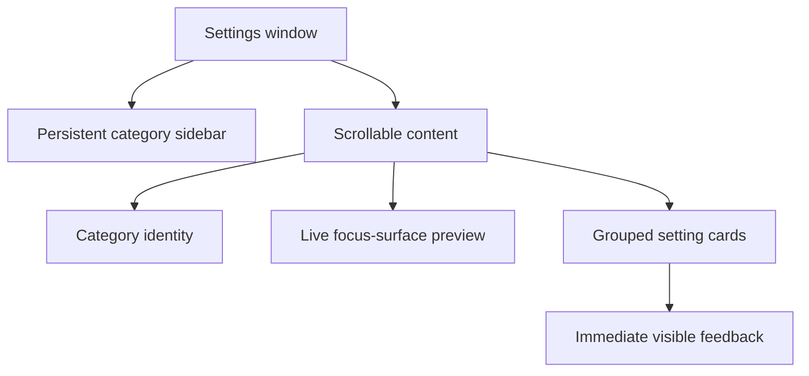

# Keep3 Visual System 2.0 - Plan

## Goal Capsule

- **Objective:** Give Keep3 a recognizable visual identity built around a quiet black focus surface that briefly comes alive during meaningful transitions.
- **Product authority:** The user approved this visual-system scope. Music and multimedia are surrounding work with a separate Product Contract and are not active scope here.
- **Execution:** Code.
- **Open blockers:** None.

---

## Product Contract

### Summary

Keep3 will use one signature visual and motion language across its top focus surface and settings experience.
The compact surface stays motionless at rest, performs a short fluid handoff when content changes, and uses an Alcove-inspired settings structure without copying Alcove's brand layer.

### Problem Frame

The MVP is functionally complete, but its top surface reads as a conventional black capsule with standard text transitions.
The two moments used most often—glancing at the resting capsule and seeing priorities rotate—do not yet express the product's promise of keeping three important things quietly in sight.
The settings experience also relies on standard grouped controls, so it does not reinforce the focus surface as a coherent product object.

### Key Decisions

- **Use the living-black-shape direction.** (session-settled: user-directed — chosen over quiet-signal and focus-rail alternatives: delight should come from the capsule's own fluid shape change.) Governs R1–R6.
- **Keep the resting surface completely still.** (session-settled: user-approved — chosen over breathing or ambient motion: visual delight must not become a new demand on attention.) Governs R2.
- **Use one signature transition.** (session-settled: user-approved — chosen over separate Fade, Slide, and Dissolve presets: a single choreography creates stronger product recognition.) Governs R3, R4, R11.
- **Borrow Alcove's settings structure, not its brand identity.** (session-settled: user-approved — chosen over a pixel-level replica: Keep3 needs the same clarity and density while remaining visually its own product.) Governs R8–R10, R12.

<!-- ce-section: work-relationships -->
### How This Work Fits Together

This plan owns Keep3's visual language for the top focus surface and settings.
The broader breakdown is the current understanding and may be revised by later plans.

- **Music and multimedia**
  - **Depends on:** The signature shape, motion grammar, and settings shell defined here.
  - **Still to decide:** How media coexists with the three priorities and when it may temporarily occupy the top surface.
  - **Planned separately:** Its own Product Contract will define media behavior, controls, and product boundaries.
- **Main priority editor**
  - **Can proceed independently of:** The focus-surface visual system.
  - **Shares:** Typography, accent, spacing, and material tokens when a later editor redesign is approved.

### Requirements

**Focus surface**

- R1. The compact and expanded focus surfaces must read as one continuous black product object across notched and floating-capsule displays.
- R2. The compact surface must remain motionless after settling, with no breathing, pulsing, shimmer, or autonomous decorative animation.
- R3. The shared persistent shell must resolve one trigger-specific signature family: content 150 milliseconds, manual or automatic component change 210 milliseconds, expansion 270 milliseconds, and collapse 200 milliseconds.
- R4. The signature transition must coordinate the surface shape, progressive blur of the outgoing title, arrival of the incoming title, and final settling as one interruptible handoff. Manual component changes may carry direction; automatic changes remain neutral.
- R5. The designated current focus must carry a persistent filled lozenge before its title; a secondary item must carry an outlined ordinal badge (`2` or `3`) instead. The marker must remain visible through handoff and expansion, and color may reinforce but must not encode the distinction.
- R6. Hover expansion and collapse must use the same motion character as item switching while remaining visibly intentional rather than notification-like. Expansion must reveal the context of the item that was visible when expansion began; if that item is secondary, its outlined ordinal badge must remain visible, and collapse must return to the designated current focus. Hover intent resolves after 140 milliseconds and exit grace after 220 milliseconds.
- R7. When Reduce Motion is enabled, all shape and positional movement must become a crossfade lasting no more than 150 milliseconds.
- R7a. A newer eligible target retargets the current presentation and invalidates stale completion. Automatic changes defer during pointer-down, keyboard, VoiceOver, or a component command, then reconcile only the latest target.

```mermaid
stateDiagram-v2
  [*] --> RestingCurrent
  RestingCurrent --> Handoff: Rotation or content update
  RestingSecondary --> Handoff: Rotation or content update
  Handoff --> RestingCurrent: Incoming item is current focus
  Handoff --> RestingSecondary: Incoming item is secondary
  RestingCurrent --> Expanded: Expand current-focus context
  RestingSecondary --> Expanded: Expand visible secondary context
  Expanded --> RestingCurrent: Interaction ends; restore current focus
```

**Settings experience**

- R8. Settings must use a persistent category sidebar and a scrollable content area composed of titled grouped cards.
- R9. Settings categories must organize controls by user intent: General, Focus Surface, Rotation, Interaction, and Accessibility.
- R10. Focus-surface appearance controls must have a persistent live preview and apply valid changes immediately to both preview and running surface.
- R11. Settings must remove the Fade, Slide, Dissolve, and motion-speed choices and present the signature transition as Keep3's only motion language.
- R12. Settings must use restrained monochrome symbols, one Keep3 accent, native macOS materials, and denser spacing without reproducing Alcove's color assignments or branding.
- R13. Existing capsule width and background-opacity controls must remain available within contrast-safe bounds.
- R14. Settings must explain when Reduce Motion or Reduce Transparency overrides a visual preference.

**Compatibility and restraint**

- R15. The visual system must preserve the current non-activating surface behavior and must not take keyboard focus during passive interaction.
- R16. The system must remain legible in light appearance, dark appearance, increased contrast, and Reduce Transparency modes.
- R17. Decorative color, motion, and imagery must not introduce task progress, completion, urgency, or notification semantics.

### Key Flows

- F1. Priority handoff
  - **Trigger:** Weighted rotation or an edit changes the visible item.
  - **Steps:** The resting surface briefly reshapes, the outgoing title yields, the incoming title arrives, and the surface returns to rest.
  - **Outcome:** The user notices a polished handoff without mistaking a secondary item for a new current focus.
  - **Covers:** R2–R5.
- F2. Intentional expansion
  - **Trigger:** The configured hover delay completes or the user clicks in click-to-expand mode.
  - **Steps:** The same black object expands and reveals the context of the item that was visible when expansion began. A secondary item retains its outlined ordinal badge throughout expansion; when interaction ends, the surface collapses to the designated current focus.
  - **Outcome:** Expansion feels related to item switching, preserves the distinction between designated focus and secondary browsing, and does not behave like a separate popover.
  - **Covers:** R1, R5, R6, R15.
- F3. Visual adjustment
  - **Trigger:** The user opens Settings and selects Focus Surface.
  - **Steps:** The preview demonstrates the current appearance, valid adjustments update it immediately, and the running surface follows without an explicit save.
  - **Outcome:** The user can understand each appearance choice before returning to work.
  - **Covers:** R8–R14.

### Acceptance Examples

- AE1. Resting remains quiet
  - **Covers R2.**
  - **Given:** The compact surface has finished displaying an item.
  - **When:** No rotation, edit, or intentional interaction occurs for 60 seconds.
  - **Then:** The surface shows no autonomous visual movement.
- AE2. Secondary rotation preserves focus meaning
  - **Covers R3–R5.**
  - **Given:** The first item is the designated current focus and the second item is due to rotate in.
  - **When:** The signature handoff completes.
  - **Then:** The second title is readable, the 150-millisecond content handoff settles without replacing the shell, and the first item remains the designated focus.
- AE3. Editing uses the same language
  - **Covers R3, R4.**
  - **Given:** The visible item's title changes in the editor.
  - **When:** The valid edit reaches the focus surface.
  - **Then:** The title uses the signature handoff rather than abruptly replacing text or invoking a different preset.
- AE4. Reduced motion removes spatial movement
  - **Covers R7, R14.**
  - **Given:** Reduce Motion is enabled.
  - **When:** Rotation, an edit, expansion, or collapse occurs.
  - **Then:** The content crossfades without shape or positional movement.
- AE5. Settings preview makes adjustments visible
  - **Covers R8–R14.**
  - **Given:** The user is viewing the Focus Surface settings category.
  - **When:** The user changes capsule width or opacity.
  - **Then:** The live preview and running surface update immediately while preserving legibility.
- AE6. Presentation style does not split the brand
  - **Covers R1, R16.**
  - **Given:** Keep3 moves between a notched primary display and a non-notched primary display.
  - **When:** The surface is repositioned.
  - **Then:** Both presentations retain the same material, typography, focus semantics, and motion grammar.

### Success Criteria

- After 14 consecutive workdays, the user still keeps automatic rotation enabled and does not describe the signature transition as distracting.
- In side-by-side review, the resting, switching, and expanded states are recognizable as one Keep3 object on both notched and non-notched displays.
- In a blind comparison against the current MVP transition, at least four of five evaluators can distinguish the new trigger-specific handoff family from the baseline and recognize one uninterrupted Keep3 object across rotation, editing, component changes, and expansion.
- A visual review passes in light, dark, increased-contrast, Reduce Motion, and Reduce Transparency configurations without losing current-focus meaning.
- A planning pass can define implementation without inventing motion behavior, settings organization, accessibility fallback, or visual scope.

### Scope Boundaries

- **Included:** Compact and expanded top-surface identity, signature motion, visual semantics, settings navigation, grouped settings cards, and live appearance preview.
- **Deferred:** A broader redesign of the main priority editor.
- **Separate Product Contract:** Music playback, media metadata, album art, system media integration, and media controls.
- **Outside this product's identity:** Alcove-style battery, connectivity, focus-mode, display, sound, calendar, lock-screen, file-tray, and general notification HUDs.
- **Prohibited:** Alcove source code, assets, branding, or pixel-level reproduction.

### Dependencies and Assumptions

- The existing product principles in `docs/ideas/keep3.md` remain authoritative: attention over task management, quiet by default, and one thing at a time.
- The MVP behavior contract in `docs/specs/keep3-mvp.md` remains authoritative except where this plan replaces the motion-preset requirements.
- The current non-activating panel, weighted rotation, expansion triggers, and accessibility semantics remain behaviorally valid.
- Alcove 1.7.7 is a directional quality benchmark, not a product-scope template.

### Outstanding Questions

**Deferred to Planning**

- Resolved by the 2026-07-26 continuity plan: use the trigger-specific
  150/200/210/270-millisecond family and a 120-millisecond Reduce Motion
  crossfade.
- Select the concrete typography, material, corner geometry, and spacing tokens that satisfy the approved visual direction.

### Sources and Research

- `docs/ideas/keep3.md` — product promise, attention principles, and original non-goals.
- `docs/specs/keep3-mvp.md` — current top-surface behavior, appearance settings, accessibility, and platform constraints.
- `docs/verification/keep3-mvp.md` — implemented presentation and physical-verification evidence.
- [Alcove](https://tryalcove.com/) and the locally installed Alcove 1.7.7 settings experience — directional reference for fluid transitions, settings density, and context-triggered feedback.

## Deferred / Open Questions

### From 2026-07-26 review

- **Resolved: overlapping transitions use latest-wins retargeting** — Requirements / Key Flows (P1, adversarial, confidence 75)

  Rotation, editing, component changes, and intentional expansion retarget the
  current presentation. Stale generation completions are ignored and automatic
  component changes defer while an explicit interaction owns the surface.
