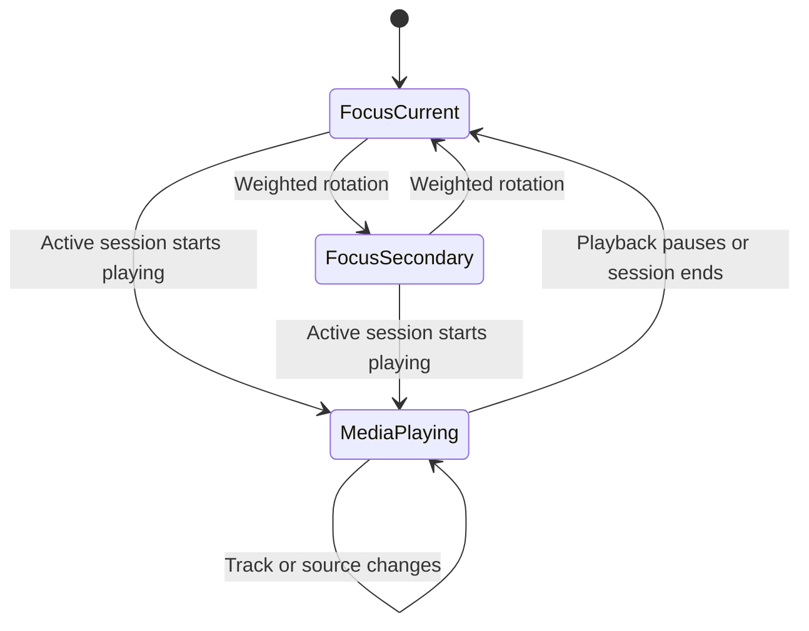
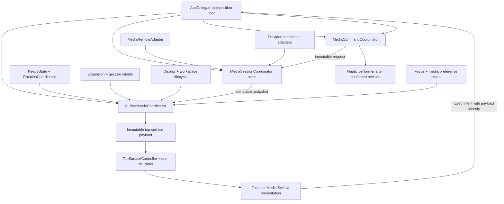
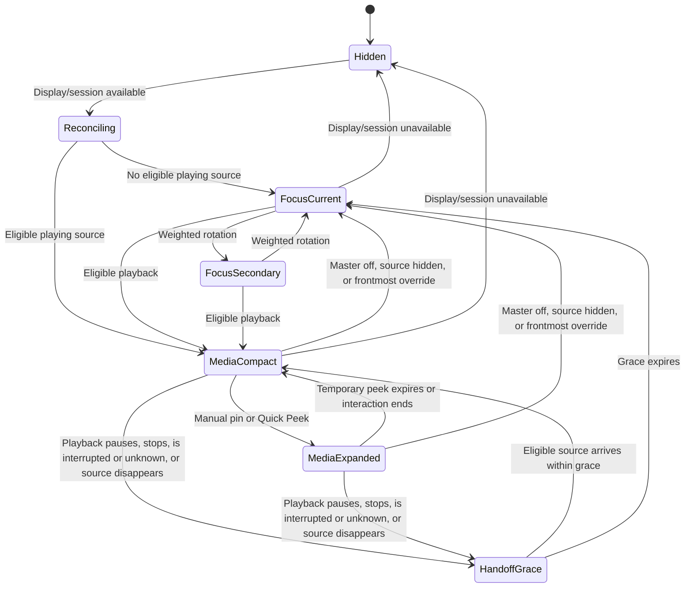
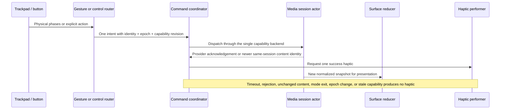
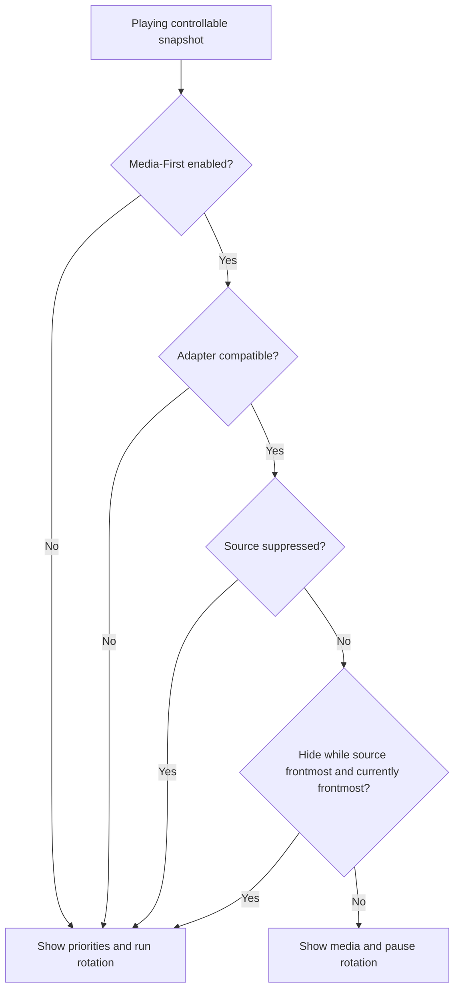

# Keep3 Music and Multimedia - Plan

## Goal Capsule

- **Objective:** Ship Keep3 Visual System 2.0 as the shared surface foundation, then add an Alcove-parity media mode that owns that surface during active playback and returns it to the designated focus when playback stops.
- **Product authority:** This file owns media behavior; `docs/plans/2026-07-25-001-feat-keep3-visual-system-plan.md` owns the visual language, settings shell, and accessibility motion fallback.
- **Implementation authority:** The Planning Contract and U1–U8 define the combined delivery order without weakening either Product Contract. U3 is an independently releasable visual checkpoint; U4 is the media release gate.
- **Execution:** Code, with deterministic state/adapter tests before UI integration and signed runtime compatibility proof before MediaRemote-dependent work proceeds.
- **Stop condition:** Stop media implementation if the required MediaRemote symbol set cannot load atomically, a supported OS cannot cleanly disable the adapter, or the direct notarized build cannot be validated; visual/focus work remains independently shippable.
- **Tail ownership:** The active shipping workflow owns simplification, review, release verification, commit, PR, and CI follow-through.

---

## Product Contract

### Summary

Keep3 will add a Media-First Mode for active system playback, with media metadata, artwork, progress, controls, gestures, haptics, Quick Peek, and Alcove-parity media customization.
Like Alcove, it will use an isolated MediaRemote integration for system-wide sessions and public Apple Events or ScriptingBridge integrations for richer provider-specific actions.
Playing media temporarily owns the top surface; pausing or ending playback returns Keep3 to the designated current focus.

### Problem Frame

Controlling media currently requires the source application or a separate system surface, breaking the visual continuity the user wants at the top of the display.
Alcove demonstrates that media metadata, physical-feeling gestures, and responsive transitions can make this frequent interaction feel native and enjoyable.
Keep3's MVP deliberately excluded music and general notch utilities, so this work needs a narrow media exception that does not turn the product into a general HUD toolbox.

### Key Decisions

- **Media owns the surface while playing.** (session-settled: user-directed — chosen over simultaneous focus-and-media layouts: the top surface should retain one clear visual protagonist.) Governs R1–R6.
- **Align with Alcove's media capability, not a minimal controller.** (session-settled: user-directed — chosen over a play-pause-only first version: media mode must include the interaction and customization depth that makes Alcove compelling.) Governs R7–R12, R24–R27.
- **Use two-finger vertical track switching with success-only haptics.** (session-settled: user-directed — chosen over button-only control: track changes should have direct physical feedback.) Governs R13–R17.
- **Preserve the three-priority state during media mode.** (session-settled: user-approved — chosen over continuing hidden priority rotation: returning to the designated focus prevents a stale secondary item from appearing.) Governs R3–R5.
- **Follow Alcove's hybrid media-integration strategy.** (session-settled: user-directed — chosen over public-API-only coverage or reduced provider support: Alcove-equivalent source coverage is authoritative, so Keep3 may use private MediaRemote behind an isolated adapter and public Apple Events or ScriptingBridge where richer source-specific actions are needed.) Governs R18–R23.

<!-- ce-section: work-relationships -->
### How This Work Fits Together

This plan owns media behavior, media controls, media gestures, and media settings.
The broader breakdown is the current understanding and may be revised by later plans.

- **Keep3 Visual System 2.0**
  - **Enables:** The living black shape, signature transition, settings shell, and accessibility motion fallback used by media mode.
  - **Authority:** `docs/plans/2026-07-25-001-feat-keep3-visual-system-plan.md`.
  - **Extended by:** Media-only artwork, waveform, and content-derived color inside the established black container.
- **Three-priority focus experience**
  - **Can proceed independently of:** Media metadata and playback controls.
  - **Shares:** The same top-surface location and gesture input.
  - **Protected by:** Media mode may pause presentation but must not mutate priority content, ordering, or designated focus.

### Actors

- A1. The user listens to media while working and controls it from the top surface.
- A2. The active media source publishes playback state, metadata, artwork, progress, and supported actions.
- A3. The MediaRemote-backed integration identifies the system-active media session and reports which controls are available.

### Requirements

**Mode arbitration and lifecycle**

- R1. Keep3 must enter Media-First Mode when the media-integration layer reports a controllable system session in the playing state.
- R2. Media-First Mode must replace priority content rather than combine media and priorities in the same compact or expanded layout.
- R3. Entering Media-First Mode must pause priority rotation without changing priority content, order, or designated current focus.
- R4. Pausing playback or ending the active media session must return the surface to the designated current focus within one signature transition.
- R5. Returning to priorities must restart the current-focus display duration rather than resume a hidden secondary-item timer.
- R6. A track or active-source change during playback must update Media-First Mode without flashing priority content between media states.



**Media presentation and controls**

- R7. Compact media presentation must show available artwork, title, artist, and a configurable waveform without becoming taller than the approved compact visual envelope.
- R8. Expanded media presentation must show artwork, title, artist, playback position, duration, and the supported primary controls.
- R9. Primary controls must include previous, play or pause, and next whenever the active source reports those actions as available.
- R10. The progress surface must support seeking when the active source reports seek capability and must remain read-only otherwise.
- R11. Configurable secondary actions must support Favorite, Shuffle, Repeat, Repeat One, and Copy Source when the active source exposes the corresponding capability. Copy Source must be an explicit, write-only user action that copies only a canonical public HTTPS share URL supplied by the media-integration layer; Keep3 must never read existing clipboard contents, must reject credentials and local or non-public URI schemes, and must hide the action when no compliant URL is available.
- R12. A track or metadata change must briefly expand the media surface to show the new metadata, then return to compact media after a two-second Quick Peek that can be disabled or adjusted from one to five seconds.

**Gestures and haptic feedback**

- R13. In Media-First Mode, a completed two-finger upward gesture must request the next track and a completed downward gesture must request the previous track.
- R14. One gesture must request at most one track change, even when the input contains momentum or repeated scroll deltas.
- R15. Keep3 must provide one haptic response only after the active source confirms that the requested track change succeeded.
- R16. An unavailable, rejected, or unchanged track request must not produce success haptics. Every primary, secondary, seek, and gesture action must be bound to the immutable identity and advertised capability snapshot of the session visible when the user acts; if the active session changes, Keep3 must cancel pending dispatch or ignore its confirmation, and success may be accepted only from that same session.
- R17. Outside Media-First Mode, the existing gesture semantics for browsing priority items must remain unchanged.

**Source coverage and graceful degradation**

- R18. Keep3 must follow the system-selected active media source reported by MediaRemote and must not require the user to choose a source for ordinary playback.
- R19. Required coverage is Apple Music, Spotify, NetEase Cloud Music, browser media, and other sources that publish a controllable macOS Now Playing session.
- R20. When the active source omits artwork, progress, seeking, or a secondary action, the layout must collapse cleanly and must not show a dead control. All source metadata and artwork must be treated as untrusted: metadata must render only as bounded, non-executable text; artwork must be validated and resource-bounded image data delivered by the integration layer; Keep3 must never dereference a source-supplied artwork URL directly and must omit rejected content without disrupting media controls.
- R21. When multiple sources compete, Keep3 must follow the active source selected by MediaRemote and update without exposing a source-selection UI.
- R22. Keep3 must not create a listening history, media library, recommendation profile, media account, or analytics record.
- R23. MediaRemote is the sole approved private-framework exception and must be isolated behind a replaceable adapter. Provider-specific enhancements should use public Apple Events or ScriptingBridge integrations where available; private symbols must not escape the adapter, and an unavailable or incompatible adapter must disable media mode cleanly rather than fall back to screen capture, Accessibility scraping, provider credentials, or another private framework.

**Media settings**

- R24. The settings sidebar defined by the visual-system plan must add a Media category without changing the category structure owned by that plan.
- R25. Media appearance settings must include Monochrome, Colored, and Gradient artwork treatments, live waveform, compact waveform visibility, artwork flip, and media-title extras.
- R26. Media behavior settings must include a master Media-First Mode switch, Quick Peek on media change, Quick Peek duration, and hiding media mode while the source application is frontmost. The master switch must default on; while it is off, active playback must never replace priority content or pause priority rotation.
- R27. Media controls settings must let the user choose which supported secondary actions appear without allowing unsupported actions to remain visible.
- R28. Media-specific color and artwork must remain inside Media-First Mode and must not alter the resting priority surface.

### Key Flows

- F1. Playback takes over
  - **Trigger:** A supported source begins playing.
  - **Actors:** A1, A2, A3.
  - **Steps:** Priority rotation pauses, the signature transition introduces media content, and Media-First Mode settles with available metadata and controls.
  - **Outcome:** Media becomes the only top-surface protagonist while the priority state remains intact.
  - **Covers:** R1–R3, R6–R9.
- F2. Gesture changes track
  - **Trigger:** A1 completes a two-finger upward or downward gesture in Media-First Mode.
  - **Actors:** A1, A2.
  - **Steps:** Keep3 resolves one direction, requests one track change, waits for source confirmation, updates media content, and emits haptics only after success.
  - **Outcome:** Track switching feels physical and never acknowledges a failed action.
  - **Covers:** R13–R16.
- F3. Playback gives focus back
  - **Trigger:** Playback pauses or the active session ends.
  - **Actors:** A2, A3.
  - **Steps:** Media controls disappear through the signature transition, the designated current focus returns, and its display duration restarts.
  - **Outcome:** The focus experience resumes without showing a stale secondary item.
  - **Covers:** R3–R5.
- F4. Capability-aware expansion
  - **Trigger:** A1 intentionally expands Media-First Mode.
  - **Actors:** A1, A2.
  - **Steps:** Keep3 reveals metadata, progress, and only the actions supported by the active source.
  - **Outcome:** The expanded surface remains complete even when providers expose different capabilities.
  - **Covers:** R8–R11, R20, R27.

### Acceptance Examples

- AE1. Playing media takes priority
  - **Covers R1–R3.**
  - **Given:** A secondary priority is visible and a supported media source is paused.
  - **When:** The source begins playing.
  - **Then:** Media replaces the secondary priority through the signature transition and the designated focus remains unchanged.
- AE2. Pause returns to the designated focus
  - **Covers R4, R5.**
  - **Given:** Media is playing while the second priority would otherwise be due to rotate.
  - **When:** Playback pauses.
  - **Then:** The designated current focus returns within one signature transition and receives a fresh current-focus duration.
- AE3. Successful upward gesture advances once
  - **Covers R13–R15.**
  - **Given:** The active source supports Next and Media-First Mode is visible.
  - **When:** The user completes one upward two-finger gesture with momentum.
  - **Then:** Exactly one next-track request succeeds, the new track appears, and one success haptic occurs.
- AE4. Failed track request stays quiet
  - **Covers R15, R16, R20.**
  - **Given:** The active source does not support Previous.
  - **When:** The user completes a downward two-finger gesture.
  - **Then:** The track does not change, no success haptic occurs, and no unusable Previous control is shown.
- AE5. Missing metadata collapses cleanly
  - **Covers R7–R10, R20.**
  - **Given:** A browser media session exposes title and play-pause but no artwork, duration, or seeking.
  - **When:** Keep3 enters Media-First Mode.
  - **Then:** Title and play-pause remain usable while artwork, duration, seek affordance, and empty gaps are absent.
- AE6. Source handoff does not expose priorities
  - **Covers R6, R18, R21.**
  - **Given:** One source is playing and macOS promotes another source to active playback.
  - **When:** The active source changes.
  - **Then:** Media content transitions directly to the new source without showing a priority between them.
- AE7. Track change uses Quick Peek
  - **Covers R12, R25, R26.**
  - **Given:** Quick Peek is enabled at its default duration and compact media is visible.
  - **When:** The active track metadata changes.
  - **Then:** The media surface briefly expands with the new metadata and returns to compact media after two seconds.
- AE8. Focus gesture semantics return
  - **Covers R4, R17.**
  - **Given:** Media has paused and the designated current focus is visible.
  - **When:** The user performs the existing priority-browsing gesture.
  - **Then:** Keep3 browses priorities and does not issue a media command.

### Success Criteria

- Apple Music, Spotify, NetEase Cloud Music, and browser media each pass the playback-start, metadata-update, primary-control, pause-return, and graceful-degradation scenarios available to that source.
- Repeated gesture testing produces no multi-track skips from one gesture and no success haptic for an unconfirmed action.
- Media takeover and return never mutate the three priorities or expose a hidden secondary item.
- The user can complete play or pause and next or previous actions without opening the source application.
- Media mode remains a bounded playback companion and does not introduce general HUD, library, history, account, or recommendation behavior.
- Apple Music, Spotify, NetEase Cloud Music, and browser playback all meet the shared takeover, metadata, transport, and return baseline; across the signed source matrix, seeking and every R11 secondary action are exercised at least once before media is declared complete.

### Scope Boundaries

**Included**

- Active-media detection, metadata, artwork, progress, primary and supported secondary controls, seeking, media Quick Peek, waveform and artwork treatments, two-finger track gestures, haptic confirmation, source handoff, and media settings.

**Deferred for later**

- Queue display and editing.
- Manual source selection when several media applications are active.
- Provider-specific sign-in or account features.

**Outside this product's identity**

- Media search, recommendations, listening history, playlists, library management, and social features.
- Alcove-style battery, connectivity, focus-mode, display, sound, calendar, lock-screen, file-tray, and general notification HUDs.
- Screen-audio capture, Accessibility scraping, provider-account access, or any private framework other than the approved MediaRemote adapter as a fallback for unavailable metadata.

### Dependencies and Assumptions

- `docs/plans/2026-07-25-001-feat-keep3-visual-system-plan.md` owns the container shape, signature transition, settings shell, and accessibility motion behavior.
- The repository currently has no media playback, metadata, album-art, or media-framework integration.
- The existing top surface already receives vertical wheel and horizontal swipe input for priority browsing; Media-First Mode must arbitrate those gestures by visible mode.
- Media-source capabilities vary, so parity means matching Alcove's media behavior when a source exposes the necessary action and degrading per R20 otherwise.
- The current non-activating panel contract remains authoritative during media interaction.
- The media-specific MediaRemote exception supersedes the MVP prohibition on private frameworks only for the isolated adapter defined by R23; the documented-API boundary remains authoritative everywhere else.
- Local inspection of Alcove 1.7.7 confirmed that its main app and helper link Apple's private MediaRemote framework, while Apple Events and ScriptingBridge provide source-specific integrations.

### Outstanding Questions

**Resolved during planning**

- KTD4 and U4 define the atomic MediaRemote compatibility gate, required symbol groups, supported-OS matrix, and clean-disable behavior.
- KTD6 and KTD7 define same-session state-change confirmation before haptic feedback.
- KTD5 defines active-source arbitration without routine manual source selection.

**Deferred to implementation**

- U4 records exact per-OS symbol and callback compatibility plus the provider capability matrix because those results require signed runtime execution. A failed mandatory-core compatibility row disables media atomically; an optional-group failure is recorded in the matrix and omits only its corresponding capability. Neither outcome changes the Product Contract.

### Sources and Research

- `docs/ideas/keep3.md` — original product identity and the explicit decision to exclude music from the MVP.
- `docs/specs/keep3-mvp.md` — current gesture behavior, non-activating panel contract, privacy boundary, and prohibition on private frameworks.
- `docs/research/apple-platform-api-notes.md` — existing Apple platform research and documented-API policy.
- `Keep3/Overlay/TopSurfacePanel.swift` — current wheel and swipe input path.
- `docs/plans/2026-07-25-001-feat-keep3-visual-system-plan.md` — visual and settings authority for this media mode.
- [Alcove](https://tryalcove.com/) and the locally installed Alcove 1.7.7 media settings — feature-parity reference for Now Playing, Quick Peek, waveform, artwork, gestures, and media customization.
- Local Alcove 1.7.7 binary inspection — direct evidence of the private MediaRemote framework in the main app and helper, MediaRemote command symbols in the helper, and Apple Events/ScriptingBridge source integrations.
- [Apple MediaPlayer](https://developer.apple.com/documentation/mediaplayer/) — public API boundary for publishing and handling an application's own media session.

---

## Planning Contract

### Product Contract preservation

Product Contract unchanged.
The visual-system Product Contract remains authoritative for visual R1–R17, F1–F3, and AE1–AE6; U1–U3 cite those IDs with the `visual` prefix to keep the two namespaces unambiguous.

### Key Technical Decisions

- KTD1. **Use one discriminated top-surface payload and one mode coordinator.** `TopSurfaceContent` is currently focus-only, so focus and media will become immutable payload variants selected by a single main-actor reducer. `AppDelegate` owns the mode, session, and command coordinators; views emit typed intents carrying their rendered payload identity and never retain an actor or coordinator. The existing rotation, interaction, lifecycle, and controller objects remain collaborators rather than presentation owners. Governs media R1–R6 and visual R1–R6.
- KTD2. **Retarget to the latest desired state and reject stale completions.** The coordinator tracks desired state, rendered state, transition phase, and a monotonically increasing generation. Display unavailability hides immediately; media eligibility preempts focus rotation; manual expansion pins over Quick Peek; same-mode updates coalesce to the newest payload at the next transition boundary. This prevents queued stale animations and priority flashes. Governs media R1–R6, R12 and visual R3–R6.
- KTD3. **Encode the signature transition as resolved visual tokens, not a user preference.** Use one approximately 760-millisecond shape-and-content handoff within the visual Product Contract's envelope; resting content has no repeat animation. Reduce Motion resolves every spatial/shape transition to a 120-millisecond crossfade, while Reduce Transparency, increased contrast, and differentiate-without-color resolve at render time. Governs visual R2–R7, R11, R14, R16.
- KTD4. **Runtime-resolve the sole private framework behind a tiered compatibility gate.** (session-settled: user-directed — chosen over public-API-only coverage or reduced provider support: Alcove-equivalent cross-application control requires MediaRemote.) A mandatory core group covers discovery, notifications, client identity, metadata, baseline capabilities, and transport dispatch; any missing core symbol disables media. Seek, repeat, shuffle, and other optional groups resolve independently and disappear as capabilities when absent. No private type crosses the adapter. Governs R18–R23.
- KTD5. **Keep eligibility and handoff policy on the main actor.** The session actor owns adapter health, MediaRemote's active client, normalization, provider enrichment, capabilities, and command dispatch. The surface reducer alone combines immutable snapshots with the master switch, suppression list, frontmost preference, display availability, rotation ownership, and 500-millisecond handoff grace. The last media payload remains visible with disabled controls during grace so direct handoff never flashes priorities. Governs R1–R6, R18–R23, R26.
- KTD6. **Version independent media facts independently.** A normalized snapshot carries stable session identity, adapter-subscription epoch, capability revision, content revision, and a timestamped progress sample. Commands bind to session identity, epoch, and capability revision; signature transitions react to content revision; progress interpolation changes none of them. Provider data may enrich only the exact MediaRemote-selected provider identity, and each capability names one internal dispatch backend. Governs R6, R9–R11, R16, R18–R21.
- KTD7. **Recognize physical gesture phases and confirm media state before haptics.** (session-settled: user-directed — chosen over button-only media control: vertical two-finger gestures with physical feedback are part of the approved media interaction.) The recognizer preserves both axes, ignores momentum, emits at most one command at physical gesture end, and serializes one pending track command per session. Provider acknowledgement is preferred; otherwise a same-session content-identity change within two seconds confirms success before requesting AppKit's best available haptic performer, independent of rendering. Governs R13–R17.
- KTD8. **Make provider enrichment explicit, nonessential, and subordinate to MediaRemote identity.** MediaRemote supplies automatic baseline takeover and owns active-session lifecycle. Apple Events or ScriptingBridge run only after a user-initiated enable action and permission preflight; exact provider identity must match the current session, each enriched capability has one backend owner, and denial, mismatch, revocation, missing scripting support, or timeout retracts only provider-owned capabilities. Apple Events dispatch is restricted to a compile-time registry that maps supported signed bundle identifiers to fixed capability-scoped commands; unknown identities are rejected, and no target, command, or script is derived from MediaRemote metadata. Governs R11, R18–R23.
- KTD9. **Treat media visuals as bounded local rendering.** Artwork is decoded from adapter-delivered data through ImageIO with byte, pixel, frame-count, and thumbnail bounds; source URLs are never fetched. The live waveform is a deterministic playback-reactive visual, not audio capture, and stops animating when media is not playing or the surface is hidden. Reduce Motion resolves it to a stable, non-animated level pattern while retaining playback and progress information. Governs R7, R20, R22, R25, R28 and visual R17.
- KTD10. **Separate preference stores and callbacks by domain.** `AppPreferences` remains the focus/visual store; a sibling media store owns media defaults, suppression identities, and permission posture. Focus callbacks may re-resolve surface geometry and rotation, while media callbacks may recompute eligibility or presentation without resetting priority state. Unknown stored enum values fall back safely and every numeric value is clamped on read and write. Governs R24–R28 and visual R8–R14.
- KTD11. **Keep the undocumented ABI out of the focus process.** A bundled, versioned XPC media service owns `dlopen`/`dlsym`, MediaRemote callbacks, and private command calls; the app sees only bounded normalized value messages and can invalidate, back off, or relaunch the service after interruption. Service crash or protocol mismatch disables media for that availability epoch and never terminates, blocks, or mutates the focus product. Governs R18–R23.

### Assumptions

These are non-blocking defaults selected for this headless delivery and remain visible for later product review.

- ASM1. Distribution is a Developer ID signed, hardened, notarized direct download like Alcove; Mac App Store distribution is excluded because MediaRemote is private.
- ASM2. Keep3 retains its macOS 14.0 deployment target. Media is enabled only on OS/build combinations that pass U4; unsupported combinations show an unavailable explanation in Media Settings and preserve focus behavior.
- ASM3. When frontmost-source hiding is enabled, its specific preference overrides media takeover: the designated focus returns, priority rotation resumes, and media can retake the surface when the source is no longer frontmost.
- ASM4. Paused, stopped, interrupted, unknown, and lost sessions enter a 500-millisecond handoff grace, then return to the newest designated focus. Controls are disabled during grace.
- ASM5. The existing hover/click expansion preference applies to both payloads. Quick Peek is temporary; completed hover delay, click expansion, keyboard entry, or control interaction pins media expansion until the existing dismissal rule or a mode/session boundary.
- ASM6. Unwanted-source recovery is application-wide because MediaRemote does not promise a stable browser-tab identity. The surface identifies the source application and offers an accessible hide action backed by a reversible, bounded bundle-ID list.
- ASM7. Media controls remain labeled native buttons with accessibility values and capability-filtered custom actions. Previous/next buttons and keyboard navigation are the non-gesture alternative, and explicit keyboard mode restores the previously frontmost application when it ends.
- ASM8. Provider enrichment is off until the user enables it in Media Settings. Permission denial is remembered without repeated prompts and includes a route to the relevant System Settings pane.
- ASM9. Default media preferences are Media-First on, Quick Peek on at two seconds, frontmost hiding off, monochrome artwork, live and compact waveform on, artwork flip and title extras off, no optional secondary actions, and no suppressed sources.

### High-Level Technical Design

The diagrams are authoritative for ownership and ordering; prose and KTDs govern if a label is abbreviated.









### Lifecycle ownership

| Event | Surface reducer | Session actor | Pending interaction |
|---|---|---|---|
| Display geometry or Space change | Re-layout the current payload without changing mode | Keep the current subscription epoch | Preserve valid interaction; cancel only geometry-invalid hit state |
| Screen sleep or user session resignation | Hide and end the current availability generation | Stop observation idempotently and invalidate the subscription epoch | Cancel transition, Quick Peek, gesture, command, and Automation work |
| Wake or user session activation | Stay hidden for reconciliation grace | Start a new subscription epoch and request a fresh snapshot | Accept work only after the new epoch becomes current |
| Source handoff | Retain disabled media during grace, then select successor or focus | Replace active identity and retract mismatched provider enrichment | Cancel manual pin and commands bound to the old session |
| Application termination | Permanently close presentation | Permanently close adapters and reject later callbacks | Cancel all timers and never restore the prior application afterward |

### Output Structure

```text
Keep3/
  Media/
    MediaSession.swift
    MediaSessionProviding.swift
    MediaRemoteAdapter.swift
    MediaRemoteSymbols.swift
    MediaCompatibilityReport.swift
    MediaSessionCoordinator.swift
    MediaCommandCoordinator.swift
    MediaGestureRecognizer.swift
    MediaArtworkDecoder.swift
    MediaHapticFeedback.swift
    ProviderEnrichmentService.swift
    MediaRemoteServiceProtocol.swift
  Overlay/
    SurfaceModeCoordinator.swift
    SignatureSurfaceTransition.swift
    TopSurfacePresentation.swift
  Features/Settings/
    SettingsSidebarView.swift
    FocusSurfaceSettingsView.swift
    MediaSettingsView.swift
    SurfacePreview.swift
  Persistence/
    MediaPreferences.swift
Keep3MediaService/
  MediaRemoteService.swift
  main.swift
Keep3Tests/
  Media/
  Overlay/
  Persistence/
docs/verification/
  keep3-media-compatibility.md
  keep3-visual-media.md
```

### Sources and Research

- `Keep3/App/Keep3App.swift`, `Keep3/Overlay/TopSurfaceInteractionModel.swift`, and `Keep3/Overlay/RotationCoordinator.swift` establish the composition root, injected timer seams, and existing pause/reset behavior reused by KTD1–KTD2.
- `Keep3/Overlay/TopSurfacePanel.swift` establishes the nonactivating panel, phase-aware event boundary, and explicit keyboard-navigation mode extended by KTD7.
- `Keep3/Persistence/AppPreferences.swift` and its tests establish bounded UserDefaults persistence for KTD10.
- `/Applications/Alcove.app` 1.7.7 locally links MediaRemote and ScriptingBridge; its helper imports client discovery, per-client metadata and command capability queries, command dispatch, seeking, repeat, shuffle, and notification symbols.
- The local macOS 15.7 MediaRemote framework declares no public SDK headers and an internal 15.7 build minimum, making runtime resolution and the U4 compatibility matrix load-bearing.
- [Apple Developer Program License Agreement](https://developer.apple.com/support/terms/apple-developer-program-license-agreement/) limits App Store submissions to documented APIs, shaping ASM1.
- [NSEvent](https://developer.apple.com/documentation/appkit/nsevent), [NSHapticFeedbackManager](https://developer.apple.com/documentation/appkit/nshapticfeedbackmanager), [NSWorkspace](https://developer.apple.com/documentation/appkit/nsworkspace), [Scripting Bridge](https://developer.apple.com/documentation/scriptingbridge), [Apple Events entitlement](https://developer.apple.com/documentation/bundleresources/entitlements/com.apple.security.automation.apple-events), and [CGImageSource](https://developer.apple.com/documentation/imageio/cgimagesource) constrain KTD5–KTD9.
- No institutional learning corpus exists under `docs/solutions/`; this delivery should capture the private-adapter compatibility and confirmation findings after implementation.

---

## Implementation Units

### U1. Establish the authoritative surface payload and transition arbiter

- **Goal:** Give focus, media, expansion, lifecycle, and animation one deterministic presentation owner before either UI is expanded.
- **Requirements:** Media R1–R6, R16; visual R1–R6, R15; media F1, F3; visual F1, F2; KTD1–KTD2; ASM2–ASM5.
- **Dependencies:** None.
- **Files:**
  - Create `Keep3/Overlay/TopSurfacePresentation.swift`
  - Create `Keep3/Overlay/SurfaceModeCoordinator.swift`
  - Modify `Keep3/Overlay/TopSurfaceContent.swift`
  - Modify `Keep3/Overlay/TopSurfaceInteractionModel.swift`
  - Modify `Keep3/Overlay/RotationCoordinator.swift`
  - Modify `Keep3/App/Keep3App.swift`
  - Modify `Keep3.xcodeproj/project.pbxproj`
  - Create `Keep3Tests/Overlay/SurfaceModeCoordinatorTests.swift`
  - Modify `Keep3Tests/Overlay/TopSurfaceInteractionTests.swift`
- **Approach:**
  1. Replace the focus-only presentation state with immutable focus and media payload variants plus expansion reason and presentation revision.
  2. Add a main-actor reducer that derives desired mode from lifecycle availability, preferences, media eligibility, user interaction, and the preserved focus state.
  3. Route rotation callbacks, model edits, settings changes, display refresh, and media snapshots through the reducer; only it may call the top-surface controller.
  4. Carry a generation token through scheduled transitions, grace timers, expansion timers, and callbacks so stale work is ignored.
  5. Update hidden priority state and schedule while media owns the surface without emitting focus presentation or advancing a hidden timer.
- **Patterns to follow:** Injected schedulers in `TopSurfaceInteractionModel` and `RotationCoordinator`; unavailable-reason reconciliation in `DisplayLifecycleCoordinator`; value semantics in `TopSurfaceContent`.
- **Test scenarios:**
  1. Covers media AE1. Given a secondary focus is rendered, when an eligible media snapshot arrives during its handoff, the reducer publishes media directly and preserves the designated focus.
  2. Covers media AE2. Given media owns the surface and a hidden priority edit changes the designated focus, when media exits, the newest designated focus appears with a fresh duration.
  3. Covers visual AE3. Given a visible title changes without changing its item ID, the presentation revision advances once and the signature handoff is selected.
  4. Given rotation, edit, and expansion intents arrive during one transition, only the latest allowed payload commits and stale generation completions do nothing.
  5. Given display deactivation, all timers and pending generations are cancelled; activation remains hidden until fresh reconciliation chooses media or focus.
  6. Given zero priorities and eligible media, media remains visible; when that media exits, the surface hides cleanly.
- **Verification:** Reducer tests prove every state transition without AppKit, and no collaborator can publish directly to `TopSurfaceController`.

### U2. Implement Visual System 2.0 on the shared surface

- **Goal:** Replace the MVP's generic capsule and motion presets with the approved living black shape, focus semantics, and one accessible signature transition.
- **Requirements:** Visual R1–R7, R15–R17, F1–F2, AE1–AE4, AE6; KTD2–KTD3.
- **Dependencies:** U1.
- **Files:**
  - Create `Keep3/Overlay/SignatureSurfaceTransition.swift`
  - Modify `Keep3/Overlay/TopSurfaceView.swift`
  - Modify `Keep3/Overlay/TopSurfaceContent.swift`
  - Modify `Keep3/Overlay/DisplayGeometry.swift`
  - Modify `Keep3/Overlay/TopSurfaceController.swift`
  - Modify `Keep3/Overlay/TopSurfacePanel.swift`
  - Modify `Keep3.xcodeproj/project.pbxproj`
  - Create `Keep3Tests/Overlay/SignatureSurfaceTransitionTests.swift`
  - Modify `Keep3Tests/Overlay/DisplayGeometryTests.swift`
  - Modify `Keep3Tests/Overlay/TopSurfacePanelTests.swift`
- **Approach:**
  1. Resolve shape geometry, typography, marker, blur, arrival, and settle tokens through one transition descriptor shared by compact/expanded and notch/floating styles.
  2. Replace `scope`, `circle`, and fraction semantics with a filled current-focus lozenge or outlined secondary ordinal while retaining an accessible textual distinction.
  3. Make shape and title retarget from their current visual values rather than queueing independent SwiftUI transitions.
  4. Keep the fixed panel canvas and active hit frame; extend existing `SurfaceMetrics` instead of creating another window.
  5. Resolve Reduce Motion, Reduce Transparency, increased contrast, and differentiate-without-color live, with no autonomous idle animation.
- **Patterns to follow:** `TopSurfaceShape` animatable geometry; `ResolvedSurfaceAppearance`; `DisplayGeometry` fixed-canvas layout; existing labeled native controls.
- **Test scenarios:**
  1. Covers visual AE1. Given the compact surface has settled, advancing a test clock for 60 seconds produces no animation or presentation revision.
  2. Covers visual AE2. A secondary focus completes one handoff within 650–850 milliseconds and keeps an outlined `2` or `3` marker.
  3. Covers visual AE4. Reduce Motion selects a crossfade no longer than 150 milliseconds with no shape or positional movement.
  4. Covers visual AE6. Notched and floating layouts resolve different geometry but identical semantic tokens, markers, and motion phases.
  5. Increased contrast and differentiate-without-color retain current/secondary meaning without depending on color.
  6. Passive hover and scroll do not make the panel key or activate Keep3.
- **Verification:** Unit tests prove token resolution and geometry; physical review captures resting, switching, expanded, light/dark, contrast, reduced-motion, and reduced-transparency states on notched and non-notched layouts.

### U3. Replace Settings with the Alcove-inspired Keep3 shell and live preview

- **Goal:** Deliver the visual Product Contract's sidebar/card settings structure without copying Alcove branding and without retaining obsolete motion choices.
- **Requirements:** Visual R8–R14, F3, AE5; media R24; KTD3, KTD10.
- **Dependencies:** U2.
- **Files:**
  - Create `Keep3/Features/Settings/SettingsSidebarView.swift`
  - Create `Keep3/Features/Settings/FocusSurfaceSettingsView.swift`
  - Create `Keep3/Features/Settings/SurfacePreview.swift`
  - Modify `Keep3/Features/Settings/SettingsView.swift`
  - Modify `Keep3/App/RootView.swift`
  - Modify `Keep3/Persistence/AppPreferences.swift`
  - Modify `Keep3.xcodeproj/project.pbxproj`
  - Modify `Keep3Tests/Persistence/AppPreferencesTests.swift`
  - Modify `Keep3UITests/Keep3UITests.swift`
- **Approach:**
  1. Build persistent General, Focus Surface, Rotation, Interaction, Accessibility, and Media categories with a scrollable card content region.
  2. Remove motion-preset and speed UI while accepting old stored keys without using them.
  3. Keep bounded width and opacity settings and show system accessibility overrides beside the live preview.
  4. Drive the preview from the same resolved appearance and payload values as the running surface.
  5. Add the Media category as the explicit extension point authorized by media R24; its full content lands in U6.
- **Patterns to follow:** `AppPreferences` private setters and clamp-on-read behavior; stable identifiers in `SettingsView`; UI-test defaults-suite isolation.
- **Test scenarios:**
  1. Covers visual AE5. Changing capsule width or opacity updates preview and running-surface preference output immediately within safe bounds.
  2. Old persisted motion preset and speed values neither crash nor restore removed controls.
  3. Every sidebar category is keyboard and VoiceOver reachable, keeps selection while content scrolls, and has a stable automation identifier.
  4. Media appears as a first-class category without changing the ordering or purpose of the visual plan's existing categories.
  5. System Reduce Motion or Reduce Transparency overrides the preview at render time without overwriting stored choices.
- **Verification:** Preference tests cover migration and clamping; UI tests navigate every category and exercise the preview-backed controls.

### U4. Prove and isolate the MediaRemote compatibility boundary

- **Goal:** Establish a replaceable MediaRemote adapter with a mandatory core gate, optional capability groups, and a normalized session contract before media UI depends on private behavior.
- **Requirements:** R18–R23, AE5–AE6; KTD4, KTD6, KTD11; ASM1–ASM2.
- **Dependencies:** U1.
- **Files:**
  - Create `Keep3/Media/MediaSession.swift`
  - Create `Keep3/Media/MediaSessionProviding.swift`
  - Create `Keep3/Media/MediaRemoteSymbols.swift`
  - Create `Keep3/Media/MediaRemoteAdapter.swift`
  - Create `Keep3/Media/MediaCompatibilityReport.swift`
  - Create `Keep3/Media/MediaRemoteServiceProtocol.swift`
  - Create `Keep3MediaService/MediaRemoteService.swift`
  - Create `Keep3MediaService/main.swift`
  - Modify `Keep3.xcodeproj/project.pbxproj`
  - Create `Keep3Tests/Media/MediaRemoteSymbolsTests.swift`
  - Create `Keep3Tests/Media/MediaSessionNormalizationTests.swift`
  - Create `docs/verification/keep3-media-compatibility.md`
- **Execution note:** Treat this as a signed runtime spike and release gate. Do not begin MediaRemote-dependent UI integration until the current host resolves the mandatory core, reports every optional group, emits stable snapshots, and proves clean disable.
- **Approach:**
  1. Define a public-to-Keep3 protocol using only normalized Swift values and explicit unavailable/error states.
  2. Add a bundled XPC media-service target with one versioned, bounded property-list-safe message contract; keep service lifecycle, interruption handling, and restart backoff outside the presentation reducer.
  3. Dynamically load MediaRemote inside that service and resolve the minimal symbol groups named by KTD4 without a static import, SDK header, or private type crossing the process boundary.
  4. Convert service messages on a dedicated app actor into immutable snapshots with separate session identity, subscription epoch, capability revision, content revision, and timestamped progress.
  5. Make mandatory-core startup all-or-nothing and idempotent; optional seek/repeat/shuffle groups retract only their capabilities when unavailable. A helper crash, malformed message, or protocol mismatch ends the current epoch and disables media without terminating the app.
  6. Record architecture, OS build, resolved groups, subscription behavior, clean-disable result, helper-crash containment, and source capabilities for Apple Music, Spotify, NetEase Cloud Music, Safari, and Chrome.
- **Patterns to follow:** Protocol-backed system services in `LaunchAtLoginService`; injected notification centers in `DisplayLifecycleObserver`; pure value tests in `Keep3Tests`.
- **Test scenarios:**
  1. A fake loader missing one mandatory-core symbol returns unavailable and never registers notifications; a missing optional symbol group preserves baseline media and omits only that capability.
  2. Repeated start/stop calls register and unregister once without callbacks after shutdown.
  3. Out-of-order client callbacks produce only increasing revisions for the current session; a callback queued across the actor/main boundary after `stop()` or an epoch change is discarded.
  4. Oversized text, invalid duration/progress, malformed artwork data, and unknown commands normalize to absent safe fields.
  5. Covers media AE5. A title/play-pause-only source produces a usable snapshot without artwork, duration, seek, or empty capabilities.
  6. The real signed adapter starts or cleanly disables on each release-blocking macOS/architecture row without affecting focus presentation.
  7. Forced helper exit, malformed XPC payload, and protocol-version mismatch invalidate one epoch, produce no late callback, leave focus usable, and respect bounded restart backoff.
- **Verification:** Automated loader/normalization tests pass, and the compatibility document contains an explicit result for every required OS/source capability row before U5–U8 can be declared done.

### U5. Add media lifecycle, source policy, and consented provider enrichment

- **Goal:** Turn normalized snapshots into predictable takeover/return behavior with source recovery, frontmost policy, and optional provider actions.
- **Requirements:** R1–R6, R11, R16, R18–R23, R26; F1, F3; AE1–AE2, AE5–AE6; KTD5–KTD6, KTD8; ASM3–ASM8.
- **Dependencies:** U1, U4.
- **Files:**
  - Create `Keep3/Media/MediaSessionCoordinator.swift`
  - Create `Keep3/Media/ProviderEnrichmentService.swift`
  - Create `Keep3/Media/MediaSourcePolicy.swift`
  - Create `Keep3/Media/WorkspaceApplicationObserver.swift`
  - Create `Keep3/Persistence/MediaPreferences.swift`
  - Create `Keep3/Keep3.entitlements`
  - Modify `Keep3.xcodeproj/project.pbxproj`
  - Create `Keep3Tests/Media/MediaSessionCoordinatorTests.swift`
  - Create `Keep3Tests/Media/MediaSourcePolicyTests.swift`
  - Create `Keep3Tests/Media/WorkspaceApplicationObserverTests.swift`
  - Create `Keep3Tests/Media/ProviderEnrichmentServiceTests.swift`
  - Create `Keep3Tests/Persistence/MediaPreferencesTests.swift`
- **Approach:**
  1. Keep the actor responsible only for adapter health, active-session normalization, provider enrichment, capability ownership, and command dispatch; the main-actor surface reducer computes eligibility.
  2. Implement the 500-millisecond handoff/reconciliation grace and disable controls on the retained payload until a successor arrives or focus returns.
  3. Persist all media defaults, permission posture, and a bounded reversible bundle-ID suppression list in the media preference store; identify every surface payload by source application when available.
  4. Add a user-initiated Automation permission flow, generated-Info.plist usage-description setting, and target hardened-runtime entitlement setting; never prompt during launch or playback.
  5. Dispatch enrichment only through a compile-time provider registry keyed by supported signed bundle identifiers and fixed capability-scoped commands. Reject unknown identities and never derive an Apple Events target, command, or script from metadata.
  6. Merge provider data only for the exact MediaRemote-selected identity, assign each enriched capability one dispatch backend, and retract provider-owned capabilities on denial or mismatch.
  7. Inject workspace notifications and frontmost-application observation behind a deterministic seam rather than polling.
  8. End the current subscription epoch and discard actor-to-main deliveries on sleep/session deactivation; request a fresh snapshot in a new epoch before showing the panel after activation.
- **Patterns to follow:** `DisplayLifecycleCoordinator` reason reconciliation; `AppPreferences` bounded values; injected notification centers in `DisplayLifecycleObserver`; `LaunchAtLoginController` system state as source of truth.
- **Test scenarios:**
  1. Playing, paused, stopped, interrupted, unknown, source-lost, and recovered states select the ASM4 outcome and never leave media stuck.
  2. Covers media AE6. A new eligible source within grace produces media-to-media transition with no focus frame; expiry produces current focus.
  3. Enabling frontmost hiding returns focus and resumes a fresh rotation; leaving the source app retakes media if the captured session is still current.
  4. Suppressing the current stable bundle ID returns focus immediately, survives relaunch, and is reversible; a source without stable identity cannot be persisted.
  5. Denied, revoked, timed-out, missing-scripting, and provider-not-running cases remove enrichment without interrupting MediaRemote baseline.
  6. Frontmost notifications from an injected observer recompute only for the matching immutable session; a raced bundle/session identity is ignored.
  7. Display wake waits for fresh reconciliation; stale pre-sleep snapshots, old-epoch actor deliveries, and permission callbacks cannot restore the panel.
- **Verification:** Pure coordinator/policy/observer tests cover the full lifecycle, and a signed build proves the generated usage description and attached Automation entitlement before demonstrating grant and denial without passive prompts.

### U6. Build the capability-aware media surface and Media Settings

- **Goal:** Deliver compact/expanded media, Quick Peek, safe artwork, waveform, seeking, controls, and the approved customization depth inside the shared black object.
- **Requirements:** R7–R12, R20, R24–R28; F4; AE5, AE7; KTD3, KTD6, KTD9–KTD10; ASM5, ASM8–ASM9.
- **Dependencies:** U2–U5.
- **Files:**
  - Create `Keep3/Media/MediaArtworkDecoder.swift`
  - Create `Keep3/Overlay/MediaSurfaceView.swift`
  - Create `Keep3/Overlay/MediaWaveformView.swift`
  - Create `Keep3/Features/Settings/MediaSettingsView.swift`
  - Modify `Keep3/Overlay/TopSurfaceView.swift`
  - Modify `Keep3/Overlay/TopSurfaceController.swift`
  - Modify `Keep3/Overlay/DisplayGeometry.swift`
  - Modify `Keep3/Persistence/MediaPreferences.swift`
  - Modify `Keep3.xcodeproj/project.pbxproj`
  - Create `Keep3Tests/Media/MediaArtworkDecoderTests.swift`
  - Create `Keep3Tests/Overlay/MediaSurfacePresentationTests.swift`
  - Modify `Keep3Tests/Persistence/MediaPreferencesTests.swift`
  - Modify `Keep3Tests/Overlay/DisplayGeometryTests.swift`
- **Approach:**
  1. Render compact and expanded variants from the immutable capability snapshot and omit unsupported regions entirely.
  2. Keep artwork, content-derived monochrome/colored/gradient treatments, and waveform inside media payloads; focus payloads remain unchanged.
  3. Decode adapter bytes through bounded ImageIO thumbnails and reject animated, oversized, malformed, or resource-excessive content without losing controls.
  4. Model Quick Peek as a temporary expansion intent separate from hover/click/manual pin timers.
  5. Define one pure `MediaSurfaceAction` callback for primary controls, seek, configured secondary actions, source hiding, and accessibility custom actions; this unit owns capability-aware layout, not command dispatch.
  6. Add all bounded media behavior, appearance, action, permission, compatibility, and suppression settings with live preview where meaningful.
- **Patterns to follow:** Existing compact/expanded composition in `TopSurfaceView`; `ExpandedSurfaceContentLayout`; accessibility labels and identifiers; settings bindings and isolated defaults.
- **Test scenarios:**
  1. Covers media AE5. Missing artwork, duration, seek, and secondary capabilities remove controls and gaps while title/play-pause remain usable.
  2. Covers media AE7. Track identity change starts the configured two-second Quick Peek, which collapses unless manual pin supersedes it.
  3. Disabling Quick Peek ends a temporary expansion; changing its duration affects only the next peek.
  4. Malformed or oversized artwork is omitted; no URL fetch or executable content path is attempted.
  5. Monochrome, colored, and gradient treatments stay inside media and retain contrast/differentiate-without-color legibility.
  6. Media master off keeps focus preview/rotation active; incompatible adapter shows an explanation rather than dead media controls.
  7. Every visible control emits the same typed action whether invoked by pointer, keyboard, or accessibility, and has a label, enabled state, and value where applicable.
  8. Compact media with artwork and waveform enabled remains inside the approved compact envelope for both notched and floating layouts.
  9. Reduce Motion replaces the playback-reactive waveform with a stable non-animated level pattern and changes no stored media preference.
- **Verification:** Pure presentation, action-intent, media-preference, and decoder tests cover settings defaults, capability collapse, Quick Peek, source identity, and accessibility metadata; U8 owns fixture-backed UI verification.

### U7. Implement track gestures, commands, seeking, and success-only haptics

- **Goal:** Align media interaction with Alcove's vertical two-finger switching while preventing momentum skips, stale commands, and false haptic acknowledgement.
- **Requirements:** R9–R17, F2, AE3–AE4, AE8; KTD6–KTD7; ASM5, ASM7.
- **Dependencies:** U4–U6.
- **Files:**
  - Create `Keep3/Media/MediaGestureRecognizer.swift`
  - Create `Keep3/Media/MediaCommandCoordinator.swift`
  - Create `Keep3/Media/MediaHapticFeedback.swift`
  - Modify `Keep3/Overlay/TopSurfacePanel.swift`
  - Modify `Keep3.xcodeproj/project.pbxproj`
  - Create `Keep3Tests/Media/MediaGestureRecognizerTests.swift`
  - Create `Keep3Tests/Media/MediaCommandCoordinatorTests.swift`
  - Modify `Keep3Tests/Overlay/TopSurfacePanelTests.swift`
  - Modify `Keep3Tests/Overlay/TopSurfaceInteractionTests.swift`
- **Execution note:** Implement the recognizer and command-confirmation tests before wiring real events or MediaRemote dispatch.
- **Approach:**
  1. Replace the dominant scalar callback with a normalized event carrying both axes, precision, physical phase, and momentum phase.
  2. Keep focus browsing behavior outside media; inside media, arm one vertical direction after threshold and dispatch once on physical end. Route both gestures and U6's typed surface actions through one command coordinator.
  3. Serialize one pending track action per session and temporarily disable matching controls until confirmation or a two-second timeout.
  4. Accept provider acknowledgement when available, otherwise confirm from a newer same-session content identity after dispatch; cancel on epoch, capability, source, mode, or pending-command change.
  5. Request the current AppKit haptic performer after normalized media confirmation, independent of whether the surface is visible or its transition has committed; never treat haptic delivery as observable success.
  6. Expose protocol-typed command and haptic constructors for U8 composition, and capture/restore the previously frontmost application around explicit keyboard mode without deprecated activation APIs.
- **Patterns to follow:** Existing gesture-phase tests and manual timer scheduler; `TopSurfaceKeyboardCommand`; protocol-backed launch-at-login test doubles.
- **Test scenarios:**
  1. Covers media AE3. One upward precise two-finger gesture with momentum dispatches one Next, commits one new track, and requests one haptic.
  2. Covers media AE4. Unsupported Previous, rejection, timeout, unchanged identity, stale session, or mode exit dispatches no success haptic.
  3. Large diagonal movement follows the dominant physical vertical intent only after threshold; horizontal focus browsing remains unchanged outside media.
  4. Momentum-only, cancelled, phase-less legacy wheel, and session-change-mid-gesture inputs reset safely and never multi-skip.
  5. A second track action while one is pending is disabled and cannot dispatch.
  6. Covers media AE8. After media returns to focus, identical scroll input browses priorities and sends no media command.
  7. Keyboard dismissal, source loss, and display deactivation restore the prior frontmost app and clear pending input.
- **Verification:** Media gesture tests own phase recognition, panel tests own AppKit event translation, and focus interaction tests contain only regressions for unchanged priority browsing; physical trackpad and Magic Mouse verification records direction, momentum, and actual haptic requests.

### U8. Integrate, document, and release-verify the combined experience

- **Goal:** Wire all units through the composition root, prove cross-layer flows in Debug and Release, and replace obsolete MVP assertions with the narrow approved exception.
- **Requirements:** All media R1–R28, F1–F4, AE1–AE8; all visual R1–R17, F1–F3, AE1–AE6; KTD1–KTD10; ASM1–ASM9.
- **Dependencies:** U1–U7.
- **Files:**
  - Modify `Keep3/App/Keep3App.swift`
  - Modify `Keep3/App/RootView.swift`
  - Modify `Keep3/Overlay/DisplayLifecycleObserver.swift`
  - Modify `Keep3.xcodeproj/project.pbxproj`
  - Modify `Keep3Tests/App/AppModelTests.swift`
  - Modify `Keep3Tests/Overlay/DisplayLifecycleTests.swift`
  - Modify `Keep3UITests/Keep3UITests.swift`
  - Modify `docs/specs/keep3-mvp.md`
  - Modify `docs/research/apple-platform-api-notes.md`
  - Modify `docs/verification/keep3-mvp.md`
  - Create `docs/verification/keep3-visual-media.md`
- **Approach:**
  1. Make `AppDelegate` the sole live composition owner for the adapter, session actor, mode and command coordinators, interaction router, both preference stores, rotation coordinator, controller, and lifecycle epochs.
  2. Add deterministic UI-test media fixtures through the existing environment-injection pattern without changing production behavior.
  3. Verify display, Space, sleep, wake, editor updates, settings changes, permissions, source handoff, and application termination across focus and media modes.
  4. Update the MVP documented-API rule to name MediaRemote as the sole isolated exception and record direct-distribution, privacy, signing, and compatibility evidence.
  5. Run formatting, coverage tests, static analysis, Release build, entitlement inspection, runtime source matrix, accessibility/visual review, and idle performance measurements.
- **Patterns to follow:** AppDelegate composition root; UI-test state/defaults injection; `docs/verification/keep3-mvp.md` evidence table.
- **Test scenarios:**
  1. Covers media F1/F3. A UI fixture takes over from a secondary focus, survives metadata updates, then returns the newest designated focus with fresh timing.
  2. Covers media F2. The tested gesture pipeline dispatches once, ignores stale confirmation, and requests exactly one haptic only after a valid normalized same-session confirmation, without requiring the new track to render first.
  3. Covers media F4. Expanded controls match fixture capabilities and remain usable through Quick Peek/manual pin transitions.
  4. Covers visual F1/F2. Focus rotation, edit, expansion, collapse, and media takeover all use one transition family without idle motion.
  5. Sleep/wake, Space/display change, source loss, master toggle, frontmost override, and suppression never create duplicate panels, timers, or stale focus flashes.
  6. Automation denial and adapter incompatibility preserve the focus experience and produce no repeated prompt, crash, private-type leak, or dead control.
  7. A signed Release artifact carries only the intended Automation entitlement, has no networking capability, and passes direct distribution/notarization validation.
- **Verification:** Fixture-backed UI tests cover U6's settings defaults, capability collapse, Quick Peek, source identity, action identifiers, and accessibility metadata; the full Verification Contract passes and both verification documents contain current evidence.

---

## System-Wide Impact

- **Composition and lifecycle:** `AppDelegate` changes from direct focus rendering to sole ownership of the mode, session, and command coordinators. Display/Space changes re-layout only; sleep/session resignation ends one subscription epoch; wake starts a new epoch; termination closes all adapters permanently.
- **State integrity:** Priority content stays in `Keep3State`; media snapshots stay ephemeral and never enter JSON persistence. UserDefaults gains bounded media preferences, suppression identities, and permission posture only.
- **Security and privacy:** Media metadata is untrusted local IPC input. Keep3 adds no networking, history, analytics, account, provider credentials, screen capture, Accessibility scraping, or audio capture.
- **Permissions and distribution:** Provider enrichment adds Automation usage text and entitlement to a direct notarized build. The private adapter makes Mac App Store submission out of scope.
- **Performance:** Focus idle remains deadline-driven and static. Media progress/waveform updates must stop when hidden or paused and must not turn into a high-frequency global poll.
- **Accessibility:** The panel remains passive/nonactivating by default; explicit keyboard mode, controls, custom actions, motion/transparency/contrast resolution, and focus restoration are cross-mode contracts.

---

## Risks and Dependencies

| Risk or dependency | Consequence | Mitigation |
|---|---|---|
| Private MediaRemote symbols or callback semantics change | Media may fail after an OS update | Atomic dynamic gate, per-build compatibility report, normalized protocol boundary, clean disable |
| Direct signing or notarization rejects the private dependency | Selected integration cannot ship through the chosen channel | Signed/notarized U4 spike before media UI; stop condition in Goal Capsule |
| System active source differs from user intent | Wrong source can take over or receive commands | Source identity, reversible application suppression, immutable session binding, no routine source picker |
| An unrelated external track change lands inside the two-second fallback window | A gesture could receive a false success haptic when no provider acknowledgement exists | Prefer provider acknowledgement, serialize one command, bind epoch/session/content-before values, record this residual ambiguity in provider matrix |
| Untrusted metadata or artwork consumes resources or impersonates UI | Surface spoofing, memory/CPU pressure, malformed decode | Visible source identity, bounded text/ImageIO decode, no source URL fetching |
| Automation permission is denied or revoked | Provider-only favorite/share actions disappear | User-initiated consent, baseline MediaRemote independence, capability removal and Settings recovery |
| Animation, progress, or waveform work violates quiet-idle goals | Distraction or idle CPU regression | Static focus idle, reducer-owned transitions, visibility-aware media clock, performance gate |
| Manual Xcode project registration misses a source or test | Local file exists but target build omits it | Register each unit's files in `project.pbxproj` and verify both app/test target membership |

---

## Verification Contract

| Gate | Command or procedure | Proves |
|---|---|---|
| Format | `xcrun swift-format format --in-place --recursive Keep3 Keep3Tests Keep3UITests` followed by `xcrun swift-format lint --recursive Keep3 Keep3Tests Keep3UITests` | Swift sources match repository format |
| Unit and UI tests | `xcodebuild -project Keep3.xcodeproj -scheme Keep3 -configuration Debug -destination 'platform=macOS' -derivedDataPath .build/DerivedData -enableCodeCoverage YES test` | Reducers, adapters, gestures, preferences, lifecycle, and UI fixtures satisfy U1–U8 scenarios |
| Static analysis | `xcodebuild -project Keep3.xcodeproj -scheme Keep3 -configuration Debug -destination 'platform=macOS' -derivedDataPath .build/DerivedData analyze` | AppKit/private-boundary and concurrency paths have no analyzer findings |
| Release build | `xcodebuild -project Keep3.xcodeproj -scheme Keep3 -configuration Release -destination 'platform=macOS,arch=arm64' -derivedDataPath .build/DerivedData build` | Shipping configuration and manual project membership are complete |
| Signing boundary | Inspect the Release app with `codesign -d --entitlements :- .build/DerivedData/Build/Products/Release/Keep3.app` and validate the signed/notarized artifact | Only intended Automation capability exists; direct distribution remains viable |
| Media compatibility | Run the signed U4 diagnostic on every supported macOS major/build and architecture, then exercise Apple Music, Spotify, NetEase Cloud Music, Safari, and Chrome rows in `docs/verification/keep3-media-compatibility.md` | Required symbol groups, callbacks, commands, handoff, permission behavior, and clean disable are explicit |
| Media parity release | Exercise the common baseline on Apple Music, Spotify, NetEase Cloud Music, and browser playback; exercise seek plus every R11 secondary action across the matrix | Capability degradation cannot turn total absence of Alcove-depth controls into a passing release |
| Visual/accessibility review | Capture both display styles in light/dark, increased contrast, Reduce Motion, Reduce Transparency, and differentiate-without-color; exercise keyboard and VoiceOver actions | The living shape, focus semantics, controls, and fallbacks remain legible and nonactivating |
| Runtime performance | After a two-minute Release warm-up, measure five minutes of focus idle and media playing/hidden states | Focus idle stays at or below the MVP 0.5% CPU/100 MB targets; hidden/paused media clocks stop |
| Browser test applicability | No browser surface is shipped; provider browser playback is validated through the native compatibility matrix | Browser automation is not substituted for native macOS UI and media integration proof |

---

## Definition of Done

- **Visual checkpoint:** U1–U3, their tests, release build, and visual/accessibility evidence may ship independently before media; U4 runs immediately after U1 and can block U5–U8 without blocking that visual release.
- U1–U8 are implemented in dependency order and every listed test scenario has automated or explicitly recorded physical evidence.
- The Visual System 2.0 contract is visible in focus rest, handoff, expansion, settings, and accessibility configurations without autonomous idle motion.
- Media takeover, source handoff, Quick Peek, controls, seeking, settings, vertical gestures, and success-only haptic requests work for every capability exposed by the tested sources. Every named source passes the shared baseline, and the source matrix collectively proves seek plus every R11 secondary action.
- Focus content, ordering, and designated current focus never mutate because media is active; every media exit returns the latest designated focus with a fresh duration.
- Missing symbols, denied Automation, missing metadata, malformed artwork, unsupported commands, stale callbacks, and source loss fail closed without affecting the focus product.
- The app retains macOS 14.0 baseline support; each supported media-enabled OS/build is named in the compatibility report.
- The Release artifact builds, analyzes, passes tests, carries only the intended entitlement, and has current direct-signing/notarization evidence.
- `docs/specs/keep3-mvp.md`, `docs/research/apple-platform-api-notes.md`, `docs/verification/keep3-mvp.md`, and the new verification reports agree on the sole MediaRemote exception and its clean-disable boundary.
- No networking, provider credentials, history, analytics, screen/audio capture, Accessibility scraping, unrelated HUD functionality, or Mac App Store path is introduced.
- Experimental files, abandoned adapter paths, duplicate transition code, obsolete settings controls, and other dead-end implementation residue are removed from the final diff.
