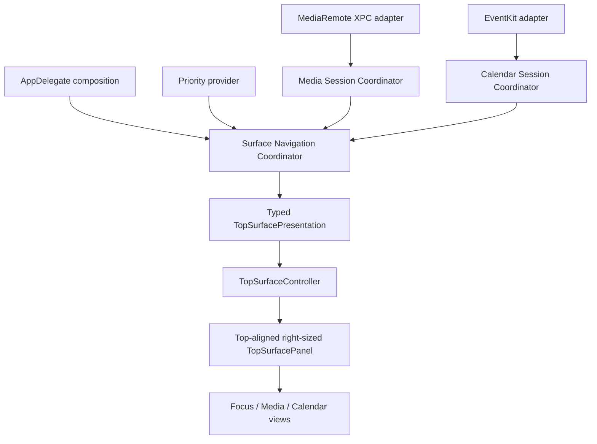
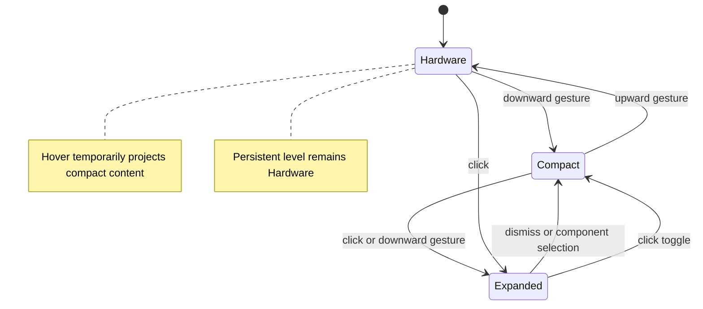
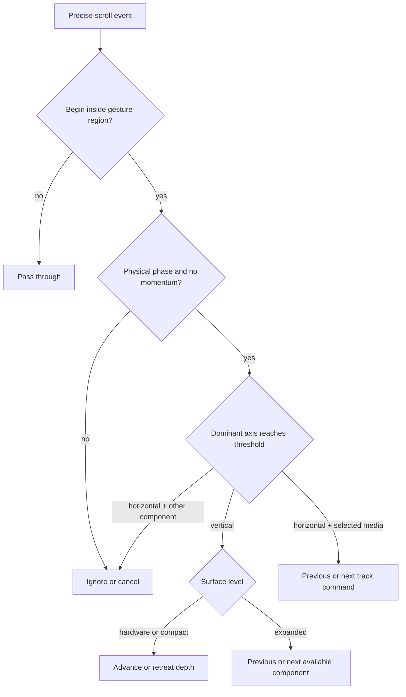
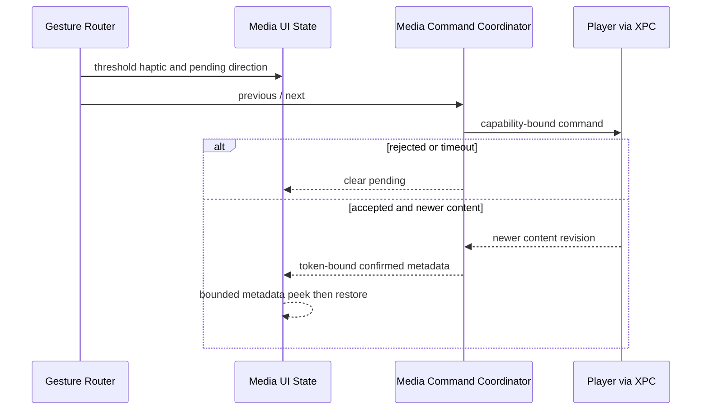

# Mac Event Surface Interactions - Plan

## Goal Capsule

- **Objective:** Evolve Keep3 from a focus/media MVP into an extensible Mac event surface whose first components are priorities, global media, and Calendar.
- **Authority:** The Product Contract in this plan governs the new behavior. Existing media safety boundaries and priority invariants remain authoritative where this plan does not replace them.
- **Execution profile:** Implement behavior test-first, preserve the current dirty visual baseline, and validate native panel geometry and real trackpad direction on the installed Release app.
- **Stop conditions:** Stop if Calendar access requires broader data collection than EventKit event reads, if the global media XPC boundary must be weakened, or if a gesture cannot be made axis-exclusive and one-action-per-gesture.
- **Tail ownership:** The implementation includes code, tests, product-spec updates, Release build, ad-hoc signing, installation, and live macOS verification.

---

## Product Contract

### Summary

Keep3 becomes a top-of-screen event surface rather than a two-mode MVP. Priorities, active media, and ongoing or upcoming Calendar events share one top-aligned surface, can be navigated with deliberate two-finger gestures, and retain component-specific compact and expanded experiences.

### Problem Frame

The current product hard-codes priorities and playing media as competing presentations. That works for the MVP, but it cannot express Calendar or later Mac event sources without multiplying special cases in lifecycle, layout, and gesture code. Calendar earns its place by letting the user recover the next relevant commitment without opening Calendar or abandoning the current task.

The current surface also jumps from compact to fully expanded for a track change. That is visually expensive for a frequent, low-attention action. The new interaction model needs a quiet hardware-aligned rest state, a glance state, a deliberate expanded state, and a smaller directional media confirmation.

### Actors

- A1. The Mac user who glances at the physical notch and uses a trackpad without wanting the frontmost app interrupted.
- A2. A component provider that supplies bounded, typed event content and availability.
- A3. The active media player reached through the existing isolated MediaRemote XPC boundary.
- A4. EventKit, which supplies Calendar data only after explicit user authorization.

### Requirements

#### Component model and ownership

- R1. The surface supports an ordered, type-safe component collection whose initial component IDs are priorities, media, and Calendar, without treating provider views as arbitrary plugins.
- R2. A component publishes bounded immutable content, availability, compact/expanded presentation data, and supported actions; unavailable components are skipped during navigation.
- R3. Priorities remain the default fallback, media may auto-select when a new eligible playing session begins, and a manual component selection takes precedence for the remainder of that media session.
- R4. When the selected component becomes unavailable, the surface selects the next available component and ultimately returns to priorities; one component owns the surface at a time.
- R5. A future component is admitted only when it is passive, local-first, glanceable, non-interruptive, and tied to the user's current or imminent context; adding it must not require another global focus/media-style ownership branch or changes to existing provider internals. Priorities represent chosen context, media represents active context, and Calendar represents imminent context.

#### Surface depth and direct manipulation

- R6. A notched display has three persistent surface levels: hardware-aligned, compact glance, and expanded; a non-notched display uses equivalent minimal, compact, and expanded floating capsules.
- R7. The hardware-aligned level visually matches the physical notch and exposes no decorative content outside it at rest; pointer hover temporarily reveals compact glance without pinning it, and an active media track gesture may temporarily extend or reveal metadata before restoring the unchanged persistent level.
- R8. Pointer exit returns a hover-only glance to hardware-aligned, while a compact level reached by a gesture remains pinned; clicking visible non-interactive surface chrome enters expanded, and only non-interactive expanded chrome or an explicit dismiss action returns to compact. Component controls and Calendar rows consume their own clicks without collapsing the surface.
- R9. A deliberate precise two-finger downward gesture advances `hardware → compact → expanded`; from expanded, vertical gestures select the next or previous available component and land that component in compact.
- R10. A deliberate upward gesture retreats `compact → hardware`; vertical gestures at expanded select the component in the gesture direction rather than navigating inside component content.
- R11. Gesture recognition locks to one axis, ignores momentum, cancels on component/session change, and emits no more than one action for one physical gesture. A valid gesture emits one haptic when it first crosses the lock threshold, while the fingers remain on the input surface.
- R12. Surface transitions keep one top-aligned visual surface, animate content and shape without stealing focus, and resize the owning panel to the current visible interaction envelope so transparent unused canvas never covers unrelated menu-bar regions.

#### Media track changes

- R13. When media is selected, precise horizontal two-finger gestures request previous or next track; vertical gestures never dispatch media commands.
- R14. The pending direction extends the media capsule toward the gesture direction and retracts if the command is rejected or times out.
- R15. A confirmed content revision shows a temporary compact metadata peek containing artwork, title, and artist; it must not reveal the full progress/control layout.
- R16. The metadata peek begins only after the new content identity arrives, has a bounded duration, and returns to the current persistent surface level.
- R17. A supported track gesture emits one haptic at lock-threshold crossing before gesture-end command dispatch. Command acceptance, rejection, timeout, and confirmed content emit no second haptic; the existing session, epoch, capability-revision, and content-revision chain remains authoritative for the metadata peek.

#### Calendar component

- R18. Calendar access is opt-in from Settings and requests EventKit full event access only after an explicit user action.
- R19. Calendar uses EventKit in the main app, queries a bounded 24-hour window, discards cancelled events, ranks ongoing timed events before upcoming timed events and all-day context, then immediately normalizes at most five results and discards the rest. Calendar content never crosses the network or enters the media XPC service.
- R20. The Calendar component preserves chronological order inside each relevance group, handles all-day events, limits rendered fields to time and title, and exposes no notes, attendees, or private URLs. Declined-meeting inference is intentionally unavailable because the adapter does not read attendees.
- R21. Disabled, not-determined, denied, restricted, initial-loading, refreshing, empty, and EventKit-failure states are represented explicitly; Calendar failures never hide priorities or stop media monitoring. The first authorized query shows bounded loading, refresh retains the last in-memory snapshot only while authorization and generation remain valid, and failure without a valid snapshot shows recoverable Settings guidance.
- R22. The compact Calendar presentation shows the nearest event or an empty-day state; expanded presentation shows a bounded upcoming list.

#### Compatibility and quality

- R23. Existing priority editing, weighted rotation, media playback ownership, source suppression, XPC fail-closed behavior, accessibility, and display lifecycle recovery remain functional.
- R24. Reduce Motion replaces directional shape travel with a short opacity/metadata transition while preserving state and command semantics.
- R25. VoiceOver identifies the selected component, surface level, current content, and available actions. After explicit keyboard activation, Down advances depth or selects the next component from expanded, Up retreats depth or selects the previous component from expanded, Escape dismisses, and focus returns to the previously active application; equivalent named VoiceOver actions expose depth and component navigation without a trackpad.
- R26. Calendar integration adds no third-party dependency, account, cloud sync, telemetry, notification permission, screen capture, global event monitor, or Accessibility scraping.
- R27. Calendar normalization stores only event identifiers, title, start/end time, and all-day state; the adapter may inspect cancellation status solely to discard the event and never publishes or persists it. Disabling Calendar, authorization loss, session lock, or generation change clears published and in-flight event data before another component is rendered.
- R28. A gesture acquires ownership only when its physical begin event lies inside the panel's current visible interaction envelope, whose screen-space frame is captured for that gesture generation; leaving that captured frame, hiding or resizing the panel, changing component/session/authorization, or locking the session cancels it before it can act.
- R29. The embedded media helper admits only the containing Keep3 application as its active client; connection invalidation clears monitoring and command context, and an old or second client cannot replace or replay against the active connection.

### Key Flows

- F1. Surface depth
  - **Trigger:** The pointer or a precise vertical gesture enters the hardware-aligned surface.
  - **Actors:** A1.
  - **Steps:** Hover previews compact; a downward gesture pins compact; another downward gesture expands; dismissal returns to compact; an upward gesture returns to hardware-aligned.
  - **Outcome:** The surface reveals only the amount of content the user deliberately requested.
  - **Covered by:** R6-R12, R28.
- F2. Component selection
  - **Trigger:** A vertical gesture completes while the surface is expanded.
  - **Actors:** A1, A2.
  - **Steps:** Axis lock confirms vertical intent; unavailable components are skipped; the chosen component becomes compact and manual selection suppresses media snapback for the current media session.
  - **Outcome:** Priorities, media, and Calendar can be visited without mode fighting.
  - **Covered by:** R1-R5, R9-R11.
- F3. Track navigation
  - **Trigger:** A horizontal two-finger gesture completes while media is selected.
  - **Actors:** A1, A3.
  - **Steps:** Crossing the gesture lock threshold emits one haptic while the fingers remain down; the capsule extends in the pending direction; the existing command coordinator dispatches once at gesture end; confirmed content produces the small metadata peek, while failure retracts without another haptic.
  - **Outcome:** Track changes feel directional and informative without a disruptive full expansion.
  - **Covered by:** R13-R17, R24.
- F4. Calendar authorization and display
  - **Trigger:** The user enables Calendar from Settings.
  - **Actors:** A1, A4.
  - **Steps:** Keep3 requests full event access; authorized results are normalized and observed; denial remains a recoverable Settings state; Calendar becomes navigable only when enabled and authorized.
  - **Outcome:** Calendar events participate in the surface without a launch-time privacy prompt.
  - **Covered by:** R18-R22, R26-R27.

### Acceptance Examples

- AE1. Given hardware-aligned rest, when the pointer briefly enters and exits, then compact content appears only during hover and the surface returns to the hardware outline without becoming pinned. Covers R6-R8.
- AE2. Given hardware-aligned rest, when two completed downward gestures occur, then the first pins compact and the second opens the selected component's expanded presentation. Covers R9-R11.
- AE3. Given expanded priorities and eligible media plus Calendar, when the user gestures downward, then media becomes selected in compact form; when the user gestures downward through expanded again, Calendar becomes selected without media immediately taking the surface back. Covers R1-R5, R9.
- AE4. Given selected playing media, when a supported horizontal previous gesture crosses the lock threshold but no newer content arrives, then one haptic occurs during the gesture, the capsule extends left, retracts on timeout, and produces no metadata peek or completion haptic. Covers R13-R17.
- AE5. Given selected playing media, when a horizontal next gesture crosses the lock threshold and is confirmed by a newer content revision, then one haptic occurs during the gesture and the capsule extends right and shows only artwork, title, and artist for a bounded interval before returning to its prior persistent level. Covers R13-R17.
- AE6. Given Calendar access is not determined, when Keep3 launches, then no Calendar prompt appears; when the user enables Calendar in Settings, then the system prompt appears once. Covers R18, R21.
- AE7. Given denied or revoked Calendar access and playing media, when Calendar refresh fails, then previously published Calendar titles are cleared, media and priorities remain navigable, and Settings explains how to restore access. Covers R21, R23, R27.
- AE8. Given Reduce Motion is enabled, when a track gesture crosses the lock threshold and succeeds, then the recognition haptic still occurs during the gesture and the metadata peek changes without directional geometry travel. Covers R17, R24.
- AE9. Given the hardware-aligned surface leaves a neighboring menu-bar item outside the panel's current interaction envelope, when the pointer clicks or scrolls over that item, then Keep3 receives no event and the underlying system item retains it. Covers R12, R28.
- AE10. Given the media helper already has its Keep3 client, when another local process or stale connection attempts to monitor or command media, then the helper rejects it without executing the command. Covers R23, R29.
- AE11. Given Calendar is enabled with all-day context plus an imminent timed event, when Calendar becomes compact, then the non-cancelled timed event wins the relevance ranking and its time and title are recoverable without opening Calendar or activating Keep3. Covers R19-R22.

### Key Product Decisions

- **Event components replace the focus/media special case.** (session-settled: user-directed — chosen over keeping Keep3 limited to priorities plus media: Calendar and later Mac app events need the same switchable surface.) Governs R1-R5.
- **The notch has hardware-aligned, compact glance, and expanded levels.** (session-settled: user-directed — chosen over an always-visible content capsule: the physical notch should remain the quiet visual baseline.) Governs R6-R12.
- **Media track navigation is horizontal.** (session-settled: user-directed — chosen over vertical track gestures: vertical intent now belongs to surface depth and component switching.) Governs R9-R17.
- **Track changes use a small metadata peek.** (session-settled: user-directed — chosen over full media expansion: full controls are too disruptive for frequent track changes.) Governs R14-R17.

### Scope Boundaries

#### In scope

- A reusable component contract and selection coordinator.
- Priorities, global media, and EventKit Calendar as the first providers.
- Three persistent surface levels, hover preview, click expansion, and gesture-driven depth/component navigation.
- Horizontal media track gestures, directional shape response, confirmed small metadata peek, and haptics.
- Settings, fixtures, accessibility, tests, Release installation, and live Mac verification needed for these behaviors.

#### Deferred to Follow-Up Work

- Additional providers such as notifications, battery, timers, downloads, clipboard, files, meetings from network accounts, or third-party SDK integrations.
- User-configurable component ordering, per-component gesture mappings, and multi-display independent surfaces.
- Calendar write/edit actions, reminders, notification delivery, meeting join links, notes, attendees, and location.

#### Outside this product's identity

- Screen capture, Accessibility scraping, foreground-activity surveillance, generic notch-widget hosting, cloud accounts, team collaboration, analytics, or productivity scoring.

---

## Planning Contract

### Key Technical Decisions

- KTD1. **Use a typed component registry and enum presentation boundary.** Component providers publish normalized value payloads and availability, while `TopSurfacePresentation` remains a closed, type-safe enum for SwiftUI rendering. This creates a stable provider seam without permitting arbitrary view injection. Implements R1-R5.
- KTD2. **Use one authoritative generation-tagged surface state.** Media and Calendar coordinators own source subscriptions, while the surface navigation coordinator alone owns selected component, manual pinning, persistent level, hover preview, gesture generation, and transient media feedback. Legacy interaction models produce intents and timer completions; presentation payloads are derived snapshots. Implements R2-R5, R21, R23, R27-R28.
- KTD3. **Represent persistent level explicitly.** Replace cross-cutting `isExpanded` mutation with `SurfaceLevel.hardware`, `.compact`, and `.expanded`; media metadata peek and pending direction are transient fields inside the authoritative state, not additional persistent levels. Implements R6-R10, R15-R16.
- KTD4. **Route all scroll events through one axis-lock recognizer.** A single pure recognizer owns physical phase, accumulated deltas, axis lock, threshold, momentum rejection, and one-action emission. Its resolved intent is routed to surface navigation or media commands. Implements R9-R13.
- KTD5. **Right-size the panel to the visible interaction envelope.** AppKit cannot provide true per-pixel pass-through to a different process from transparent portions of one window, so the panel frame follows the current hardware, compact, expanded, or transient-feedback envelope. Hover, click, and precise-scroll ownership may differ only inside that visible envelope; any neighboring menu-bar area remains outside the Keep3 window and therefore routes directly to the underlying process. Frame and gesture-generation updates are atomic. Implements R7, R12, R28.
- KTD6. **Make media command confirmation a typed event.** The command coordinator emits token-bound pending, confirmed-content, and failed/cancelled events. Pending supplies direction only; metadata peek consumes only the matching confirmed-content event; rejection, timeout, and context change clear transient state. Implements R14-R17, R23.
- KTD7. **Wrap EventKit behind a narrow actor-backed adapter.** The adapter owns `EKEventStore`, authorization, change notifications, bounded queries, field projection, and immediate result capping; tests use a protocol fixture and never access the machine's real calendars. Implements R18-R22, R26-R27.
- KTD8. **Request Calendar permission from Settings only.** The generated Info.plist carries `NSCalendarsFullAccessUsageDescription`, but launch and background refresh never trigger the prompt. Implements R18, R21.
- KTD9. **Validate the embedded helper's client boundary without broadening its API.** Prefer the private lifecycle of the embedded Application XPC service; if the endpoint is reachable by unrelated local clients, gate one active connection with audit-token code-signing validation and clear all context on invalidation. Bundle ID alone is not a trust decision. Implements R23, R29.

### Assumptions

- Manual component selection remains pinned until the current media session ends, the selected component becomes unavailable, or the app restarts; a later distinct media session may auto-select media again.
- Expanded vertical navigation selects a component and lands it in compact, preventing a newly selected component from appearing fully open without a second deliberate expansion.
- The first Calendar version queries from the current instant through 24 hours ahead, includes ongoing and all-day events, and publishes at most five normalized events.
- Calendar is disabled by default to avoid an unsolicited privacy prompt; enabling it is the explicit authorization action.
- On non-notched displays, the hardware-aligned level is represented by a minimal centered capsule because no physical obstruction exists.
- The current uncommitted media visual polish is the implementation baseline and must not be reverted.

### High-Level Technical Design

#### Component topology

#### Persistent surface state

#### Gesture arbitration

#### Media command and peek sequence

### System-Wide Impact

- **Lifecycle:** Display sleep/wake, authorization change, component switch, and app termination increment the authoritative surface generation before cancelling Calendar observation, gestures, timers, and media pending animation; stale completions cannot mutate the new presentation.
- **Privacy:** Calendar adds a new TCC permission and Info.plist explanation. The adapter projects and caps identifier/title/time/all-day values immediately; disabling, revocation, or lock clears them before VoiceOver or another component can expose stale content.
- **Preferences:** The new surface-level preference supersedes independent focus/media expansion triggers. If legacy values disagree, preserve each component's old trigger until the user first changes the unified control, then persist only the unified value; migration tests assert this compatibility bridge.
- **Packaging:** New source and test groups must be registered in `Keep3.xcodeproj/project.pbxproj`. Release signing remains ad-hoc for the personal MediaRemote build, so helper client admission must be proven from the embedded endpoint lifecycle or stop as incompatible.
- **Accessibility:** The selected component and surface level become part of the accessibility summary and test fixtures.

### Risks and Dependencies

- **Natural scrolling direction:** AppKit delta signs vary with user scrolling settings. Resolve semantic intent at the adapter boundary and verify both synthetic events and the local trackpad.
- **Menu-bar interaction:** A transparent panel can intercept system input. Hover, click, and gesture regions must be independently testable; gesture acquisition happens only at physical begin and every non-owned event passes through.
- **EventKit permission state:** Access can change while Keep3 runs. Observe store changes and foreground activation, and fail closed on query errors.
- **Calendar data remanence:** TCC revocation or session lock can leave titles in an existing SwiftUI/accessibility tree. Clear normalized snapshots before publishing the replacement component and reject stale queries by generation.
- **Media snapback:** Progress snapshots are frequent. Auto-selection must key on a new eligible session transition rather than every snapshot.
- **Private media ABI:** Existing MediaRemote integration remains version-fragile, but this feature does not broaden the private surface or move it into the main app.
- **XPC client admission:** The helper currently accepts listener connections. Verify that the embedded Application XPC endpoint is inaccessible to unrelated processes; otherwise require audit-token designated-requirement validation and single-client semantics before shipping.
- **Dirty baseline:** Existing uncommitted geometry/media polish overlaps this work. Implementation must layer changes and compare the final diff without resetting those files.

### Sources and Research

- `Keep3/Overlay/SurfaceModeCoordinator.swift` is the current hard-coded ownership arbiter and media handoff implementation.
- `Keep3/Overlay/DisplayGeometry.swift` and `Keep3/Overlay/TopSurfacePanel.swift` establish the fixed top canvas and active-frame hit testing.
- `Keep3/Overlay/SurfaceGestureRecognizer.swift` owns threshold-crossing gesture feedback timing, while `Keep3/Media/MediaCommandCoordinator.swift` remains authoritative for session/revision confirmation and metadata peeks.
- `Keep3/Media/MediaGestureRecognizer.swift` provides the current pure scroll-event test pattern but assigns the wrong axis for the new design.
- `Keep3/Media/MediaSurfaceInteractionModel.swift` provides timer ownership and content-identity patterns but currently maps track changes to full expansion.
- `Keep3Tests/Overlay/TopSurfaceInteractionTests.swift`, `Keep3Tests/Overlay/SurfaceModeCoordinatorTests.swift`, and `Keep3Tests/Media/MediaGestureRecognizerTests.swift` establish manual-scheduler and pure gesture test patterns.
- Apple EventKit documentation requires full access before fetching events and requires handling denial without blocking the app: <https://developer.apple.com/documentation/eventkit/ekeventstore/requestfullaccesstoevents(completion:)>
- Apple documents `NSCalendarsFullAccessUsageDescription` as required for apps that read Calendar data: <https://developer.apple.com/documentation/bundleresources/information-property-list/nscalendarsfullaccessusagedescription>

---

## Implementation Units

### U1. Establish the event component and selection contract

- **Goal:** Replace the global focus/media special case with a typed component registry, availability model, selection policy, and explicit surface level while preserving current visible behavior.
- **Requirements:** R1-R5, R23; KTD1-KTD3.
- **Dependencies:** None.
- **Files:**
  - `docs/specs/keep3-mvp.md`
  - `Keep3/Overlay/SurfaceComponent.swift`
  - `Keep3/Overlay/SurfaceNavigationCoordinator.swift`
  - `Keep3/Overlay/TopSurfacePresentation.swift`
  - `Keep3/Overlay/SurfaceModeCoordinator.swift`
  - `Keep3Tests/Overlay/SurfaceNavigationCoordinatorTests.swift`
  - `Keep3Tests/Overlay/SurfaceModeCoordinatorTests.swift`
  - `Keep3.xcodeproj/project.pbxproj`
- **Approach:**
  1. Update the product spec so Calendar and the event-surface identity replace contradictory MVP exclusions.
  2. Define stable component IDs, availability, selection source, surface level, and typed payload ownership.
  3. Move manual pinning, persistent/transient level state, generation, and fallback into the navigation coordinator while preserving media grace and focus recovery.
  4. Keep media eligibility and source policy in the existing media path instead of leaking MediaRemote concepts into the generic component contract.
- **Execution note:** Start with failing selection and fallback tests before refactoring the existing coordinator.
- **Patterns to follow:** Immutable `Equatable & Sendable` payloads in `Keep3/Overlay/TopSurfacePresentation.swift`; `@MainActor` state coordination and manual timer fixtures.
- **Test scenarios:**
  - Focus is selected when it is the only available component.
  - A new eligible media session auto-selects media once, while progress-only snapshots do not override manual focus or Calendar selection.
  - Manual next/previous navigation wraps and skips unavailable components.
  - Loss of the selected component falls back deterministically without publishing two owners at once.
  - Media pause/exit releases the session pin and returns the latest designated focus.
  - Display deactivation publishes hidden and requires fresh reconciliation before any component returns.
- **Verification:** Existing focus/media ownership tests pass through the new contract, and new tests prove manual selection cannot be defeated by recurring media snapshots.

### U2. Implement three-level surface state and unified gesture arbitration

- **Goal:** Add hardware, compact, and expanded levels plus one surface-wide recognizer for vertical depth/component actions and horizontal media intent.
- **Requirements:** R6-R13, R24-R25, R28; KTD2-KTD5.
- **Dependencies:** U1.
- **Files:**
  - `Keep3/Overlay/SurfaceGestureRecognizer.swift`
  - `Keep3/Overlay/SurfaceNavigationCoordinator.swift`
  - `Keep3/Overlay/TopSurfaceInteractionModel.swift`
  - `Keep3/Media/MediaGestureRecognizer.swift`
  - `Keep3/Overlay/TopSurfacePanel.swift`
  - `Keep3/App/Keep3App.swift`
  - `Keep3Tests/Overlay/SurfaceGestureRecognizerTests.swift`
  - `Keep3Tests/Overlay/SurfaceNavigationCoordinatorTests.swift`
  - `Keep3Tests/Overlay/TopSurfaceInteractionTests.swift`
  - `Keep3Tests/Overlay/TopSurfacePanelTests.swift`
  - `Keep3Tests/Media/MediaGestureRecognizerTests.swift`
- **Approach:**
  1. Normalize AppKit deltas into semantic horizontal and vertical intent at one boundary.
  2. Lock axis after threshold, ignore momentum, emit once at physical end, and cancel on context change.
  3. Route vertical intents to level/component navigation and horizontal intents only to selected eligible media.
  4. Distinguish hover-only compact from gesture-pinned compact so pointer exit does not undo direct manipulation.
  5. Resize the non-activating panel to the current visible interaction envelope and only observe precise scroll sequences that begin inside it; neighboring menu-bar regions stay outside Keep3's window.
- **Execution note:** Implement the pure recognizer and state transitions test-first; do not depend on XCUITest for physical trackpad synthesis.
- **Patterns to follow:** `SurfaceScrollEvent`, `TopSurfaceGesturePhase`, and existing precise/momentum fixtures.
- **Test scenarios:**
  - A downward gesture moves hardware to compact, the next moves compact to expanded, and no gesture emits twice.
  - An upward gesture moves compact to hardware; a gesture from expanded selects the correct component and lands compact.
  - Horizontal intent is ignored for focus and Calendar and becomes previous/next only for selected media.
  - Diagonal input locks to the dominant axis and cannot perform both a component change and track command.
  - Momentum, non-precise wheel input, cancellation, component change, and session change do not emit stale actions.
  - Hover enter/exit is temporary, while gesture-pinned compact survives pointer exit.
  - After explicit activation, Up/Down and equivalent VoiceOver actions reproduce depth and component navigation; Escape restores focus to the previously active application.
  - The panel window frame tracks the hardware, compact, expanded, and transient-feedback envelope without an unused transparent maximum canvas.
  - Clicks and scrolls over neighboring menu-bar regions never enter the Keep3 window and remain owned by the underlying process.
  - Priority actions, media controls, and Calendar rows consume clicks; only background chrome and explicit dismissal collapse expanded content.
  - Region change, panel hide, lock, or component/session/authorization generation change cancels an armed gesture.
- **Verification:** Deterministic unit tests cover every state/axis edge, and the panel retains non-activating behavior.

### U3. Replace full media Quick Peek with directional compact metadata feedback

- **Goal:** Move track navigation to horizontal gestures and implement pending directional stretch plus confirmed compact artwork/title/artist feedback.
- **Requirements:** R13-R17, R23-R24; KTD4, KTD6.
- **Dependencies:** U1, U2.
- **Files:**
  - `Keep3/Overlay/TopSurfacePresentation.swift`
  - `Keep3/Media/MediaCommandCoordinator.swift`
  - `Keep3/Media/MediaSurfaceInteractionModel.swift`
  - `Keep3/Overlay/MediaSurfaceView.swift`
  - `Keep3/Overlay/DisplayGeometry.swift`
  - `Keep3/App/Keep3App.swift`
  - `Keep3Tests/Media/MediaCommandCoordinatorTests.swift`
  - `Keep3Tests/Media/MediaSurfaceInteractionModelTests.swift`
  - `Keep3Tests/Overlay/MediaSurfacePresentationTests.swift`
  - `Keep3Tests/Overlay/DisplayGeometryTests.swift`
- **Approach:**
  1. Publish a token-bound pending previous/next event without marking the media surface expanded.
  2. Clear pending geometry on the matching failed, rejected, timeout, context-invalidated, or cancelled event.
  3. Emit one haptic at supported gesture lock-threshold crossing and start the metadata peek only from the matching confirmed-content event.
  4. Render title and artist in one right-to-left inline transition, preserve the current panel height, and extend only toward the requested direction by atomically resizing the top-aligned panel around the transient visible envelope.
  5. Use opacity and content replacement without directional travel under Reduce Motion.
- **Execution note:** Characterize gesture-threshold timing and command-confirmation tests before changing presentation state.
- **Patterns to follow:** Generation-safe pending commands in `MediaCommandCoordinator`; manual timers in `MediaSurfaceInteractionModelTests`; current dirty Alcove-aligned media layout as the visual baseline.
- **Test scenarios:**
  - A previous gesture creates left pending direction and a next gesture creates right pending direction.
  - Accepted-without-content-change and rejected commands retract without a peek or completion haptic.
  - Pre-ack content candidates still wait for command acceptance before confirmation.
  - Unsolicited external track changes never satisfy or imitate a pending Keep3 command's metadata peek.
  - Confirmed newer content publishes the new title/artist without a second haptic and collapses after the bounded timer.
  - A second session, stale capability revision, media pause, source suppression, or display deactivation clears all transient feedback.
  - The metadata peek never exposes progress or the full control row.
  - Reduce Motion produces the same state outcomes without direction-dependent geometry.
- **Verification:** Command tests preserve all existing stale/rejection guarantees, geometry tests prove bounded left/right extension, and presentation tests distinguish compact peek from full expansion.

### U4. Add the opt-in EventKit Calendar provider

- **Goal:** Add an isolated, testable Calendar source that normalizes authorization and upcoming events into a bounded component payload.
- **Requirements:** R18-R22, R26-R27; KTD2, KTD7-KTD8.
- **Dependencies:** U1.
- **Files:**
  - `Keep3/Calendar/CalendarEvent.swift`
  - `Keep3/Calendar/CalendarEventProviding.swift`
  - `Keep3/Calendar/EventKitCalendarAdapter.swift`
  - `Keep3/Calendar/CalendarSessionCoordinator.swift`
  - `Keep3/Persistence/CalendarPreferences.swift`
  - `Keep3Tests/Calendar/CalendarSessionCoordinatorTests.swift`
  - `Keep3Tests/Persistence/CalendarPreferencesTests.swift`
  - `Keep3.xcodeproj/project.pbxproj`
- **Approach:**
  1. Define bounded normalized event and authorization types without exposing `EKEvent` outside the adapter.
  2. Request full access only from the explicit Settings action; query only after authorization.
  3. Observe EventKit store changes and foreground activation, with generation-safe cancellation and no polling.
  4. Inspect cancellation status only for filtering, rank ongoing timed then upcoming timed then all-day entries, project only identifier/title/time/all-day values, cap immediately at five, and normalize initial-loading, refreshing, empty, denied, restricted, and failure states without persistence.
  5. Publish Calendar availability independently from media and focus source lifecycles.
- **Execution note:** Develop entirely against a fixture provider first; use a live EventKit smoke check only after unit behavior is complete.
- **Patterns to follow:** Protocol adapter plus actor source ownership in `Keep3/Media/MediaSessionProviding.swift` and `Keep3/Media/MediaSessionCoordinator.swift`.
- **Test scenarios:**
  - No permission request occurs on initialization, app launch, component navigation, or background refresh.
  - Explicit enable requests access once and transitions not-determined to authorized or denied.
  - Authorized queries discard cancelled events, rank ongoing timed before upcoming timed before all-day context, preserve chronology within each group, and cap the list.
  - Empty authorized results publish an empty-day payload rather than a failure.
  - Initial load publishes a bounded loading payload; refresh retains only the still-authorized current-generation in-memory snapshot with an updating marker.
  - Denied, restricted, and query-error states remain bounded and do not retry in a loop.
  - A stale query result after disable, sleep, or generation change cannot republish Calendar content.
  - A fixture with many events publishes only five normalized values; cancellation status is filter-only, and the adapter never accesses notes, attendees, location, URL, calendar account, or unbounded strings.
  - Disabling Calendar, TCC revocation, lock, or generation change removes titles from presentation and accessibility output before a stale query can return.
- **Verification:** Unit tests require no real Calendar database, and project metadata contains the full-access usage description for Debug and Release.

### U5. Render Calendar and the shared three-level surface chrome

- **Goal:** Give all three components coherent hardware, compact, and expanded presentations while preserving their component-specific content.
- **Requirements:** R6-R12, R15, R20-R25, R27-R28; KTD1, KTD3, KTD5.
- **Dependencies:** U1-U4.
- **Files:**
  - `Keep3/Overlay/CalendarSurfaceView.swift`
  - `Keep3/Overlay/TopSurfaceView.swift`
  - `Keep3/Overlay/MediaSurfaceView.swift`
  - `Keep3/Overlay/TopSurfacePanel.swift`
  - `Keep3/Overlay/TopSurfaceController.swift`
  - `Keep3/Overlay/DisplayGeometry.swift`
  - `Keep3/Overlay/TopSurfaceContent.swift`
  - `Keep3Tests/Overlay/CalendarSurfacePresentationTests.swift`
  - `Keep3Tests/Overlay/MediaSurfacePresentationTests.swift`
  - `Keep3Tests/Overlay/DisplayGeometryTests.swift`
  - `Keep3Tests/Overlay/TopSurfacePanelTests.swift`
- **Approach:**
  1. Make persistent level part of every presentation payload and derive geometry from component plus level.
  2. Render hardware-aligned as physical black only, compact as component glance content, and expanded as the component's detailed layout.
  3. Add Calendar compact time/title and expanded upcoming-list layouts with loading, updating, empty, and recoverable-failure treatments.
  4. Keep the surface top-aligned while resizing panel bounds to the visible presentation; animate shape/content in local coordinates and never retain an input-owning transparent maximum canvas.
  5. Add component/level accessibility summaries and retain explicit keyboard activation.
- **Execution note:** Use geometry/presentation tests before native screenshots; this unit contains visual work but also has testable state and layout contracts.
- **Patterns to follow:** `NotchCompactContentLayout`, `ExpandedSurfaceContentLayout`, `TopSurfaceShape`, and the current artwork/waveform metrics.
- **Test scenarios:**
  - Notched hardware level exactly matches obstruction width/height and renders no content wings.
  - Hover compact, pinned compact, media metadata peek, and expanded frames stay within one panel canvas.
  - Floating displays produce centered minimal, compact, and expanded equivalents.
  - Calendar timed, all-day, ongoing, empty, and long-title payloads remain within compact and expanded bounds.
  - Calendar loading, updating, and failure layouts remain bounded and never expose revoked or stale titles.
  - Panel active hit testing follows the visible surface while tracking continues over the intended physical envelope.
  - Reduce Motion, Reduce Transparency, increased contrast, and missing artwork preserve legibility and semantics.
- **Verification:** Layout tests cover representative notched and non-notched displays, accessibility identifiers are stable, and native inspection matches the intended three-level hierarchy.

### U6. Integrate lifecycle, settings, fixtures, and product verification

- **Goal:** Compose the new providers and interaction system in the app, migrate preferences, and prove complete focus/media/Calendar flows in a signed Release installation.
- **Requirements:** R3-R5, R18, R21, R23-R29; KTD2, KTD7-KTD9.
- **Dependencies:** U1-U5.
- **Files:**
  - `Keep3/App/Keep3App.swift`
  - `Keep3/App/EditorWindowController.swift`
  - `Keep3/App/RootView.swift`
  - `Keep3/Features/Settings/SettingsSidebarView.swift`
  - `Keep3/Features/Settings/SettingsView.swift`
  - `Keep3/Features/Settings/CalendarSettingsView.swift`
  - `Keep3/Persistence/AppPreferences.swift`
  - `Keep3/Persistence/MediaPreferences.swift`
  - `Keep3UITests/Keep3UITests.swift`
  - `Keep3Tests/App/EditorWindowControllerTests.swift`
  - `Keep3Tests/Persistence/AppPreferencesTests.swift`
  - `Keep3Tests/Persistence/MediaPreferencesTests.swift`
  - `Keep3Tests/Media/MediaRemoteAdapterIntegrationTests.swift`
  - `Keep3MediaService/main.swift`
  - `docs/verification/keep3-event-surface.md`
  - `Keep3.xcodeproj/project.pbxproj`
- **Approach:**
  1. Keep `AppDelegate` as lifecycle/composition while moving selection, gestures, and provider state into their coordinators.
  2. Bridge legacy focus/media expansion settings independently until the user changes the unified surface control, then retire the component-specific values with deterministic precedence.
  3. Add Calendar Settings authorization, current status, enable/disable, and recovery guidance.
  4. Add deterministic debug fixtures for Calendar snapshots and surface gestures instead of touching real provider data in UI tests.
  5. Verify focus rotation, media-first auto-entry/manual override, Calendar selection, pause fallback, TCC/lock clearing, and full lifecycle cleanup.
  6. Prove the embedded XPC endpoint's client admission and invalidation behavior; add audit-token single-client validation only if the endpoint is otherwise reachable.
  7. Build, sign, install over a recoverable backup, and inspect geometry, input pass-through, accessibility, natural-scroll direction, animation, haptics, and idle behavior.
- **Execution note:** Run unit/integration gates before XCUITest and native installation; UI runners require an unlocked user session and must not use unsigned full-scheme execution.
- **Patterns to follow:** Existing environment-backed UI fixtures, recoverable `/Applications` install workflow, and `docs/verification/keep3-visual-media.md`.
- **Test scenarios:**
  - Existing preferences preserve each component's behavior on first launch even when legacy focus/media triggers differ; changing the unified control retires the bridge.
  - Enabling Calendar from Settings invokes only the fixture authorization path in UI tests and makes Calendar navigable.
  - Playing media auto-selects once; a fixture component gesture selects priorities or Calendar; progress updates do not steal the surface back.
  - Pausing or exiting the player clears the media-session pin and returns to the latest designated focus, matching the product's media-exit fallback.
  - Closing the editor, display sleep/wake, app termination, and relaunch cancel and restore only fresh source generations.
  - Accessibility navigation can identify, advance/retreat, switch, and dismiss every component, with focus restored after exit.
  - An unrelated or second XPC client cannot monitor or command media, and stale connections lose all session/capability context.
- **Verification:** Full unit tests, targeted signed UI flows, static analysis, Release build, package integrity, and live installed-app evidence all pass or carry an explicit environment exception.

---

## Verification Contract

| Gate | Applies to | Command or evidence | Done signal |
|---|---|---|---|
| Strict formatting | All Swift changes | `xcrun swift-format lint --strict --recursive Keep3 Keep3Tests Keep3MediaService Keep3UITests` | Zero findings |
| Unit tests | U1-U6 | `xcodebuild test -project Keep3.xcodeproj -scheme Keep3 -configuration Debug -destination 'platform=macOS' -derivedDataPath .build/DerivedData -only-testing:Keep3Tests CODE_SIGNING_ALLOWED=NO` | All tests pass; machine-dependent integration skips are explained |
| Static analysis | U1-U6 | `xcodebuild analyze -project Keep3.xcodeproj -scheme Keep3 -configuration Debug -destination 'platform=macOS' -derivedDataPath .build/DerivedData CODE_SIGNING_ALLOWED=NO` | Analyze succeeds |
| Signed UI fixtures | U5-U6 | Targeted `Keep3UITests` from an unlocked desktop without `CODE_SIGNING_ALLOWED=NO` | Priority/media/Calendar selection and fallback flows pass |
| Release package | U6 | Arm64 Release build followed by explicit ad-hoc deep signing and strict codesign verification | App and embedded XPC are valid arm64 artifacts |
| Media boundary | U3, U6 | `otool`/`nm` checks plus helper integration and client-admission tests | Main app has no static MediaRemote dependency; helper remains the sole private boundary and accepts only the containing active client |
| Calendar privacy | U4, U6 | Unit payload inspection plus installed Settings/TCC/lock flow | No launch prompt, persistence, network, stale accessibility title, attendee access, or published field beyond the bounded title/time projection |
| Native geometry and input | U2, U3, U5, U6 | CGWindow/Accessibility frame inspection, pass-through probes, and screenshots on notched hardware | Each level remains top-aligned and the panel frame matches its visible interaction envelope; neighboring menu-bar input never enters Keep3's window |
| Trackpad and haptic | U2, U3, U6 | Real two-finger vertical/horizontal gestures in NetEase Cloud Music or another supported player | Axes are exclusive, one command fires, direction matches intent, and exactly one haptic occurs at lock-threshold crossing before the fingers lift |
| Idle resources | U6 | Activity Monitor sample after Release warm-up | No continuous polling or unexpected idle animation outside active media waveform |
| Diff hygiene | All | `git diff --check` and review of pre-existing dirty files | No whitespace errors and no user baseline reverted |

---

## Definition of Done

- The product specification no longer claims Calendar or general event components are out of scope.
- Priorities, playing media, and authorized Calendar are represented through one typed component/selection contract.
- Manual component navigation works while media is playing and is not immediately undone by recurring media snapshots.
- Hardware-aligned, compact, and expanded levels follow the pointer, click, dismissal, and vertical gesture rules in R6-R12.
- Horizontal media gestures produce directional pending feedback and confirmed compact metadata without opening full controls.
- Rejected, timed-out, stale, and cancelled media commands produce no completion haptic or metadata peek; a supported gesture may already have emitted its single threshold-recognition haptic.
- Calendar authorization is explicit, denial-safe, network-free, non-persistent, and limited to bounded title/time presentation.
- Calendar disable, revocation, lock, and stale queries cannot leave event titles visible or accessible.
- The panel frame never covers unused transparent menu-bar space, gesture ownership begins only inside the visible envelope, and neighboring menu-bar input remains with the underlying process.
- Media metadata peek consumes token-bound command confirmation rather than inferring success from unrelated snapshot changes.
- The media helper's active-client boundary is verified or hardened without weakening its fail-closed behavior.
- Existing priority editing/rotation, MediaRemote XPC fail-closed behavior, display lifecycle, settings, accessibility, and package integrity remain green.
- Automated verification and installed Release evidence cover the new behavior, with any machine/session exception recorded.
- Abandoned experiments, duplicate legacy gesture paths, obsolete focus/media special-case branches, and dead preference code are removed from the final diff.
