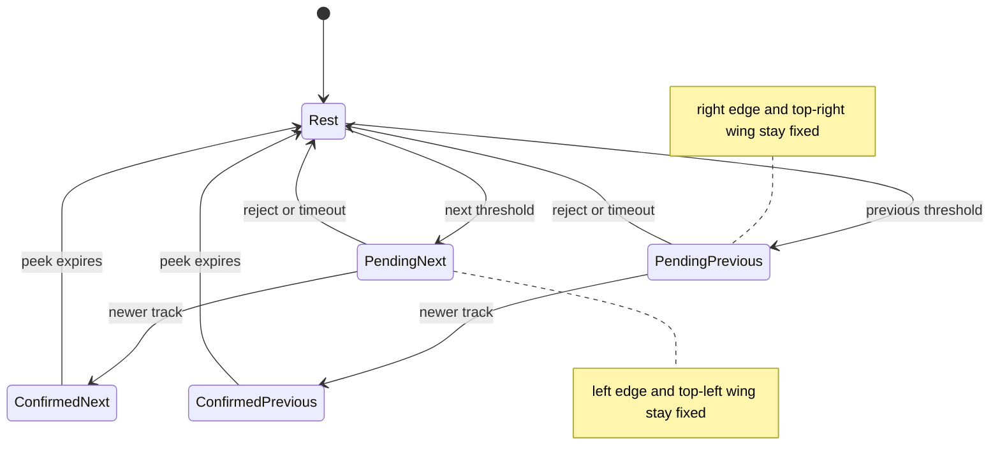
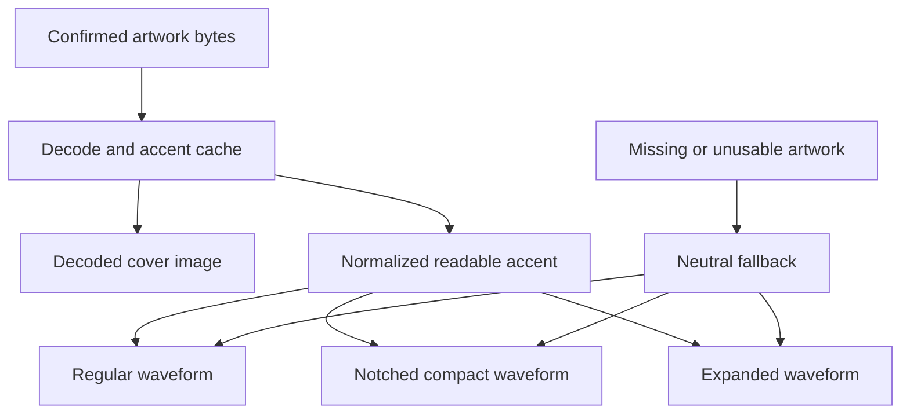
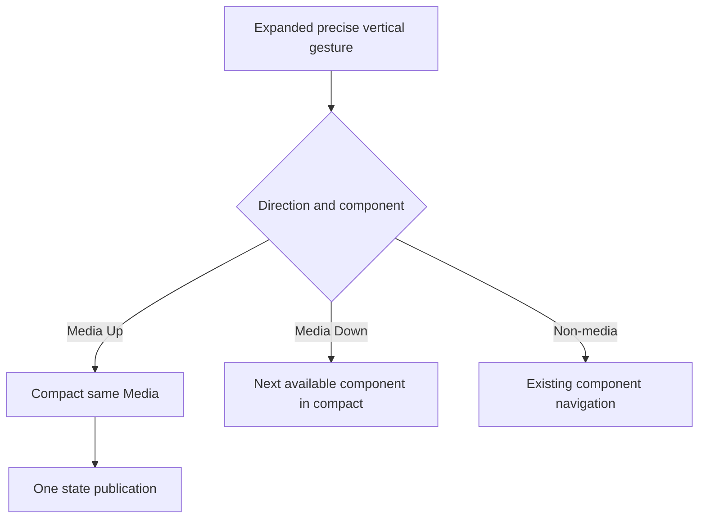

# Media Track Transition and Gesture Corrections - Plan

## Goal Capsule

- **Objective:** Correct the in-progress media track transition so directional changes keep the opposite side visually stable, show track metadata beneath the hardware notch, color every waveform from the current artwork, and make an upward gesture from expanded media return to compact media.
- **Authority:** The Product Contract below supersedes conflicting track-peek and expanded-media clauses in `docs/plans/2026-07-25-002-feat-keep3-media-mode-plan.md`, `docs/plans/2026-07-26-001-feat-event-surface-interactions-plan.md`, and `docs/specs/keep3-mvp.md`.
- **Execution profile:** Preserve the current dirty event-surface implementation, replace obsolete assertions before changing behavior, and verify pure geometry/state contracts before native animation review.
- **Stop condition:** Stop if the fix would require discarding unrelated dirty-tree work or weakening single-command, haptic, reduced-motion, accessibility, display-bounds, or MediaRemote confirmation guarantees.
- **Tail ownership:** The implementation owns tests, product and verification documentation, formatting, analysis, Release build, native visual proof, review fixes, commit, PR, and CI follow-through.

---

## Product Contract

### Summary

Keep3 will retain the directional media feedback already under development while separating the stable notch wings from a rounded metadata shelf below the notch. The waveform will inherit a readable color from the active cover, and expanded Media will treat an upward two-finger gesture as depth retreat rather than component rotation.

### Problem Frame

The current dirty implementation solves directional width anchoring but regresses the confirmed peek to notch height, places title and artist in the waveform wing, and clips the changing frame with a generic compact contour. During animation this can disturb the fixed side and expose angular geometry. The waveform also remains static white, so it does not carry the active track's visual identity.

The shared gesture state machine currently treats both vertical directions from any expanded component as component navigation. In expanded Media, this makes an upward gesture switch to Priorities or another component instead of returning to the normal compact player.

### Actors

- A1. The Mac user switching tracks with a precise two-finger gesture on a notched or non-notched display.
- A2. The active media session providing confirmed metadata and optional cover artwork.
- A3. VoiceOver or keyboard users invoking the equivalent surface retreat action after explicitly activating Keep3.

### Requirements

#### Directional transition and metadata

- R1. A Next transition preserves the baseline screen-space left edge, left wing content, and left contour through pending feedback, confirmed peek, and retraction; Previous mirrors this by preserving the right side.
- R2. The changing side and lower shelf use continuous rounded geometry without angular protrusions in normal motion; with Reduce Motion, Keep3 establishes the final rounded shelf frame without animated travel, crossfades confirmed metadata, and restores the persistent frame only after the fade completes.
- R3. On a notched display, confirmed title and artist render in a dedicated bounded region below the hardware notch and never replace or overlap the artwork or waveform wing.
- R4. Rejection, timeout, stale confirmation, rapid replacement, and retraction restore the prior persistent surface level without changing the stable side or showing stale metadata; an opposite-direction request first cancels to that clean baseline before starting the mirrored transition.
- R5. Display containment never moves the baseline stable edge: preferred-width fit is measured from that fixed anchor into the changing side, which shrinks first and tail-truncates metadata when space is constrained.

#### Artwork-derived waveform

- R6. Regular, notched-compact, and expanded waveforms use a readable accent derived from the current confirmed cover artwork.
- R7. Missing, malformed, transparent, grayscale, or low-contrast artwork produces a deterministic readable fallback or normalized sRGB accent whose final composited waveform reaches at least 3:1 contrast against the black surface.
- R8. Artwork decoding and accent extraction remain bounded and cached outside the waveform animation timeline so cover color does not add per-frame image work.

#### Expanded Media retreat

- R9. A precise upward two-finger gesture from expanded Media emits the existing single navigation haptic at lock threshold, commits one same-component collapse, and ends in compact Media.
- R10. The corrected upward gesture never dispatches a media command or selects Priorities, Calendar, or another surface component.
- R11. Expanded Media downward component navigation and the established expanded navigation behavior of non-media components remain unchanged.
- R12. The equivalent activated keyboard and VoiceOver retreat action for expanded Media uses a localized return-to-compact name, performs the same atomic collapse, moves focus to the compact Media surface, and announces the resulting state once.

### Key Flows

- F1. Directional confirmed track peek
  - **Trigger:** A supported horizontal media gesture commits and a newer same-session track confirms.
  - **Actors:** A1, A2
  - **Steps:** The pending frame extends on the requested side; confirmed metadata appears below the notch; the bounded peek retracts to the prior level.
  - **Outcome:** The opposite side remains visually unchanged and the transition has no angular contour.
  - **Covered by:** R1-R5
- F2. Cover-colored waveform
  - **Trigger:** Confirmed media artwork appears or changes.
  - **Actors:** A2
  - **Steps:** The artwork cache decodes the image, resolves a readable accent once, and supplies it to every waveform style.
  - **Outcome:** The waveform changes with the cover and stays visible on black.
  - **Covered by:** R6-R8
- F3. Expanded Media upward retreat
  - **Trigger:** A1 crosses the upward vertical lock threshold while Media is expanded.
  - **Actors:** A1, A3
  - **Steps:** Recognition emits one navigation feedback event; commit collapses the current Media component to compact.
  - **Outcome:** Media remains selected and no track or component switch occurs.
  - **Covered by:** R9-R12

### Acceptance Examples

- AE1. Given compact Media on a notched display, when Next enters pending feedback and then shows confirmed metadata, then the panel `minX`, left wing content, and left contour remain at their baseline screen positions while only the right and lower regions change. Covers R1-R5.
- AE2. Given the same state for Previous, when pending, confirmation, and retraction complete, then the panel `maxX` and right-side content remain fixed. Covers R1-R5.
- AE3. Given a cover dominated by a visible blue or red color, when the artwork revision changes, then all waveform styles resolve to the normalized cover accent without work inside a timeline tick. Covers R6-R8.
- AE4. Given absent, invalid, transparent, or near-black artwork, when Media renders, then the waveform uses a neutral fallback or normalized sRGB accent that reaches 3:1 final contrast against black. Covers R7-R8.
- AE5. Given expanded Media, when a precise upward gesture commits, then one navigation feedback occurs and the published state is compact Media with no intermediate component selection. Covers R9-R12.
- AE6. Given Reduce Motion, when a track change confirms, then the fixed side stays invariant and metadata crossfades below the notch without directional travel. Covers R1-R4.

### Key Product Decisions

- **Only the requested track side changes.** (session-settled: user-directed — chosen over a whole-surface or symmetric morph: a Next transition must not disturb the left side.) Governs R1, R4-R5.
- **Track metadata belongs below the hardware notch.** (session-settled: user-directed — chosen over placing title and artist in the waveform wing: the wave remains a playback indicator and metadata needs its own legible region.) Governs R2-R4.
- **Waveform color follows the current cover.** (session-settled: user-directed — chosen over a static white waveform: the active song's visual identity should carry into the playback indicator.) Governs R6-R8.
- **Expanded Media Up returns to compact Media.** (session-settled: user-directed — chosen over switching to another component such as Priorities: upward is a depth retreat from the player, not type navigation.) Governs R9-R12.

### Scope Boundaries

#### In scope

- Track pending, confirmed peek, and retraction geometry for notched and floating surfaces.
- Track title and artist placement, waveform accent extraction, expanded Media gesture semantics, accessibility parity, tests, product/spec updates, and native visual verification.

#### Deferred to Follow-Up Work

- Broader redesign of compact or expanded media controls.
- Multi-color waveform gradients, animated palette interpolation, or a user-selectable accent policy.

#### Outside this product's identity

- Changes to MediaRemote command confirmation, supported players, component ordering, Calendar data, or priority-item content.

---

## Planning Contract

### Key Technical Decisions

- KTD1. **Model track feedback as a stable top row plus a directional lower transient.** Preserve `DisplayGeometry.mediaLayout` fixed-edge anchoring, restore the confirmed peek's below-notch height, and give track feedback its own continuous shape state rather than treating it as full expansion or putting metadata in a wing. Implements R1-R5.
- KTD2. **Assert invariants in screen space as well as local layout space.** Geometry values will cover fixed panel edges, obstruction reservation, wing frames, metadata bounds, and representative contour points; installed-app review remains authoritative for AppKit frame interpolation. Implements R1-R5.
- KTD3. **Resolve a small Sendable artwork accent beside image decoding.** A bounded deterministic sampler produces normalized sRGB components cached with the artwork bytes; SwiftUI converts that value to a waveform style input, normalizes the final composited color to 3:1 contrast against black, and uses neutral white as the final fallback. Implements R6-R8.
- KTD4. **Keep palette work outside `TimelineView`.** `MediaSurfaceView` resolves the accent once per artwork/content revision and passes it explicitly to regular, notched-compact, and expanded `MediaWaveformView` instances. Implements R6-R8.
- KTD5. **Make expanded Media Up an explicit depth retreat.** Gesture recognition distinguishes Media from other expanded components, `retreatDepth` collapses the selected component atomically to compact, and accessibility wording reflects that action; expanded Media Down and non-media navigation keep their current contracts. Implements R9-R12.
- KTD6. **Layer onto the dirty event-surface baseline.** Replace the inline-metadata and expanded-component assertions surgically, preserve unrelated pending changes, and use the focused plan as the correction authority rather than reverting owner files. Implements R1-R12.

### Assumptions

- “Normal media-player state” means compact Media, not hardware-only or hover-preview state.
- Only expanded Media Up changes semantics; expanded Media Down remains next-component navigation, and Priorities/Calendar keep their existing expanded behavior.
- The notched confirmed peek uses separate title and artist lines beneath the obstruction and truncates long Unicode metadata without changing its envelope.
- Previous mirrors Next's fixed-side rule, even though the reported defect named Next specifically.
- At display edges, safe containment reduces the changing-side transient and truncates metadata before considering any other layout change; the baseline stable edge does not move.
- The current dirty worktree is intentional implementation context and may contain unrelated user work that must remain intact.

### High-Level Technical Design

#### Directional peek lifecycle

#### Artwork accent data flow

#### Expanded vertical intent

### System-Wide Impact

- **Geometry and input:** The panel frame grows downward during confirmed notch peeks, so gesture-context resize cancellation and active hit testing must remain deliberate and must not dispatch a duplicate command.
- **Accessibility:** Expanded Media changes the meaning of Up for trackpad, keyboard, and VoiceOver while other components retain existing labels and behavior.
- **Performance:** Accent sampling shares artwork cache lifetime and must not add work to the 12 Hz waveform timeline.
- **Documentation:** The focused Product Contract supersedes conflicting inline-label, fixed-height peek, and expanded Up component-switch clauses in current product and verification documents.

### Risks and Dependencies

- **Animation proof gap:** Pure geometry cannot prove that AppKit `setFrame` interpolation never flashes an angular corner; Release inspection on a real notched display is required with Reduce Motion on and off.
- **Color-space variance:** Artwork may use unexpected color spaces, alpha, grayscale, or very dark pixels; the sampler needs deterministic conversion and visibility normalization.
- **Dirty owner overlap:** Every primary owner already has uncommitted edits. Small contextual patches and diff review are required to avoid erasing event-surface work.
- **Bounds pressure:** Small or edge-constrained displays may not fit the preferred transient width; the changing side must shrink and truncate while the stable edge remains fixed.

### Sources and Research

- `Keep3/Overlay/DisplayGeometry.swift` already anchors Next to the baseline `minX` and Previous to the baseline `maxX`; this is the frame-level invariant to preserve.
- `Keep3/Overlay/MediaSurfaceView.swift` currently owns directional wing layout and transient clipping, while its dirty inline metadata placement conflicts with R3.
- `Keep3/Overlay/TopSurfaceView.swift` provides the continuous attached shape and accessibility navigation modifier to extend for a distinct track-peek state.
- `Keep3/Media/MediaArtworkDecoder.swift` is the existing cached artwork boundary; `Keep3/Overlay/MediaWaveformView.swift` currently hardcodes white inside the animated view.
- `Keep3/Overlay/SurfaceGestureRecognizer.swift` and `Keep3/Overlay/SurfaceNavigationCoordinator.swift` currently map expanded Up to previous-component selection.
- [W3C WCAG 2.2 non-text contrast guidance](https://www.w3.org/WAI/WCAG22/Understanding/non-text-contrast) uses 3:1 against adjacent colors for meaningful graphical objects; the waveform adopts that measurable floor against its black surface.
- No `docs/solutions/` corpus or `CONCEPTS.md` exists; no institutional learning conflicts with the requested correction.

---

## Implementation Units

### U1. Correct directional track-peek geometry and metadata placement

- **Goal:** Preserve the non-moving side throughout track feedback, restore the notched metadata shelf below the obstruction, and remove angular transition geometry.
- **Requirements:** R1-R5; F1; AE1, AE2, AE6; KTD1-KTD2, KTD6.
- **Dependencies:** None.
- **Files:**
  - `Keep3/Overlay/DisplayGeometry.swift`
  - `Keep3/Overlay/MediaSurfaceView.swift`
  - `Keep3/Overlay/TopSurfaceView.swift`
  - `Keep3/Overlay/TopSurfaceController.swift`
  - `Keep3/Overlay/TopSurfacePresentation.swift`
  - `Keep3Tests/Overlay/DisplayGeometryTests.swift`
  - `Keep3Tests/Overlay/MediaSurfacePresentationTests.swift`
  - `Keep3Tests/Overlay/TopSurfaceInteractionTests.swift`
- **Approach:**
  1. Replace the dirty wing-owned metadata frame with a top-row layout that preserves artwork and waveform plus a below-notch title/artist region.
  2. Keep direction-aware frame anchoring for pending and confirmed states while making the peek height and shape profile explicit.
  3. Resolve direction reversals by returning to the persistent baseline before starting the mirrored transition.
  4. Remove obsolete inline-label assertions and add screen-space fixed-edge, metadata-bound, retraction, long-text, and representative contour coverage.
  5. Preserve floating-capsule behavior with equivalent rounded metadata hierarchy and no notch-only assumptions.
- **Execution note:** Begin with failing geometry and presentation characterization for the user-reported Next case, then add the mirrored Previous and Reduce Motion cases.
- **Patterns to follow:** `DisplayGeometry.horizontallyExtendedFrame`, `NotchCompactContentLayout`, `TopSurfaceShape`, and pure layout assertions in `DisplayGeometryTests`.
- **Test scenarios:**
  - Covers AE1. Next pending, confirmed peek, and retraction preserve baseline `minX`, left wing content bounds, and fixed contour points.
  - Covers AE2. Previous preserves baseline `maxX`, right wing content bounds, and mirrored contour points.
  - Title and artist begin at or below obstruction height, remain outside artwork/waveform wings, and truncate long Unicode content without envelope growth.
  - Rejection, timeout, stale replacement, and rapid successive confirmations never expose stale metadata or a centered directional jump.
  - A pending Next interrupted by Previous returns to the persistent frame, clears transient metadata, then begins Previous with the right edge fixed.
  - Covers AE6. Reduce Motion installs the final shelf frame without travel, crossfades metadata, and restores the persistent frame after the fade.
  - Notched and floating layouts stay inside representative display bounds by shrinking the changing side and truncating metadata without moving the stable edge.
- **Verification:** Targeted geometry and presentation tests pass, and native Debug inspection shows a smooth continuous contour for pending, confirmed, and retract phases.

### U2. Derive and apply waveform accent from artwork

- **Goal:** Make every media waveform visibly follow the current cover without adding per-frame image processing.
- **Requirements:** R6-R8; F2; AE3-AE4; KTD3-KTD4, KTD6.
- **Dependencies:** U1 for final visual integration.
- **Files:**
  - `Keep3/Media/MediaArtworkDecoder.swift`
  - `Keep3/Overlay/MediaSurfaceView.swift`
  - `Keep3/Overlay/MediaWaveformView.swift`
  - `Keep3Tests/Media/MediaArtworkDecoderTests.swift`
  - `Keep3Tests/Overlay/MediaSurfacePresentationTests.swift`
- **Approach:**
  1. Extend the artwork decoding boundary with a bounded, deterministic, cacheable accent value expressed independently of SwiftUI.
  2. Normalize the final composited sRGB accent to at least 3:1 contrast against the black surface and define neutral fallback behavior for unusable images.
  3. Resolve the accent once per artwork/content revision and pass it into every waveform style.
- **Execution note:** Add deterministic solid-color and fallback tests before wiring the accent into SwiftUI.
- **Patterns to follow:** The existing artwork-data cache and pure decoder tests; explicit view inputs used by `MediaWaveformStyle`.
- **Test scenarios:**
  - Covers AE3. Representative solid red and blue images produce stable distinct normalized accents, and changed artwork changes output.
  - A heterogeneous fixture with a defined dominant region resolves to that region's expected normalized accent rather than an arbitrary corner pixel.
  - Identical artwork bytes reuse the cached decoded result and accent.
  - An instrumented cache proves repeated renders of one content revision extract once and a new artwork revision extracts again.
  - Covers AE4. Nil, malformed, fully transparent, grayscale, and near-black inputs produce a documented readable fallback or normalization.
  - Regular, notched-compact, and expanded waveform construction receives the resolved accent while pause and Reduce Motion timing stay unchanged.
- **Verification:** Decoder tests prove deterministic sampling, visibility, and fallback behavior; presentation tests prove all waveform call sites share the resolved accent.

### U3. Make expanded Media Up retreat to compact Media

- **Goal:** Correct two-finger, keyboard, and VoiceOver retreat semantics without changing downward or non-media component navigation.
- **Requirements:** R9-R12; F3; AE5; KTD5-KTD6.
- **Dependencies:** None.
- **Files:**
  - `Keep3/Overlay/SurfaceGestureRecognizer.swift`
  - `Keep3/Overlay/SurfaceNavigationCoordinator.swift`
  - `Keep3/Overlay/TopSurfaceView.swift`
  - `Keep3/Overlay/MediaSurfaceView.swift`
  - `Keep3/App/Keep3App.swift`
  - `Keep3Tests/Overlay/SurfaceGestureRecognizerTests.swift`
  - `Keep3Tests/Overlay/SurfaceNavigationCoordinatorTests.swift`
  - `Keep3Tests/Overlay/MediaSurfacePresentationTests.swift`
  - `Keep3Tests/Overlay/TopSurfaceInteractionTests.swift`
- **Approach:**
  1. Recognize expanded Media Up as depth retreat while leaving Media Down and non-media expanded directions on their current component paths.
  2. Collapse the current selected component atomically to compact for retreat and keep media availability, selection source, and session ownership unchanged.
  3. Update activated accessibility actions, focus routing, and labels so expanded Media exposes “return to compact,” focuses the compact Media surface, and announces the result once.
- **Execution note:** Write recognizer and coordinator failure cases before changing the state mapping.
- **Patterns to follow:** Pure gesture recognition, generation-tagged navigation publications, and `SurfaceAccessibilityNavigationModifier`.
- **Test scenarios:**
  - Covers AE5. Expanded Media Up emits one threshold feedback and commits retreat, producing exactly one compact Media state with no intermediate selection.
  - Expanded Media Down still selects the next available component and lands compact.
  - Expanded Priorities and Calendar retain existing previous/next component navigation.
  - Momentum, non-precise input, cancellation, frame exit, and context change commit nothing.
  - Activated keyboard and VoiceOver Media retreat share the compact result, localized action name, compact focus destination, and one announcement.
- **Verification:** Gesture and navigation tests prove direction, one feedback, one publication, unchanged selection, and absence of media commands.

### U4. Reconcile contracts and release-verify the correction

- **Goal:** Replace superseded interaction claims, run the full native quality gates, and capture visual proof of the corrected behavior.
- **Requirements:** R1-R12; F1-F3; AE1-AE6.
- **Dependencies:** U1-U3.
- **Files:**
  - `docs/specs/keep3-mvp.md`
  - `docs/verification/keep3-event-surface.md`
  - `docs/verification/keep3-visual-media.md`
- **Approach:**
  1. Update product and verification text that currently requires inline wing metadata, fixed-height confirmed peeks, or expanded Up component rotation.
  2. Run formatting, targeted and full tests, static analysis, and the arm64 Release build.
  3. Verify real trackpad direction and transition contours on the installed app for notched and floating placements, normal and Reduce Motion, representative bright/dark covers, and expanded Media retreat.
- **Patterns to follow:** Evidence tables in the existing verification documents and Release-gate commands in the prior media/event plans.
- **Test scenarios:**
  - The full test suite has no regression in single-command dispatch, stale confirmation, haptics, component availability, or focus/media ownership.
  - Release inspection proves Next fixed-left, Previous fixed-right, rounded transitions, below-notch metadata, cover-colored waveform, and Media Up retreat.
  - Missing artwork and Reduce Motion retain legibility and stable geometry.
- **Verification:** Product clauses match the focused Product Contract and all automated gates pass. Slow-motion native frame evidence on a real notched display is mandatory for the angular-corner correction; an unavailable environment leaves U1 incomplete.

---

## Verification Contract

| Gate | Applies to | Command or evidence | Done signal |
|---|---|---|---|
| Strict formatting | U1-U3 | `xcrun swift-format lint --strict --recursive Keep3 Keep3Tests Keep3MediaService Keep3UITests` | Zero findings |
| Targeted behavior tests | U1-U3 | `xcodebuild test -project Keep3.xcodeproj -scheme Keep3 -configuration Debug -destination 'platform=macOS' -derivedDataPath .build/DerivedData -only-testing:Keep3Tests/DisplayGeometryTests -only-testing:Keep3Tests/MediaSurfacePresentationTests -only-testing:Keep3Tests/MediaArtworkDecoderTests -only-testing:Keep3Tests/SurfaceGestureRecognizerTests -only-testing:Keep3Tests/SurfaceNavigationCoordinatorTests -only-testing:Keep3Tests/TopSurfaceInteractionTests CODE_SIGNING_ALLOWED=NO` | Corrected geometry, palette, gesture, and accessibility interaction suites pass |
| Full unit suite | U1-U4 | `xcodebuild test -project Keep3.xcodeproj -scheme Keep3 -configuration Debug -destination 'platform=macOS' -derivedDataPath .build/DerivedData -only-testing:Keep3Tests CODE_SIGNING_ALLOWED=NO` | All tests pass; machine-dependent skips are explained |
| Static analysis | U1-U4 | `xcodebuild analyze -project Keep3.xcodeproj -scheme Keep3 -configuration Debug -destination 'platform=macOS' -derivedDataPath .build/DerivedData CODE_SIGNING_ALLOWED=NO` | Analyze succeeds |
| Release build | U1-U4 | `xcodebuild -project Keep3.xcodeproj -scheme Keep3 -configuration Release -destination 'platform=macOS,arch=arm64' -derivedDataPath .build/DerivedData build` | arm64 Release succeeds |
| Native visual and input proof | U1-U4 | Installed Release app on notched and floating placements with real two-finger gestures, normal/Reduce Motion, valid/missing/dark artwork, and slow-motion frame capture | Fixed-side and rounded-transition invariants, metadata hierarchy, cover accent, and Media Up retreat are visibly correct; the notched corner proof is blocking |

---

## Definition of Done

- U1-U4 satisfy every cited requirement and acceptance example without discarding unrelated dirty-tree changes.
- Next leaves the left side unchanged through pending, confirmed, and retract phases; Previous preserves the right side by symmetry, including at constrained display bounds where only the changing side shrinks.
- Title and artist appear below the hardware notch, never in the waveform wing, with continuous rounded transition geometry.
- Every waveform style uses a readable current-cover accent with deterministic fallback and no palette work inside animation ticks.
- Expanded Media Up emits one navigation haptic and returns atomically to compact Media without changing component or dispatching a media command.
- Expanded Media Down, non-media component navigation, Reduce Motion, accessibility, display containment, command confirmation, and stale-event handling remain green.
- Product and verification documents no longer carry the superseded inline-metadata or expanded Up component-switch behavior.
- Formatting, targeted tests, full tests, analysis, and the Release build pass. Slow-motion native proof on a real notched display confirms the angular artifact is gone; this visual gate cannot be waived by an environment note.
- Dead-end experimental code, obsolete tests, and abandoned transition branches are removed from the final diff.
