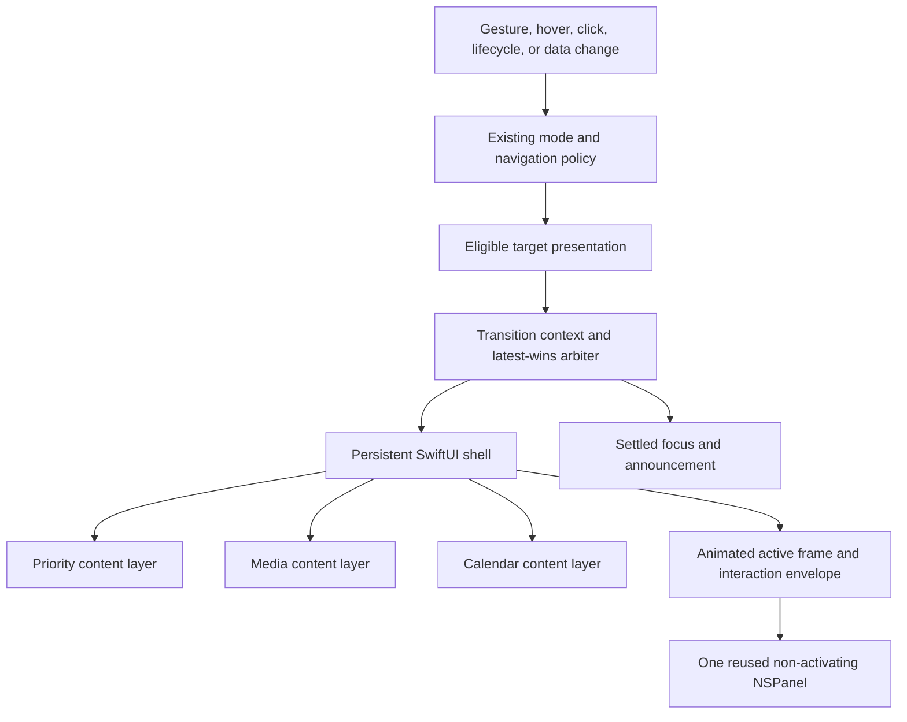
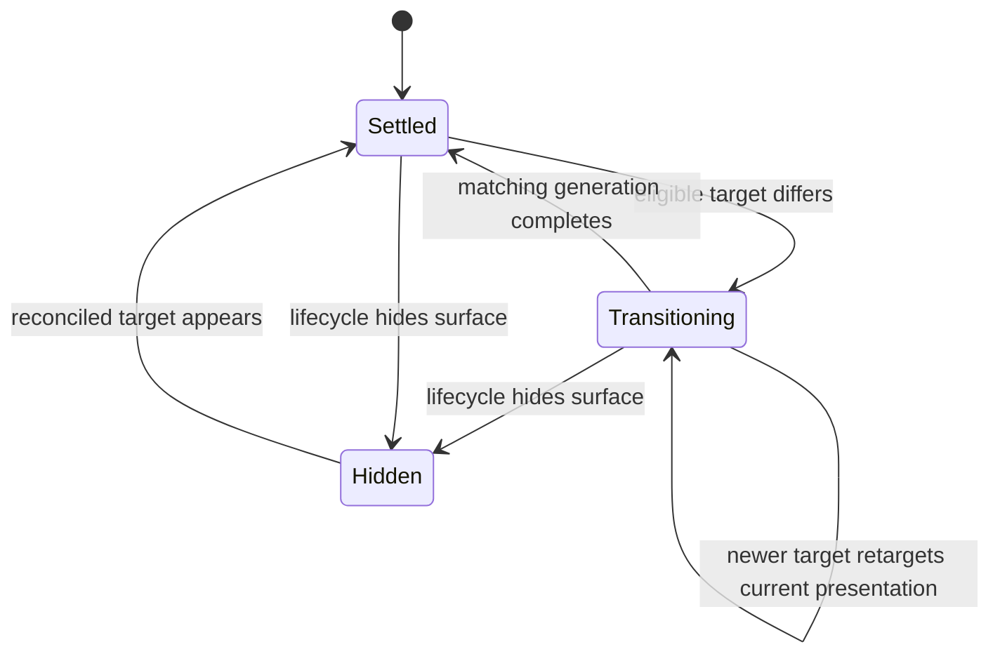
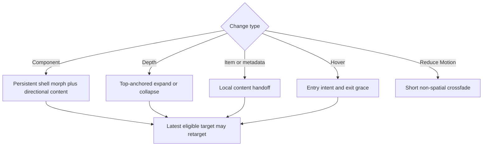

# Surface Transition Continuity - Plan

## Goal Capsule

- **Objective:** Make priority, media, calendar, and depth changes feel like one continuous top-anchored Keep3 surface instead of separate views snapping between endpoints.
- **Authority:** This plan supersedes the blanket 650–850 millisecond handoff requirement in `docs/plans/2026-07-25-001-feat-keep3-visual-system-plan.md`, the approximately 760-millisecond implementation choice in `docs/plans/2026-07-25-002-feat-keep3-media-mode-plan.md`, and the older motion presets in `docs/specs/keep3-mvp.md`. It preserves quiet-at-rest behavior, one coherent motion language, and the shipped media track-peek geometry from `docs/plans/2026-07-26-002-fix-media-track-transition-plan.md`.
- **Execution profile:** Capture the current discontinuities first and compare timing-only normalization, synchronized-frame rendering, and a stable shell against the same manual component/depth scenarios. Establish a pure interruption-safe transition contract, prove the shared envelope can contain every current presentation, then ship one persistent SwiftUI shell as the first visual checkpoint before extending the choreography to automatic, hover, and content-only changes.
- **Stop condition:** Stop if continuity would require multiple overlay panels, focus theft, private window APIs, a regression in pass-through hit testing, or weakening reduced-motion, fixed-edge track feedback, display containment, or stale-event guarantees.
- **Tail ownership:** Implementation owns focused and full tests, formatting, analysis, the arm64 Release build, installed-app visual proof, review fixes, commit, PR, and CI follow-through.

---

## Product Contract

### Summary

Keep3 will treat its notch surface as one persistent product object.
Switching priorities, components, or depth changes the content and silhouette within that object; it does not replace the object, flash an intermediate compact state, or make the user wait through one heavy animation for every update.

### Problem Frame

The current panel is reused, but `TopSurfacePanel` replaces its type-erased SwiftUI root whenever focus, media, or calendar renders.
The three component views then apply unrelated timing: priorities use a 0.76-second ease-in-out, media combines several shorter springs, calendar uses a separate 0.2-second animation, and only media animates the hosted surface frame.
Navigation publishes only the final component and level, so the renderer cannot distinguish direction, trigger, source state, or an interrupted handoff.

The result is visually abrupt even when the final state is correct.
Hover changes can also open or close immediately at the physical notch boundary, while hit testing and gesture context jump to target geometry before the visible surface finishes moving.

### Actors

- A1. A Mac user switching priorities, media, calendar, or surface depth with trackpad, mouse, click, or keyboard input.
- A2. Automatic focus rotation, calendar availability, and media lifecycle changes that can replace the visible component without direct input.
- A3. A user with Reduce Motion, VoiceOver, keyboard-only navigation, increased contrast, or a non-notched external display.

### Requirements

#### Continuous surface and responsive motion

- R1. Priorities, media, and calendar must render inside one persistent top-anchored visual shell across hardware, compact, and expanded levels; a visible-to-visible transition never removes that shell or flashes a hidden state.
- R2. Manual component navigation must move directly from source to target with directionally coherent content feedback while the outer silhouette remains continuous.
- R3. Compact-to-expanded motion must acknowledge input immediately and settle within 300 milliseconds under normal motion; collapse must be no slower than expansion.
- R4. Priority rotation, same-item edits, calendar refreshes, and media metadata changes must animate only the content that changed and must not restart the whole shell transition.

#### Interruption, hover, and interaction

- R5. When a newer eligible target arrives during motion, the latest target wins and retargets from the current presentation; stale completions never restore an older component, level, item, or metadata revision.
- R6. Hover preview must require brief entry intent, provide exit grace across the notch-to-surface corridor, open immediately on click, and remain open while the user is actively interacting.
- R7. During motion, the incoming destination immediately becomes the semantic owner, while visible geometry, hit testing, hover ownership, and gesture context share the shell's current clipped presentation silhouette. Outgoing controls and component-specific incoming controls remain inert until the destination settles; shell-level navigation remains interruptible. Input outside the currently visible silhouette, including transparent subregions inside an endpoint bounding box, continues to pass through to the frontmost application.

#### Accessibility, restraint, and regressions

- R8. Reduce Motion must replace spatial travel, scale, animated blur, and spring overshoot with a non-spatial crossfade no longer than 150 milliseconds while preserving selected-state feedback.
- R9. Component and depth changes must remain understandable through text, icon, marker, focus, and accessibility state rather than motion alone; VoiceOver announces only the settled destination.
- R10. The resting surface must remain still, and transition orchestration must add no continuous timer, display link, image processing, or idle animation.
- R11. Existing behavior remains intact: one reused non-activating panel, display containment, priority semantics, media takeover policy, track-peek fixed-edge geometry, cover-derived waveform color, calendar availability, keyboard alternatives, and single-command gesture/haptic guarantees.
- R12. Display removal, app deactivation, or temporary surface unavailability cancels the in-flight presentation; restoration renders only the latest canonical target and never resumes a stale transition or completion.

### Key Flows

- F1. Manual component switch
  - **Trigger:** A1 commits previous- or next-component navigation.
  - **Actors:** A1
  - **Steps:** The transition receives source, target, and direction; the persistent shell retargets its active frame; outgoing content yields as incoming content arrives.
  - **Outcome:** Current level policy remains authoritative: an expanded source moves directly to the target component's compact level without flashing the source's compact presentation; other switches move directly to their resolved target with no blank frame or stale source content.
  - **Covered by:** R1-R2, R5, R7, R9.
- F2. Depth and hover transition
  - **Trigger:** A1 hovers with intent, clicks, advances depth, retreats depth, or leaves the transition corridor.
  - **Actors:** A1, A3
  - **Steps:** Hover policy resolves intent and grace; the shell expands or contracts from its current geometry; the active interaction envelope follows the visible handoff.
  - **Outcome:** Expansion feels attached to the notch, reversal is smooth, and boundary jitter does not flicker the surface.
  - **Covered by:** R1, R3, R5-R9.
- F3. Automatic component handoff
  - **Trigger:** A2 starts or ends an eligible media session, changes component availability, or rotates the visible priority.
  - **Actors:** A2
  - **Steps:** Existing eligibility policy resolves the latest target; active pointer-down, keyboard, VoiceOver, or component-control commands finish before an automatic target is presented; hover alone does not defer an otherwise eligible target. The transition coordinator coalesces obsolete content updates and the same shell presents the destination.
  - **Outcome:** Automatic changes remain quiet and legible without priority flashes or interaction loss.
  - **Covered by:** R1, R4-R5, R9-R11.
- F4. Interrupted transition
  - **Trigger:** A newer component, level, hover, lifecycle, or content target arrives before the current handoff settles.
  - **Actors:** A1, A2
  - **Steps:** The current completion is invalidated; motion retargets from the presentation in flight; interaction context moves to the new bounded envelope.
  - **Outcome:** The newest valid target wins without snapping backward, queue playback, or stale accessibility announcements.
  - **Covered by:** R5, R7-R11.

### Acceptance Examples

- AE1. Given expanded Priorities, when the user navigates to Media and then Calendar, the shell stays visible and top-anchored while it moves directly to compact Media and then compact Calendar, with no intermediate source-compact, hidden, or blank frame.
- AE2. Given a compact component, when expansion is reversed halfway through, the silhouette contracts from its current presentation without jumping to either endpoint first.
- AE3. Given five rapid component changes during one handoff, when input stops, only the fifth eligible target settles and no earlier completion changes the result.
- AE4. Given the pointer crosses the physical notch boundary repeatedly, when it does not remain inside long enough to establish intent, the surface does not flicker open and closed; after entry, brief corridor crossings do not collapse it.
- AE5. Given Reduce Motion, when component, item, and depth changes occur, the destination is communicated by a short crossfade and selected-state change with no spatial travel, scale, blur, or overshoot.
- AE6. Given an automatic media takeover followed by session exit during motion, when focus becomes the latest eligible target, the surface transitions directly to that focus without a blank or unrelated priority frame.
- AE7. Given a media Next or Previous peek, when the global shell motion system is active, the shipped fixed-edge geometry, below-notch metadata, waveform accent, command count, and reduced-motion rules remain unchanged.
- AE8. Given a shell resize in flight, when the user clicks outside the shell's current clipped visible silhouette or inside a transparent subregion of the endpoint bounding box, the click reaches the frontmost application; clicks on visibly transitioning shell pixels are consumed by Keep3 without invoking outgoing or not-yet-settled component controls.
- AE9. Given a display or app lifecycle interruption during motion, when the surface becomes eligible again, it appears at the latest canonical destination without replaying the interrupted transition, duplicating haptics, or publishing a stale completion.

### Key Product Decisions

- **Borrow continuity, not product scope.** LumaNotch and legitimate notch utilities are directional evidence for a persistent physical surface; Keep3 will not copy their assets, installation flow, multi-widget dashboard, or unrelated HUD features. Governs R1-R4, R10-R11.
- **Keep one motion language with trigger-specific tempo.** The same restrained easing and continuity rules apply everywhere, but frequent content updates, component switches, expansion, collapse, and reduced motion use different bounded durations. Governs R2-R5, R8, R10.
- **Keep the object quiet at rest.** Delight belongs to meaningful state changes, not breathing, shimmer, ambient bounce, or permanent decorative motion. Governs R4, R10.

### Scope Boundaries

#### In scope

- Cross-component, cross-level, priority rotation/edit, automatic takeover/exit, hover-entry, hover-exit, and interrupted transition behavior.
- Persistent shell ownership, transition intent propagation, shared motion tokens, active interaction envelope, Reduce Motion parity, settings-preview alignment, automated coverage, and native visual verification.

#### Deferred to Follow-Up Work

- User-configurable animation speed, per-trigger dwell settings, new transition themes, or a motion editor.
- Broader settings, editor, typography, material, or control redesign beyond changes needed to demonstrate the runtime motion contract.

#### Outside this product's identity

- File-drop shelves, extra system HUDs, notifications, battery/connectivity widgets, mirrors, launchers, or features advertised by competing notch utilities.
- LumaNotch downloads, source, assets, copy, testimonials, or installation instructions.

---

## Planning Contract

### Key Technical Decisions

- KTD1. **Keep one stable SwiftUI host and shell.** Replace per-component type-erased root assignment with a stable host backed by one main-actor observable shell store and stable action router. The store refreshes transition snapshots, payloads, and destination handlers without replacing the SwiftUI root; the shell owns active-frame interpolation, mask, background, and bounded content overlap. Continue reusing one non-activating `NSPanel` and `DisplayGeometry.sharedEnvelopeLayout`; do not animate the AppKit window as the primary handoff. Implements R1-R4, R7, R10-R11.
- KTD2. **Carry explicit transition context into rendering.** A pure main-actor transition model records source, target, trigger, navigation direction, phase, generation, and reduced-motion policy. Navigation and lifecycle coordinators continue to decide eligibility and final state; the transition model decides only presentation continuity and completion validity. Implements R2-R5, R7-R9.
- KTD3. **Retarget instead of queueing.** Lifecycle hide cancels immediately; every other newer eligible target invalidates the old completion and retargets the stable animatable shell from SwiftUI's current interpolated presentation rather than reconstructing an endpoint in the semantic reducer. Same-item edits and same-component data revisions coalesce to the newest payload, while manual navigation direction remains attached to its own transition. Active pointer-down, keyboard, VoiceOver, and component-control commands pin their destination until the command settles; automatic targets then reconcile to the latest canonical state. Lifecycle restoration reconciles directly to the latest canonical state. Implements R4-R5, R9-R12.
- KTD4. **Use a bounded motion-token family.** Start with a well-damped 240–300 millisecond expansion, a 170–220 millisecond collapse, a 180–240 millisecond component-shell morph, and a 120–180 millisecond content crossfade with 6–12 points of directional offset. Priority edit/rotation uses the content phase without a large shell excursion. Manual previous/next navigation is directional; automatic media takeover/exit uses a neutral crossfade-plus-morph so it does not imply a user gesture. Hover entry uses approximately 140 milliseconds of intent and exit approximately 220 milliseconds of grace. Reduce Motion resolves global shell and component handoffs to a 120-millisecond crossfade; media Next/Previous track peek remains a preserved local-feedback exception governed by its shipped reduced-motion rules. Tune within these bounds using installed-app evidence, not separate component constants. Implements R2-R6, R8, R10.
- KTD5. **Centralize shell motion and constrain local animation.** `TopSurfaceView`, `MediaSurfaceView`, and `CalendarSurfaceView` receive the resolved transition phase and may retain component-specific micro-animation such as playback progress; they cannot independently animate the outer frame, shape, or component replacement. Animation modifiers must key to the smallest owning value so metadata refreshes do not restart shell motion. Implements R1-R4, R8, R10-R11.
- KTD6. **Use the current clipped presentation silhouette during motion.** The incoming destination becomes the semantic owner as soon as its target commits, but outgoing controls and component-specific incoming controls remain inert until settlement; shell navigation may still retarget the transition. AppKit hit testing, hover ownership, and gesture context derive from the same current interpolated visible silhouette, with transparent subregions passed through and fixed-edge track-peek protrusions included only while visible. Generation changes cancel armed gestures, haptics fire only when the gesture command commits rather than on completion or retarget, and the hover corridor follows the same silhouette without manufacturing an exit when the surface expands under the pointer. This preserves interaction on visible motion without turning the full transparent panel into a click shield. Implements R5-R7, R11.
- KTD7. **Respect both motion accessibility signals.** Resolve the existing Reduce Motion value and SwiftUI's crossfade preference into the same non-spatial transition policy. Selected component, depth, and destination remain explicit in accessibility values and focus state; intermediate frames are not separately announced. After settlement, focus moves to the equivalent destination control when one exists, otherwise to the destination surface container; unavailable targets and lifecycle restoration use the same container fallback, and each settled destination is announced once. Implements R8-R9, R11.

### Assumptions

- The reported “switching” problem includes manual component navigation, component takeover/exit, priority content handoff, and hardware/compact/expanded changes rather than only the already-corrected media track peek.
- Click expansion stays immediate; the new hover delay applies only to passive pointer entry.
- Current availability and selection policy remains authoritative. This work changes presentation continuity, not which component wins.
- The reference product is visual category evidence only. Current LumaNotch malware reporting makes its executable, installation path, and assets untrusted.

### High-Level Technical Design

#### Ownership and data flow

#### Transition lifecycle

#### Motion family

### System-Wide Impact

- **Presentation state:** `SurfaceNavigationCoordinator` and `Keep3App` must preserve trigger and direction through target publication without making animation the source of truth for product state.
- **AppKit/SwiftUI boundary:** `TopSurfacePanel` retains one root hierarchy and keeps transparent regions non-interactive; the shell owns visual interpolation inside the existing shared window envelope.
- **Input:** `TopSurfaceEventView`, `SurfaceGestureRecognizer`, hover state, and keyboard focus must agree on transition generation and active bounds.
- **Accessibility:** Reduce Motion becomes consistent across all components, and VoiceOver focus/announcements move only when the destination settles.
- **Lifecycle:** Display, app-active, and availability changes cancel presentation work without changing the canonical target; reappearance reconciles once from current state.
- **Performance:** Persistent source/target layers exist only during a bounded handoff. Media progress and waveform updates cannot invalidate the entire shell.
- **Documentation:** The visual-system and MVP motion clauses need reconciliation so future work does not restore the 0.76-second blanket duration or obsolete user presets.

### Risks and Dependencies

- **SwiftUI identity risk:** Retaining source and target long enough for a handoff can duplicate side effects or accessibility nodes. Keep content payloads immutable, disable source interaction, and expose only the settled accessibility destination.
- **Input-envelope risk:** A union frame can briefly exceed the visible silhouette. Clip it to the source-target bounds and shared panel envelope, keep the handoff bounded, and test clicks immediately outside representative geometries.
- **Interruption risk:** Completion callbacks can arrive after retarget or lifecycle hide. Bind every completion to the transition generation and prove stale rejection with a manual scheduler.
- **Performance risk:** Layering expensive media and calendar views can stutter. Keep overlap bounded, avoid image work during animation, and verify Release behavior during waveform playback and rapid navigation.
- **Contract drift:** Prior plans describe a blanket 650–850-millisecond handoff and an approximately 760-millisecond media transition. Update both owning clauses and verification evidence in the same change.
- **Visual proof gap:** Unit tests prove state, geometry, and timing policy but not perceived continuity. Slow-motion installed-app review on notched and floating displays remains required.

### Sources and Research

- `Keep3/Overlay/TopSurfacePanel.swift` replaces the hosted `AnyView` root per component and animates the active frame for Media only.
- `Keep3/Overlay/SurfaceNavigationCoordinator.swift` publishes final selection and level without source, trigger, direction, or transition phase.
- `Keep3/Overlay/SignatureSurfaceTransition.swift`, `Keep3/Overlay/MediaSurfaceView.swift`, and `Keep3/Overlay/CalendarSurfaceView.swift` currently encode incompatible timing families.
- `Keep3/Overlay/DisplayGeometry.swift` already provides a shared top-aligned panel envelope to preserve.
- `docs/plans/2026-07-25-001-feat-keep3-visual-system-plan.md` supplies the quiet-at-rest identity and records overlapping transitions as an unresolved risk.
- [Apple Motion guidance](https://developer.apple.com/design/human-interface-guidelines/motion) favors purposeful, brief, precise, interruptible feedback.
- [SwiftUI Animations](https://developer.apple.com/documentation/swiftui/animations) documents state-scoped animation and insertion/removal transitions; [crossfade preference](https://developer.apple.com/documentation/swiftui/environmentvalues/accessibilitypreferscrossfadetransitions) maps Reduce Motion to non-spatial transitions on macOS.
- [DynamicHorizon](https://www.dynamichorizon.app/), [DynamicLake changelog](https://www.dynamiclake.com/changelog), [NotchNook](https://lo.cafe/notchnook), [MediaMate](https://wouter01.github.io/MediaMate/), and the [MacStories review](https://www.macstories.net/reviews/notchnook-and-mediamate-two-apps-to-add-a-dynamic-island-on-the-mac/) support a persistent physical shell, contextual compact states, hover hysteresis, and direct expansion as useful category patterns.
- [MacGeneration's LumaNotch report](https://www.macg.co/logiciels/2026/06/lumanotch-cette-fausse-app-pour-lencoche-des-macbook-cache-un-malware-308989) and [Moonlock's related campaign reporting](https://moonlock.com/verified-x-account-spreading-amos) make LumaNotch downloads and brand assets unsuitable as trusted implementation inputs.
- No `docs/solutions/` corpus or `CONCEPTS.md` exists.

---

## Implementation Units

### U1. Establish the transition and motion contracts

- **Goal:** Make source, target, trigger, direction, timing, phase, interruption, and accessibility policy independently testable before changing rendering.
- **Requirements:** R2-R5, R8-R10; F1-F4; AE2-AE3, AE5-AE6; KTD2-KTD4, KTD7.
- **Dependencies:** None.
- **Files:**
  - `Keep3/Overlay/SignatureSurfaceTransition.swift`
  - `Keep3/Overlay/TopSurfacePresentation.swift`
  - `Keep3/Overlay/SurfaceNavigationCoordinator.swift`
  - `Keep3/Overlay/SurfaceComponent.swift`
  - `Keep3/Overlay/DisplayGeometry.swift`
  - `Keep3Tests/Overlay/SignatureSurfaceTransitionTests.swift`
  - `Keep3Tests/Overlay/SurfaceNavigationCoordinatorTests.swift`
  - `Keep3Tests/Overlay/SurfaceTransitionCoordinatorTests.swift`
  - `Keep3.xcodeproj/project.pbxproj`
- **Approach:**
  1. Add a pure transition context and phase reducer around immutable source and target presentation identities.
  2. Propagate manual direction and trigger without moving component eligibility or navigation semantics into the renderer.
  3. Resolve KTD4 tokens centrally and invalidate completions by generation.
  4. Capture the current installed build at normal speed and slow motion, then compare timing-only normalization, synchronized-frame rendering, and stable-shell rendering against the same manual component/depth scenarios.
  5. Enumerate every component, level, track-peek direction, notched/floating style, and constrained-display envelope and prove the existing shared panel contains each target before U2 begins.
  6. Rename or clarify the misleading priority transition-identity test while preserving edit-triggered content handoff.
- **Execution note:** Start with failing reducer tests for rapid replacement, reversal, and stale completion before introducing the persistent host. Proceed with KTD1 only when the stable-shell probe removes an identity discontinuity that the cheaper timing and frame-only variants do not.
- **Patterns to follow:** Main-actor coordinators with injected schedulers in `SurfaceModeCoordinator` and pure resolved policy in `SignatureSurfaceTransition`.
- **Test scenarios:**
  - Manual next and previous transitions retain mirrored direction and the same target state.
  - A compact-to-expanded transition reversed at mid-phase begins from the current presentation and settles compact.
  - Covers AE3. Five rapid targets invalidate four completion generations and settle only the latest eligible target.
  - Multiple edits to the same visible item coalesce to the newest revision without a shell-level transition.
  - Lifecycle hide cancels immediately, restoration renders the latest canonical state without replay, and a stale completion cannot republish the prior surface.
  - Covers AE5. Reduce Motion resolves every trigger to the same non-spatial crossfade policy within R8.
  - Every current target and fixed-edge track-peek presentation fits the shared envelope on notched, floating, and constrained displays.
- **Verification:** Focused transition and navigation suites prove semantic phase, token family, trigger, direction, target selection, and stale-completion outcomes; baseline captures and envelope tests gate the persistent-host implementation. Midpoint visual continuity remains a rendered-host responsibility.

### U2. Replace root swapping with one persistent shell

- **Goal:** Preserve shell identity across all component and depth changes while keeping the existing AppKit window and display envelope stable.
- **Requirements:** R1-R5, R7, R10-R11; F1-F4; AE1-AE3, AE6-AE8; KTD1-KTD3, KTD6.
- **Dependencies:** U1.
- **Files:**
  - `Keep3/Overlay/TopSurfacePanel.swift`
  - `Keep3/Overlay/TopSurfaceController.swift`
  - `Keep3/Overlay/DisplayGeometry.swift`
  - `Keep3/App/Keep3App.swift`
  - `Keep3/Overlay/SurfaceGestureRecognizer.swift`
  - `Keep3/Overlay/TopSurfaceHostState.swift`
  - `Keep3Tests/Overlay/TopSurfacePanelTests.swift`
  - `Keep3Tests/Overlay/DisplayGeometryTests.swift`
  - `Keep3Tests/Overlay/SurfaceGestureRecognizerTests.swift`
- **Approach:**
  1. Replace per-component `AnyView` root reassignment with one host and observable shell store that refreshes payloads and stable action handlers without replacing the root.
  2. Make the stable SwiftUI shell the presentation authority so frame, shape, opacity, and directional content can retarget from their current interpolated values.
  3. Keep source/target overlap bounded to the content handoff, instrument renderer lifecycle and media updates, and retain live overlap only if it does not duplicate commands, accessibility nodes, artwork decoding, or unbounded timeline work.
  4. Animate the active SwiftUI frame inside `sharedEnvelopeLayout`; keep the AppKit panel frame and focus policy unchanged.
  5. Publish KTD6's current clipped visible silhouette to hit testing and gesture context, including pass-through points inside transparent endpoint-delta areas.
  6. Disable outgoing and not-yet-settled component controls while retaining shell-level navigation for interruption; enable destination controls and accessibility only at settlement.
- **Patterns to follow:** One-panel reuse in `TopSurfaceController`, `DisplayGeometry.sharedEnvelopeLayout`, `TopSurfaceHoverRegion`, and generation-based gesture cancellation.
- **Test scenarios:**
  - Covers AE1. Focus-to-media-to-calendar updates reuse the same panel and stable host identity without an intermediate hidden presentation.
  - Source and target layers coexist only during the matching generation and source interaction is disabled.
  - Covers AE8. Representative notched and floating transitions own clicks only on the current clipped visible silhouette.
  - Endpoint-delta and transparent interior points pass through at transition start, midpoint, and settlement.
  - Actions remain current after creating the host from each initial component and switching to the other two.
  - Midpoint reversal preserves interpolated geometry, opacity, and direction without snapping to an endpoint.
  - A context-generation change cancels a gesture armed against the old frame, and command haptics remain exactly once even when motion retargets.
  - Surface removal, display loss, and reconciliation still remove or reuse the panel exactly once; restoration never resumes the old animation.
  - Covers AE7. Next and Previous media peek geometry keeps its shipped fixed edge inside the shared shell.
- **Verification:** Panel, geometry, rendered-host, and gesture tests prove host reuse, bounded overlap, action freshness, midpoint retargeting, pass-through behavior, and unchanged fixed-edge media geometry. A normal-speed installed-app checkpoint must show that manual component and depth switches preserve one trackable object before U3 begins.

### U3. Adopt one motion family across component renderers and hover

- **Goal:** Extend the verified persistent shell to priorities, media, calendar, depth, automatic handoff, content-only updates, and hover without erasing component-specific feedback.
- **Requirements:** R1-R6, R8-R11; F1-F4; AE1-AE7; KTD3-KTD5, KTD7.
- **Dependencies:** U1-U2.
- **Files:**
  - `Keep3/Overlay/TopSurfaceView.swift`
  - `Keep3/Overlay/MediaSurfaceView.swift`
  - `Keep3/Overlay/CalendarSurfaceView.swift`
  - `Keep3/Overlay/TopSurfaceContent.swift`
  - `Keep3/Overlay/TopSurfaceInteractionModel.swift`
  - `Keep3/Overlay/SurfaceNavigationCoordinator.swift`
  - `Keep3Tests/Overlay/TopSurfaceInteractionTests.swift`
  - `Keep3Tests/Overlay/MediaSurfacePresentationTests.swift`
  - `Keep3Tests/Overlay/CalendarSurfacePresentationTests.swift`
  - `Keep3Tests/Overlay/SurfaceNavigationCoordinatorTests.swift`
- **Approach:**
  1. Remove component-owned outer-frame and replacement animations and consume the central transition phase.
  2. Keep local progress, artwork, waveform, and calendar-update animation keyed to their own revisions so they do not restart the shell.
  3. Keep `TopSurfaceInteractionModel` as the sole owner of hover-entry and exit-grace scheduling; navigation receives only the resolved hover level and trigger.
  4. Use the physical notch-to-surface corridor on notched displays and the current animated silhouette plus 8 points of exit slop on floating displays; re-entry cancels the 220-millisecond grace timer.
  5. Defer automatic component presentation while pointer-down, keyboard, VoiceOver, or a component-control command is active; complete the current command, then reconcile the newest eligible target without changing existing media eligibility policy.
  6. Apply KTD7's equivalent-control/container focus fallback only when the destination settles.
- **Patterns to follow:** Existing explicit payload revisions, injected timer schedulers, and accessibility environment resolution.
- **Test scenarios:**
  - Priority rotation and same-item edit animate content without resizing or replacing the shell.
  - Media progress and waveform ticks do not create a component transition or reset its phase.
  - Calendar refresh inside Calendar leaves shell and selection identity stable.
  - Covers AE4. Brief boundary crossings do not open the surface, and exit grace prevents one-frame close/reopen flicker.
  - Floating presentation uses silhouette slop and re-entry cancellation without relying on a physical-notch corridor.
  - Click expansion bypasses hover delay; expansion under the pointer preserves entered ownership; keyboard, VoiceOver, and active media control interaction pin the intended level.
  - Covers AE5. All three renderers preserve destination feedback under the same reduced-motion policy.
  - Covers AE7. Media track-peek, artwork accent, and expanded retreat suites remain unchanged.
- **Verification:** Interaction and presentation suites prove that only owning state changes animate, hover is stable, and reduced-motion semantics match across all components.

### U4. Reconcile motion contracts and release-verify continuity

- **Goal:** Remove superseded timing claims and prove the new transition family in the installed app across displays, accessibility settings, and rapid input.
- **Requirements:** R1-R12; F1-F4; AE1-AE9.
- **Dependencies:** U1-U3.
- **Files:**
  - `docs/specs/keep3-mvp.md`
  - `docs/plans/2026-07-25-001-feat-keep3-visual-system-plan.md`
  - `docs/plans/2026-07-25-002-feat-keep3-media-mode-plan.md`
  - `docs/verification/keep3-mvp.md`
  - `docs/verification/keep3-event-surface.md`
  - `docs/verification/keep3-visual-media.md`
  - `Keep3UITests/Keep3UITests.swift`
- **Approach:**
  1. Replace the obsolete preset, blanket-duration, and single-heavy-handoff clauses with this plan's coherent trigger-specific motion contract.
  2. Extend UI coverage for final component/depth outcomes and stable accessibility identifiers while keeping interpolation quality a native visual gate.
  3. Run formatting, focused and full tests, analysis, and the arm64 Release build.
  4. Compare the installed Release build with the captured baseline at normal speed and slow motion on notched and floating displays, including rapid navigation, hover-boundary movement, media playback, calendar content, and expansion reversal.
- **Patterns to follow:** Evidence tables in existing verification documents and Release-gate commands in the prior media/event plans.
- **Test scenarios:**
  - Covers AE1-AE3. Slow-motion capture shows one continuous top edge and no source-compact intermediate, hidden, backward, or stale frame through direct and rapid switches.
  - Covers AE4. Repeated pointer movement across the physical notch boundary produces one intentional open and one delayed close.
  - Covers AE5. Reduce Motion uses only the short crossfade while VoiceOver and keyboard state remain correct.
  - Covers AE6-AE7. Automatic media takeover/exit and track feedback preserve all existing command, geometry, color, and fallback guarantees.
  - Covers AE8. Clicking immediately outside the transitioning visible envelope continues to operate the frontmost app without activating Keep3.
  - Covers AE9. Display removal, deactivation, and restoration show only the latest state and never replay a stale animation or haptic.
- **Verification:** Automated gates pass, documentation names one current motion contract, and installed Release evidence demonstrates continuity on both presentation styles.

---

## Verification Contract

| Gate | Applies to | Command or evidence | Done signal |
|---|---|---|---|
| Strict formatting | U1-U4 | `xcrun swift-format lint --strict --recursive Keep3 Keep3Tests Keep3MediaService Keep3UITests` | Zero findings |
| Targeted transition tests | U1-U3 | `xcodebuild test -project Keep3.xcodeproj -scheme Keep3 -configuration Debug -destination 'platform=macOS' -derivedDataPath .build/DerivedData -only-testing:Keep3Tests/SurfaceTransitionCoordinatorTests -only-testing:Keep3Tests/SignatureSurfaceTransitionTests -only-testing:Keep3Tests/SurfaceNavigationCoordinatorTests -only-testing:Keep3Tests/TopSurfacePanelTests -only-testing:Keep3Tests/DisplayGeometryTests -only-testing:Keep3Tests/SurfaceGestureRecognizerTests -only-testing:Keep3Tests/TopSurfaceInteractionTests -only-testing:Keep3Tests/MediaSurfacePresentationTests -only-testing:Keep3Tests/CalendarSurfacePresentationTests CODE_SIGNING_ALLOWED=NO` | Phase, retarget, renderer, hover, geometry, input, and reduced-motion suites pass |
| Full unit suite | U1-U4 | `xcodebuild test -project Keep3.xcodeproj -scheme Keep3 -configuration Debug -destination 'platform=macOS' -derivedDataPath .build/DerivedData -only-testing:Keep3Tests CODE_SIGNING_ALLOWED=NO` | All tests pass; machine-dependent skips are explained |
| UI outcome suite | U4 | `xcodebuild test -project Keep3.xcodeproj -scheme Keep3 -configuration Debug -destination 'platform=macOS' -derivedDataPath .build/DerivedData -only-testing:Keep3UITests` | Component/depth outcomes and stable accessibility identifiers pass; permission-dependent skips are explained |
| Static analysis | U1-U4 | `xcodebuild analyze -project Keep3.xcodeproj -scheme Keep3 -configuration Debug -destination 'platform=macOS' -derivedDataPath .build/DerivedData CODE_SIGNING_ALLOWED=NO` | Analyze succeeds |
| Release build | U1-U4 | `xcodebuild -project Keep3.xcodeproj -scheme Keep3 -configuration Release -destination 'platform=macOS,arch=arm64' -derivedDataPath .build/DerivedData build` | arm64 Release succeeds |
| Native continuity proof | U1-U4 | Baseline and installed Release app on notched and floating displays, normal and Reduce Motion, with normal-speed and slow-motion capture of direct switch, five-target interruption, expand/reverse, hover corridor, media takeover/exit, and track peek | At normal speed the eye can track one uninterrupted top-anchored object with immediate input acknowledgement and no disappearance, catch-up resize, or endpoint snap; slow motion confirms the latest target wins, hover does not flicker, reduced motion is non-spatial, and shipped media invariants remain correct |
| Input and accessibility proof | U2-U4 | Type continuously in another app while exercising boundary clicks, then use explicit keyboard and VoiceOver navigation | Keep3 remains non-activating outside explicit keyboard mode, outside clicks pass through, focus follows the settled target, and each destination is announced once |

---

## Definition of Done

- U1-U4 satisfy every cited requirement, flow, and acceptance example.
- Priorities, media, and calendar share one stable host and top-anchored shell across hardware, compact, and expanded levels.
- Component switches, priority edits, automatic takeover/exit, expansion, collapse, hover, and interruption use the resolved trigger-specific motion family rather than per-component outer animations.
- Five rapid eligible targets settle only the latest without a compact flash, blank frame, stale content, backward snap, or duplicate accessibility announcement.
- Hover intent and exit grace eliminate notch-boundary flicker while click, keyboard, VoiceOver, and active control interaction remain immediate and reliable.
- Reduce Motion uses a short non-spatial crossfade across every component and depth change.
- The clipped transition interaction envelope preserves visible interaction and pass-through behavior without making the shared transparent panel a click shield.
- Lifecycle interruption cancels presentation work, restoration renders only canonical state, and haptics remain tied to committed commands rather than animation callbacks.
- Existing panel focus policy, display bounds, priority semantics, media selection, track-peek fixed edges, metadata shelf, cover accent, calendar state, gestures, haptics, and command guarantees remain green.
- Formatting, targeted tests, full tests, analysis, and the arm64 Release build pass; installed normal/reduced-motion evidence on notched and floating displays confirms the perceived discontinuity is gone.
- Superseded motion presets and blanket timing claims are removed or rewritten at their owning documents.
- Experimental branches, duplicate transition constants, obsolete tests, and abandoned host implementations are removed from the final diff.
