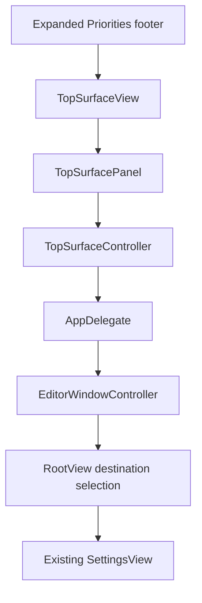
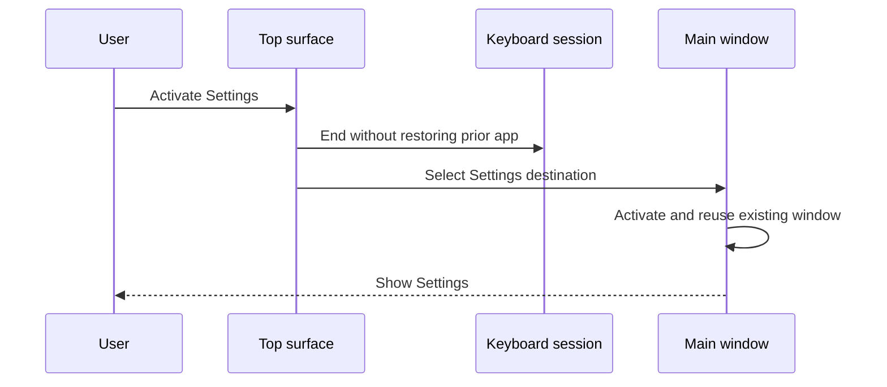

# Notch Settings Access and App Branding - Plan

## Goal Capsule

- **Objective:** Give users a direct path from the expanded Priorities surface to Keep3 Settings and replace the editor sidebar wordmark with the current app logo.
- **Product authority:** The user chose the expanded footer placement and requested both outcomes in one delivery.
- **Execution profile:** Implement the window destination path before wiring the surface action, then apply the branding change and verify the complete installed interaction.
- **Open blockers:** None.
- **Tail ownership:** LFG owns simplification, review, landing, PR creation, and CI follow-through after implementation.

---

## Product Contract

### Summary

Keep3 adds a labeled Settings action to the expanded Priorities footer and routes it to the existing main window's Settings tab.
The main editor sidebar displays the packaged Keep3 logo above its existing tagline instead of a text wordmark.

### Problem Frame

The top surface can open a visible priority, but it has no direct route to application settings.
Users must reach the main window by another path and then change tabs before they can adjust Keep3.

The editor sidebar currently renders the product name as plain text even though Keep3 already ships a distinct application icon.
The requested branding change should reuse that identity without expanding into a broader editor redesign.

### Key Decisions

- **Place Settings in the expanded Priorities footer as a labeled action.** (session-settled: user-directed — chosen over an expanded-header icon and a compact-hover icon: the user selected the footer action after comparing the three visual placements.) Governs R1, R2, R6.
- **Ship the access and branding changes together.** The notch-to-Settings flow and editor Logo replacement share one delivery boundary. Governs R1–R8.

### Requirements

**Notch-to-Settings access**

- R1. Expanded Priorities displays a labeled Settings action centered between the existing previous and next control positions.
- R2. One-item and multi-item footers keep the Settings action centered while preserving the current navigation controls and placeholders.
- R3. Activating Settings ends any explicit keyboard-navigation session without restoring the previously frontmost app, then activates and reuses the existing Keep3 window on its Settings tab.
- R4. Opening a priority continues to select that priority and present the editor tab rather than inheriting a prior Settings destination.
- R5. Passive hover, expansion, collapse, and browsing remain nonactivating.
- R6. Compact Priorities, Media, and Calendar surfaces do not gain a Settings shortcut in this change.

**App branding**

- R7. The editor sidebar replaces its “Keep3” text wordmark with the current packaged application logo while retaining the existing tagline.
- R8. The Settings action and Logo expose stable accessibility names and automation identifiers; the Logo remains identifiable as “Keep3” without restoring the visible wordmark.

### Key Flows

- F1. Open Settings from the notch
  - **Trigger:** The user activates Settings in expanded Priorities.
  - **Steps:** Keep3 ends surface keyboard navigation without restoring the previous app, selects the Settings destination, activates the existing main window, and brings it forward.
  - **Outcome:** Settings is visible without creating a second window or mutating the current priority.
  - **Covers:** R1–R3.
- F2. Open a priority after visiting Settings
  - **Trigger:** The user activates a visible priority from the expanded surface after the main window has shown Settings.
  - **Steps:** Keep3 selects the priority, selects the editor destination, and reuses the existing window.
  - **Outcome:** The matching item editor is visible rather than the previously selected Settings tab.
  - **Covers:** R4.
- F3. Recognize Keep3 in the editor
  - **Trigger:** The main window displays the editor sidebar.
  - **Steps:** The sidebar renders the packaged app logo above the unchanged tagline and exposes the app name to accessibility.
  - **Outcome:** The editor carries Keep3's current visual identity without adding a second logo asset or changing the window title.
  - **Covers:** R7, R8.

### Acceptance Examples

- AE1. Direct Settings access
  - **Covers:** R1–R3.
  - **Given:** Priorities is expanded and the main window is closed or showing the editor.
  - **When:** The user activates the footer Settings action.
  - **Then:** The existing Keep3 window becomes key on Settings, the current priority is unchanged, and the surface keyboard session is inactive.
- AE2. Footer remains balanced
  - **Covers:** R1, R2.
  - **Given:** Keep3 has either one priority or multiple priorities.
  - **When:** Priorities expands.
  - **Then:** Settings stays centered while arrow controls or equal-width placeholders occupy the side positions.
- AE3. Existing editor route wins
  - **Covers:** R4.
  - **Given:** The main window most recently displayed Settings.
  - **When:** The user activates a visible priority from the surface.
  - **Then:** The existing window shows that priority in the editor.
- AE4. Branding remains accessible
  - **Covers:** R7, R8.
  - **Given:** The editor sidebar is visible.
  - **When:** The UI is inspected visually or with accessibility.
  - **Then:** The packaged Logo and unchanged tagline are present, the plain-text sidebar wordmark is absent, and the Logo is named “Keep3”.
- AE5. Passive surface interactions remain nonactivating
  - **Covers:** R5.
  - **Given:** Keep3's Priorities surface is visible while another application is frontmost.
  - **When:** The pointer hovers, expands, collapses, or browses the surface without activating an explicit action.
  - **Then:** Keep3 does not become the active application.

### Scope Boundaries

- The Settings entry is limited to expanded Priorities, matching the selected footer sketch.
- Media, Calendar, and compact Priorities layouts remain unchanged.
- The window title remains “Keep3”.
- Settings categories, controls, and visual design remain unchanged.
- The editor sidebar keeps its current structure and tagline; only the wordmark becomes the Logo.

---

## Planning Contract

### Key Technical Decisions

- KTD1. **Own top-level destination state at the window-controller boundary.** A controller-retained observable selection drives tagged editor and Settings tabs so explicit entry points can choose a destination while reusing one window. Implements R3, R4.
- KTD2. **Thread a dedicated focus-surface Settings callback.** Extend the existing focus-only callback path from `TopSurfaceView` through `TopSurfacePanel`, `TopSurfaceController`, and `AppDelegate`, following the separate `onOpenItem` pattern rather than overloading item activation. Implements R1–R6.
- KTD3. **Source the sidebar Logo from the running application's icon.** Bridge the packaged application icon into SwiftUI instead of assuming the app-icon catalog is a reusable named image or duplicating it into a second asset set. Implements R7, R8.

### High-Level Technical Design

### Assumptions

- The selected footer design applies to expanded Priorities only; other surface components are not redesigned.
- The first Settings presentation uses its existing General default, while later presentations preserve the in-memory Settings category selection.
- Direct Settings access preserves the main window's existing size behavior; this work does not add destination-specific resizing.
- The packaged app icon is the intended Logo and the existing tagline remains unchanged.

### Sequencing

1. Establish destination-aware window presentation and prove editor/Settings selection on one reused window.
2. Add the focus-surface Settings callback and centered footer action, then prove the end-to-end route.
3. Replace the editor wordmark with the packaged Logo and verify the final accessibility and visual state.

### Sources and Research

- `Keep3/App/RootView.swift` contains the current unbound editor/Settings `TabView`.
- `Keep3/App/EditorWindowController.swift` owns the single reusable main window and its SwiftUI root.
- `Keep3/App/Keep3App.swift` shows the current open-item teardown ordering that avoids restoring the previous application.
- `Keep3/Overlay/TopSurfaceView.swift` owns the expanded Priorities footer and equal-width navigation placeholders.
- `Keep3/Overlay/TopSurfacePanel.swift` and `Keep3/Overlay/TopSurfaceController.swift` establish the callback-forwarding and explicit keyboard-session contracts.
- `Keep3/Resources/Assets.xcassets/AppIcon.appiconset` is the packaged icon source; no reusable named Logo image set exists.
- No applicable institutional learning exists under `docs/solutions/` because that directory is absent.

---

## Implementation Units

### U1. Add destination-aware main-window presentation

- **Goal:** Let callers present the existing main window on either the editor or Settings destination.
- **Requirements:** R3, R4; F1, F2; AE1, AE3; KTD1.
- **Dependencies:** None.
- **Files:**
  - `Keep3/App/RootView.swift`
  - `Keep3/App/EditorWindowController.swift`
  - `Keep3Tests/App/EditorWindowControllerTests.swift`
- **Approach:**
  1. Give the top-level tabs stable destination values and bind their selection to controller-owned observable state.
  2. Make the Settings presentation path select Settings before using the existing activation and window-reuse behavior.
  3. Make the editor presentation path select the editor so item activation cannot reopen on Settings.
- **Execution note:** Start with failing controller tests for destination selection and window reuse.
- **Patterns to follow:** `EditorWindowController.showEditor` for activation and reuse; `SettingsView` for existing nested category ownership.
- **Test scenarios:**
  1. A new controller presents the editor destination on the original window.
  2. Presenting Settings selects the Settings tab and reuses the same window after close and reopen.
  3. Presenting the editor after Settings selects the editor destination on the same window.
  4. Destination changes with activation disabled remain testable without bringing the test host app forward.
- **Verification:** Controller tests prove deterministic destination selection and single-window reuse.

### U2. Add the expanded-footer Settings route

- **Goal:** Add the centered footer action and connect it to destination-aware Settings presentation.
- **Requirements:** R1–R6, R8; F1, F2; AE1–AE3, AE5; KTD1, KTD2.
- **Dependencies:** U1.
- **Files:**
  - `Keep3/Overlay/TopSurfaceView.swift`
  - `Keep3/Overlay/TopSurfacePanel.swift`
  - `Keep3/Overlay/TopSurfaceController.swift`
  - `Keep3/App/Keep3App.swift`
  - `Keep3UITests/Keep3UITests.swift`
- **Approach:**
  1. Add a focus-only Settings callback alongside the existing item callback across the panel and controller boundaries.
  2. Render a labeled, identifiable footer action between the existing symmetric navigation slots.
  3. In the app callback, end keyboard navigation without previous-app restoration before presenting Settings.
  4. Leave Media and Calendar rendering APIs unchanged.
- **Execution note:** Add the failing signed UI fixture before completing callback plumbing.
- **Patterns to follow:** `onOpenItem` forwarding and teardown in the same files; `overlay.previous`, `overlay.next`, and `overlay.openItem` accessibility identifiers.
- **Test scenarios:**
  1. Covers AE1. Clicking `overlay.settings` from expanded Priorities opens the existing window on Settings without changing the current priority.
  2. Covers AE2. One-item and multi-item expanded fixtures expose one centered Settings action while retaining correct arrow or placeholder geometry.
  3. Covers AE3. Opening an item after Settings selects the matching item in the editor.
  4. Compact Priorities and Media/Calendar fixtures do not expose `overlay.settings`.
- **Verification:** The signed UI fixture proves the overlay-to-Settings handoff and existing overlay-to-editor regression; manual focus inspection confirms passive hover remains nonactivating.

### U3. Replace the editor wordmark with the packaged Logo

- **Goal:** Show the current Keep3 Logo in the existing editor sidebar header.
- **Requirements:** R7, R8; F3; AE4; KTD3.
- **Dependencies:** None.
- **Files:**
  - `Keep3/Features/Editor/EditorView.swift`
  - `Keep3UITests/Keep3UITests.swift`
- **Approach:**
  1. Replace the text wordmark with a SwiftUI image sourced from the running application's packaged icon.
  2. Preserve aspect ratio, original color, the tagline, and app-name accessibility semantics within the current sidebar width.
  3. Add a stable automation identifier without introducing another image asset.
- **Execution note:** Treat this as a visual change with UI smoke coverage and installed-app inspection.
- **Patterns to follow:** Existing app-icon packaging in `Keep3/Resources/Assets.xcassets/AppIcon.appiconset`; current sidebar header spacing in `EditorView`.
- **Test scenarios:**
  1. Covers AE4. The editor exposes one Logo element with the expected identifier and “Keep3” accessibility label.
  2. The existing tagline remains present after the wordmark is removed.
  3. The Logo fits the sidebar at the window's minimum width without clipping or distorting.
- **Verification:** Signed UI automation confirms the Logo and tagline; installed-app visual inspection confirms legibility at the minimum window size.

---

## Verification Contract

| Gate | Units | Command or method | Done signal |
|---|---|---|---|
| Strict formatting | U1–U3 | `xcrun swift-format lint --strict --recursive Keep3 Keep3Tests Keep3MediaService Keep3UITests` | Zero findings |
| Focused controller tests | U1 | `xcodebuild test -project Keep3.xcodeproj -scheme Keep3 -configuration Debug -destination 'platform=macOS' -derivedDataPath .build/DerivedData -only-testing:Keep3Tests/EditorWindowControllerTests CODE_SIGNING_ALLOWED=NO` | Destination and reuse tests pass |
| Full unit suite | U1–U3 | `xcodebuild test -project Keep3.xcodeproj -scheme Keep3 -configuration Debug -destination 'platform=macOS' -derivedDataPath .build/DerivedData -only-testing:Keep3Tests CODE_SIGNING_ALLOWED=NO` | All unit tests pass |
| Signed UI fixtures | U2, U3 | Targeted `Keep3UITests` on an unlocked desktop without `CODE_SIGNING_ALLOWED=NO` | Settings handoff, editor regression, Logo, and tagline assertions pass |
| Static analysis | U1–U3 | `xcodebuild analyze -project Keep3.xcodeproj -scheme Keep3 -configuration Debug -destination 'platform=macOS' -derivedDataPath .build/DerivedData CODE_SIGNING_ALLOWED=NO` | Analyze succeeds |
| Release build | U1–U3 | `xcodebuild -project Keep3.xcodeproj -scheme Keep3 -configuration Release -destination 'platform=macOS,arch=arm64' -derivedDataPath .build/DerivedData build` | arm64 Release succeeds |
| Installed interaction | U2, U3 | Launch the Release app on a notched Mac and inspect hover, expanded footer, Settings activation, editor return, and minimum-size Logo | Passive hover stays nonactivating; explicit actions and branding match R1–R8 |

---

## Definition of Done

- U1 proves editor and Settings destinations are deterministic while the main window remains single-instance and reusable.
- U2 exposes one accessible Settings action in expanded Priorities, preserves footer balance, and completes the correct focus/window handoff.
- U3 displays the packaged Logo and unchanged tagline with visual and accessibility verification.
- Existing priority browsing, item opening, Media, Calendar, keyboard navigation, and passive nonactivation behaviors remain green.
- Strict format, full unit tests, targeted signed UI fixtures, static analysis, and the arm64 Release build pass.
- Installed notched-Mac verification confirms the selected footer placement and minimum-size Logo presentation.
- No duplicate Logo asset, abandoned callback path, temporary fixture, or experimental code remains in the diff.
