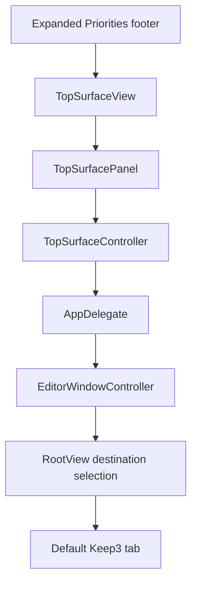

# Notch Keep3 Entry and App Branding - Plan

## Goal Capsule

- **Objective:** Give users a direct path from expanded Priorities to the main Keep3 tab, make Settings an icon-only tab, and pair the editor sidebar logo with the Keep3 brand name.
- **Product authority:** The user chose the expanded footer placement and requested both outcomes in one delivery.
- **Execution profile:** Implement the window destination path before wiring the surface action, then apply the branding change and verify the complete installed interaction.
- **Open blockers:** None.
- **Tail ownership:** LFG owns simplification, review, landing, PR creation, and CI follow-through after implementation.

---

## Product Contract

### Summary

Keep3 adds a labeled Keep3 action to the expanded Priorities footer and routes it to the existing main window's default Keep3 tab.
The main window exposes Settings as an icon-only tab, while the editor sidebar displays the packaged Keep3 logo beside the Keep3 brand name above the existing tagline.

### Problem Frame

The top surface can open a visible priority, but it has no product-level entry that reliably returns to the default Keep3 tab after Settings has been shown.
Users need a stable way to return to the main Keep3 experience without coupling that action to whichever priority is currently visible.

The editor sidebar should present the shipped application icon and the product name as one brand unit.
The requested branding change should reuse the packaged identity without expanding into a broader editor redesign.

### Key Decisions

- **Place Keep3 in the expanded Priorities footer as a labeled action.** (session-settled: user-directed — the user refined the selected footer action from Settings to a Keep3 entry after installed visual testing.) Governs R1, R2, R6.
- **Make Keep3 the default main-window destination and keep Settings icon-only.** (session-settled: user-directed — the user requested a text Keep3 tab and a gear-only Settings tab.) Governs R3, R8.
- **Ship the entry and branding changes together.** The notch-to-Keep3 flow and editor Logo-plus-wordmark treatment share one delivery boundary. Governs R1–R8.

### Requirements

**Notch-to-Keep3 access**

- R1. Expanded Priorities displays a labeled Keep3 action centered between the existing previous and next control positions.
- R2. One-item and multi-item footers keep the Keep3 action centered while preserving the current navigation controls and placeholders.
- R3. Activating Keep3 ends any explicit keyboard-navigation session without restoring the previously frontmost app, then activates and reuses the existing main window on its Keep3 tab.
- R4. Opening a priority continues to select that priority and present the Keep3 tab rather than inheriting a prior Settings destination.
- R5. Passive hover, expansion, collapse, and browsing remain nonactivating.
- R6. Compact Priorities, Media, and Calendar surfaces do not gain a Keep3 shortcut in this change.

**App branding**

- R7. The editor sidebar displays the current packaged application logo beside the visible “Keep3” brand name while retaining the existing tagline.
- R8. Keep3 is the default text tab, Settings is a gear-only tab with an accessible “设置” name, and the Keep3 action and Logo expose stable accessibility names and automation identifiers.

### Key Flows

- F1. Open Keep3 from the notch
  - **Trigger:** The user activates Keep3 in expanded Priorities.
  - **Steps:** Keep3 ends surface keyboard navigation without restoring the previous app, selects the Keep3 destination, activates the existing main window, and brings it forward.
  - **Outcome:** The default Keep3 tab is visible without creating a second window or mutating the current priority.
  - **Covers:** R1–R3.
- F2. Return from Settings to Keep3
  - **Trigger:** The user activates the footer Keep3 action after the main window has shown Settings.
  - **Steps:** Keep3 selects the default editor destination and reuses the existing window.
  - **Outcome:** The Keep3 tab is visible rather than the previously selected Settings tab.
  - **Covers:** R4.
- F3. Recognize Keep3 in the editor
  - **Trigger:** The main window displays the editor sidebar.
  - **Steps:** The sidebar renders the packaged app logo beside the Keep3 brand name above the unchanged tagline and exposes both to accessibility.
  - **Outcome:** The editor carries Keep3's current visual identity without adding a second logo asset or changing the window title.
  - **Covers:** R7, R8.

### Acceptance Examples

- AE1. Direct Keep3 access
  - **Covers:** R1–R3.
  - **Given:** Priorities is expanded and the main window is closed or showing the editor.
  - **When:** The user activates the footer Keep3 action.
  - **Then:** The existing Keep3 window becomes key on the Keep3 tab, the current priority is unchanged, and the surface keyboard session is inactive.
- AE2. Footer remains balanced
  - **Covers:** R1, R2.
  - **Given:** Keep3 has either one priority or multiple priorities.
  - **When:** Priorities expands.
  - **Then:** Keep3 stays centered while arrow controls or equal-width placeholders occupy the side positions.
- AE3. Keep3 destination wins
  - **Covers:** R4.
  - **Given:** The main window most recently displayed Settings.
  - **When:** The user activates the footer Keep3 action.
  - **Then:** The existing window switches from Settings to the Keep3 tab.
- AE4. Branding remains accessible
  - **Covers:** R7, R8.
  - **Given:** The editor sidebar is visible.
  - **When:** The UI is inspected visually or with accessibility.
  - **Then:** The packaged Logo, Keep3 brand name, and unchanged tagline are present, and the Logo remains named “Keep3”.
- AE5. Passive surface interactions remain nonactivating
  - **Covers:** R5.
  - **Given:** Keep3's Priorities surface is visible while another application is frontmost.
  - **When:** The pointer hovers, expands, collapses, or browses the surface without activating an explicit action.
  - **Then:** Keep3 does not become the active application.

### Scope Boundaries

- The Keep3 entry is limited to expanded Priorities, matching the selected footer sketch.
- Media, Calendar, and compact Priorities layouts remain unchanged.
- The window title remains “Keep3”.
- Settings categories and controls remain unchanged; only the top-level Settings tab label becomes a gear icon.
- The editor sidebar keeps its current structure and tagline while presenting the Logo and wordmark together.

---

## Planning Contract

### Key Technical Decisions

- KTD1. **Own top-level destination state at the window-controller boundary.** A controller-retained observable selection drives tagged Keep3 and Settings tabs so explicit entry points can choose a destination while reusing one window. Implements R3, R4, R8.
- KTD2. **Thread a dedicated focus-surface Keep3 callback.** Extend the existing focus-only callback path from `TopSurfaceView` through `TopSurfacePanel`, `TopSurfaceController`, and `AppDelegate`, following the separate `onOpenItem` pattern rather than overloading item activation. Implements R1–R6.
- KTD3. **Source the sidebar Logo from the running application's icon.** Bridge the packaged application icon into SwiftUI instead of assuming the app-icon catalog is a reusable named image or duplicating it into a second asset set. Implements R7, R8.

### High-Level Technical Design

### Assumptions

- The selected footer design applies to expanded Priorities only; other surface components are not redesigned.
- Settings keeps its existing General default and in-memory category selection.
- Destination changes preserve the main window's existing size behavior; this work does not add destination-specific resizing.
- The packaged app icon is the intended Logo and the existing tagline remains unchanged.

### Sequencing

1. Establish destination-aware window presentation and prove Keep3/Settings selection on one reused window.
2. Add the focus-surface Keep3 callback and centered footer action, then prove the Settings-to-Keep3 route.
3. Pair the editor wordmark with the packaged Logo and verify the final accessibility and visual state.

### Sources and Research

- `Keep3/App/RootView.swift` contains the current unbound editor/Settings `TabView`.
- `Keep3/App/EditorWindowController.swift` owns the single reusable main window and its SwiftUI root.
- `Keep3/App/Keep3App.swift` shows the current open-item teardown ordering that avoids restoring the previous application.
- `Keep3/Overlay/TopSurfaceView.swift` owns the expanded Priorities footer and equal-width navigation placeholders.
- `Keep3/Overlay/TopSurfacePanel.swift` and `Keep3/Overlay/TopSurfaceController.swift` establish the callback-forwarding and explicit keyboard-session contracts.
- `Keep3/Resources/Assets.xcassets/AppIcon.appiconset` is the packaged icon source; no reusable named Logo image set exists.
- No applicable institutional learning exists under `docs/solutions/` because that directory is absent.

---

## Implementation Units

### U1. Add destination-aware main-window presentation

- **Goal:** Let callers present the existing main window on either the editor or Settings destination.
- **Requirements:** R3, R4; F1, F2; AE1, AE3; KTD1.
- **Dependencies:** None.
- **Files:**
  - `Keep3/App/RootView.swift`
  - `Keep3/App/EditorWindowController.swift`
  - `Keep3Tests/App/EditorWindowControllerTests.swift`
- **Approach:**
  1. Give the top-level tabs stable destination values and bind their selection to controller-owned observable state.
  2. Make the Settings presentation path select Settings before using the existing activation and window-reuse behavior.
  3. Make the editor presentation path select the editor so item activation cannot reopen on Settings.
- **Execution note:** Start with failing controller tests for destination selection and window reuse.
- **Patterns to follow:** `EditorWindowController.showEditor` for activation and reuse; `SettingsView` for existing nested category ownership.
- **Test scenarios:**
  1. A new controller presents the editor destination on the original window.
  2. Presenting Settings selects the Settings tab and reuses the same window after close and reopen.
  3. Presenting the editor after Settings selects the editor destination on the same window.
  4. Destination changes with activation disabled remain testable without bringing the test host app forward.
- **Verification:** Controller tests prove deterministic destination selection and single-window reuse.

### U2. Add the expanded-footer Keep3 route

- **Goal:** Add the centered footer action and connect it to destination-aware Keep3 presentation.
- **Requirements:** R1–R6, R8; F1, F2; AE1–AE3, AE5; KTD1, KTD2.
- **Dependencies:** U1.
- **Files:**
  - `Keep3/Overlay/TopSurfaceView.swift`
  - `Keep3/Overlay/TopSurfacePanel.swift`
  - `Keep3/Overlay/TopSurfaceController.swift`
  - `Keep3/App/Keep3App.swift`
  - `Keep3UITests/Keep3UITests.swift`
- **Approach:**
  1. Add a focus-only Keep3 callback alongside the existing item callback across the panel and controller boundaries.
  2. Render a labeled, identifiable Keep3 footer action between the existing symmetric navigation slots.
  3. In the app callback, end keyboard navigation without previous-app restoration before presenting the Keep3 tab.
  4. Leave Media and Calendar rendering APIs unchanged.
- **Execution note:** Add the failing signed UI fixture before completing callback plumbing.
- **Patterns to follow:** `onOpenItem` forwarding and teardown in the same files; `overlay.previous`, `overlay.next`, and `overlay.openItem` accessibility identifiers.
- **Test scenarios:**
  1. Covers AE1. Clicking `overlay.keep3` from expanded Priorities opens the existing window on Keep3 without changing the current priority.
  2. Covers AE2. One-item and multi-item expanded fixtures expose one centered Keep3 action while retaining correct arrow or placeholder geometry.
  3. Covers AE3. Clicking Keep3 after Settings selects the Keep3 tab on the existing window.
  4. Compact Priorities and Media/Calendar fixtures do not expose `overlay.keep3`.
- **Verification:** The signed UI fixture proves the overlay-to-Keep3 handoff and existing overlay-to-editor regression; manual focus inspection confirms passive hover remains nonactivating.

### U3. Pair the editor wordmark with the packaged Logo

- **Goal:** Show the current Keep3 Logo beside the brand name in the existing editor sidebar header.
- **Requirements:** R7, R8; F3; AE4; KTD3.
- **Dependencies:** None.
- **Files:**
  - `Keep3/Features/Editor/EditorView.swift`
  - `Keep3UITests/Keep3UITests.swift`
- **Approach:**
  1. Add a SwiftUI image sourced from the running application's packaged icon beside the existing wordmark.
  2. Preserve aspect ratio, original color, the tagline, and app-name accessibility semantics within the current sidebar width.
  3. Add a stable automation identifier without introducing another image asset.
- **Execution note:** Treat this as a visual change with UI smoke coverage and installed-app inspection.
- **Patterns to follow:** Existing app-icon packaging in `Keep3/Resources/Assets.xcassets/AppIcon.appiconset`; current sidebar header spacing in `EditorView`.
- **Test scenarios:**
  1. Covers AE4. The editor exposes one Logo element with the expected identifier and “Keep3” accessibility label.
  2. The visible Keep3 brand name and existing tagline remain present.
  3. The Logo fits the sidebar at the window's minimum width without clipping or distorting.
- **Verification:** Signed UI automation confirms the Logo and tagline; installed-app visual inspection confirms legibility at the minimum window size.

---

## Verification Contract

| Gate | Units | Command or method | Done signal |
|---|---|---|---|
| Strict formatting | U1–U3 | `xcrun swift-format lint --strict` on changed Swift files | Zero findings |
| Focused controller tests | U1 | `xcodebuild test -project Keep3.xcodeproj -scheme Keep3 -configuration Debug -destination 'platform=macOS' -derivedDataPath .build/DerivedData -only-testing:Keep3Tests/EditorWindowControllerTests CODE_SIGNING_ALLOWED=NO` | Destination and reuse tests pass |
| Full unit suite | U1–U3 | `xcodebuild test -project Keep3.xcodeproj -scheme Keep3 -configuration Debug -destination 'platform=macOS' -derivedDataPath .build/DerivedData -only-testing:Keep3Tests CODE_SIGNING_ALLOWED=NO` | No new failures; known baseline failures remain documented |
| Signed UI fixtures | U2, U3 | Targeted `Keep3UITests` on an unlocked desktop without `CODE_SIGNING_ALLOWED=NO` | Keep3 handoff, default tab, editor regression, Logo, wordmark, and tagline assertions pass |
| Static analysis | U1–U3 | `xcodebuild analyze -project Keep3.xcodeproj -scheme Keep3 -configuration Debug -destination 'platform=macOS' -derivedDataPath .build/DerivedData CODE_SIGNING_ALLOWED=NO` | Analyze succeeds |
| Release build | U1–U3 | `xcodebuild -project Keep3.xcodeproj -scheme Keep3 -configuration Release -destination 'platform=macOS,arch=arm64' -derivedDataPath .build/DerivedData build` | arm64 Release succeeds |
| Installed interaction | U2, U3 | Launch the Release app on a notched Mac and inspect hover, expanded footer, Keep3 activation, tab defaults, and minimum-size branding | Passive hover stays nonactivating; explicit actions and branding match R1–R8 |

---

## Definition of Done

- U1 proves editor and Settings destinations are deterministic while the main window remains single-instance and reusable.
- U2 exposes one accessible Keep3 action in expanded Priorities, preserves footer balance, and completes the correct focus/window handoff.
- U3 displays the packaged Logo, Keep3 brand name, and unchanged tagline with visual and accessibility verification.
- Existing priority browsing, item opening, Media, Calendar, keyboard navigation, and passive nonactivation behaviors remain green.
- Strict changed-file formatting, focused tests, the baseline-adjusted unit suite, static analysis, and the arm64 Release build pass; signed UI execution is either green or its desktop-runner blocker is documented.
- Installed notched-Mac verification confirms the selected footer placement, default Keep3 tab, icon-only Settings tab, and minimum-size branding.
- No duplicate Logo asset, abandoned callback path, temporary fixture, or experimental code remains in the diff.
