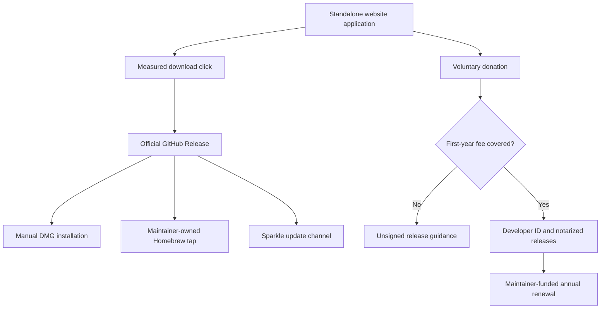
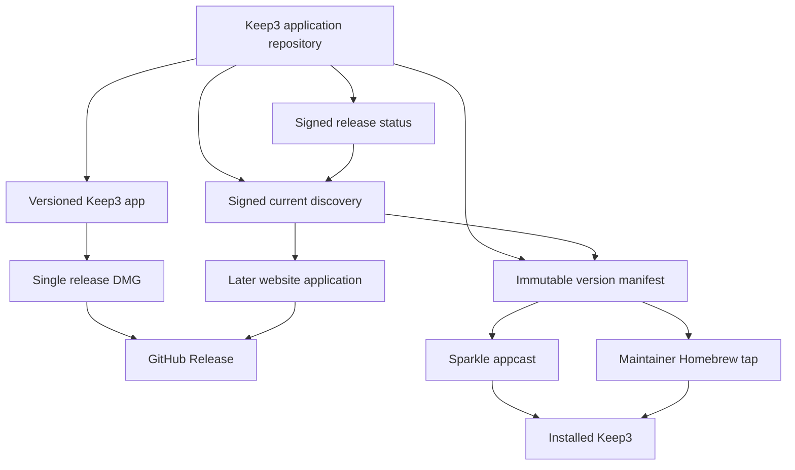
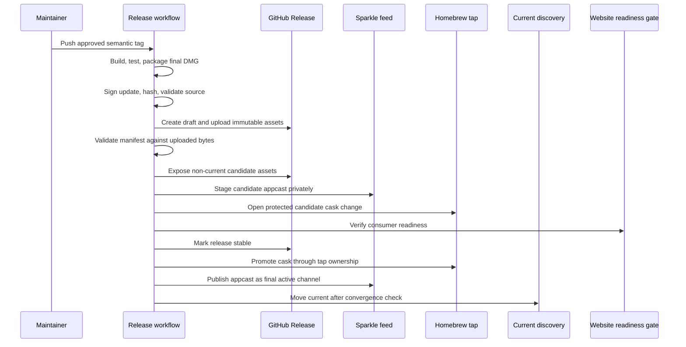
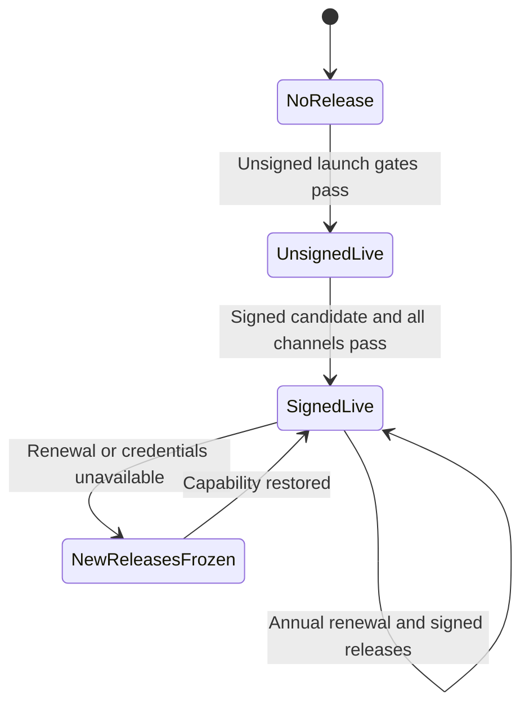
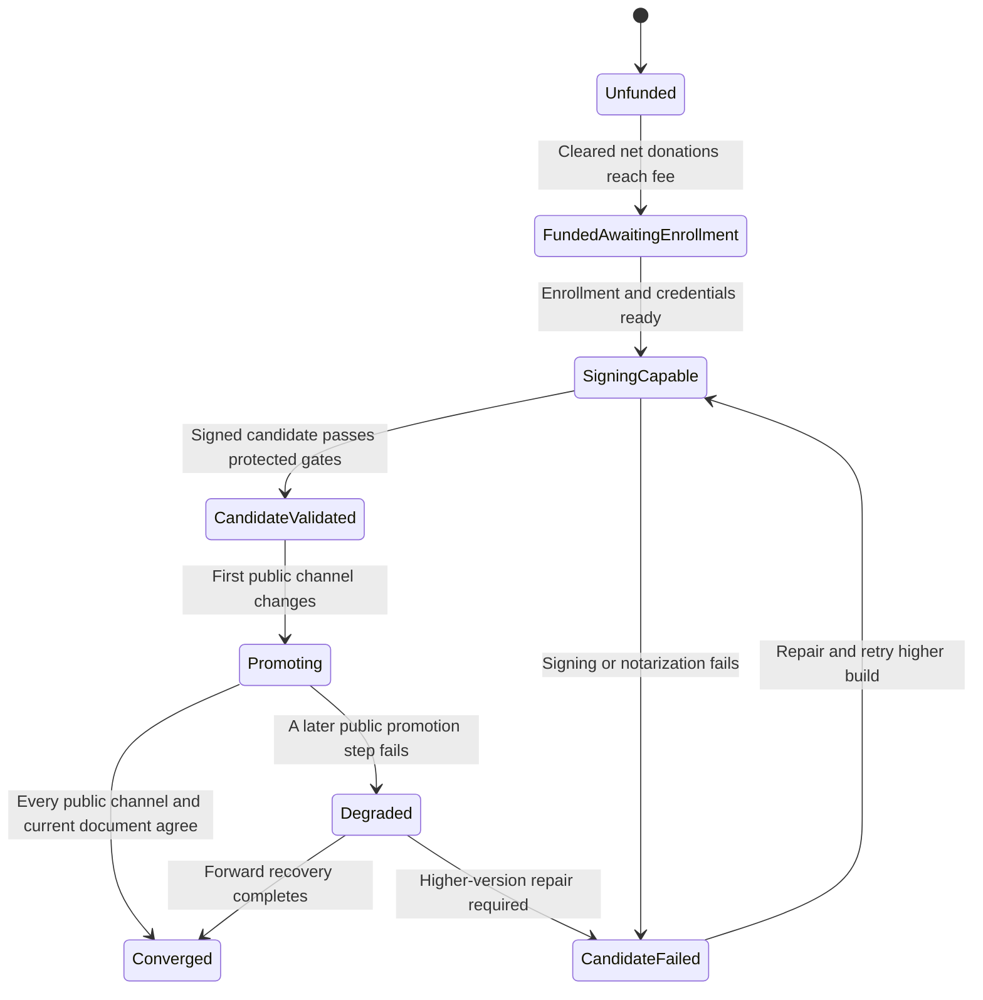
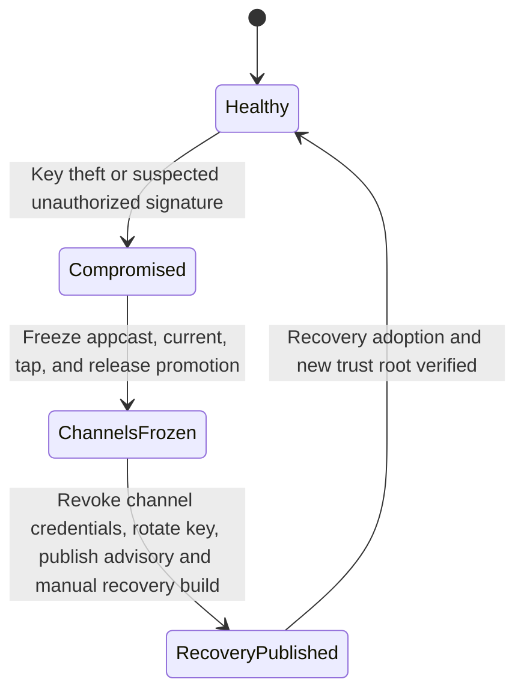
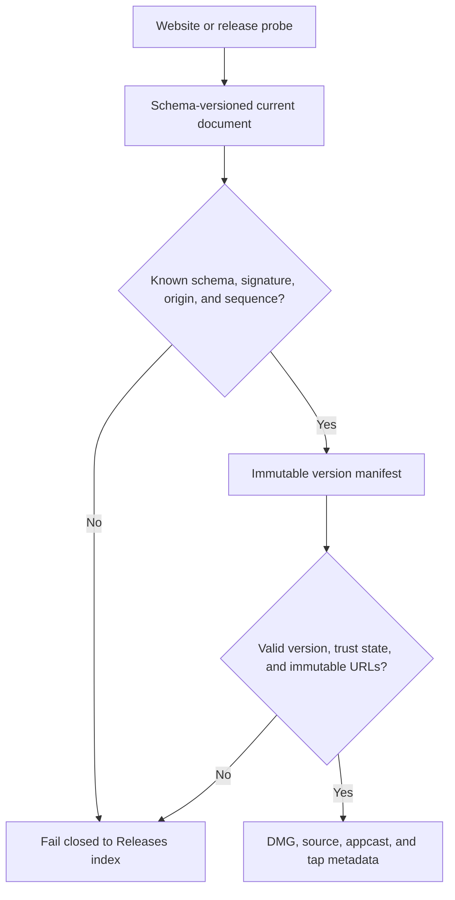
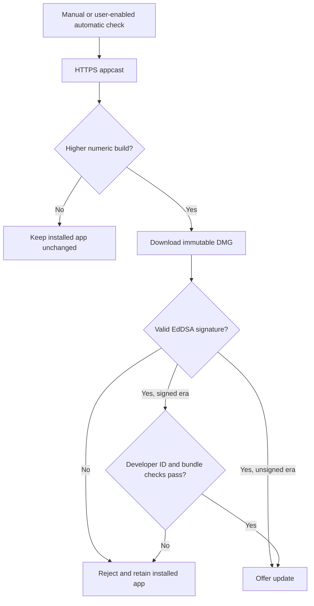

# Keep3 Open-Source Distribution and Donations - Plan

## Goal Capsule

- **Objective:** Make the Keep3 application repository ready for free GPL-3.0 distribution through GitHub Releases, a maintainer-owned Homebrew tap, and Sparkle, while defining the release contract consumed by the independently maintained website application.
- **Product authority:** The Product Contract remains the authority for the complete launch. A separately owned website application handles click measurement and the donation entry point; after `f531674` added that application to `main`, this distribution branch continues to treat it as an independent surface.
- **Execution profile:** Implement the native updater, legal/source materials, canonical single-artifact packaging, signed release metadata, unsigned channel automation, and post-threshold signing handoff in this repository. Do not modify `website/` in this feature diff.
- **Stop conditions:** Do not publish a public stable release until the website follow-up, GPL/source review, pending native release checks, first-party tap, Sparkle signing key, and required channel credentials are ready. Do not claim Developer ID or notarization until Apple enrollment and every signed-release gate pass.
- **Tail ownership:** This plan owns native distribution implementation and release-readiness evidence. The independent website application owns its deployment, download-click experiment, privacy disclosure, and donation destination.

---

## Product Contract

### Summary

Keep3 will be free and GPL-3.0 licensed, with the same complete product available to every user.
The native distribution flow will publish one verified release across GitHub, Homebrew, and Sparkle, while the separately maintained website application becomes the public entry point and owns website-only measurement and donations.

### Problem Frame

Keep3 has an implemented personal MVP but no public distribution, updater, release automation, trial, or license-management capability in the checked-in repository.
Its first public audience is unvalidated, and target users currently do nothing to recover focus through a persistent top-of-screen surface.
The first release therefore needs to test whether the product promise attracts interest without mistaking download intent for installation or retention.

The existing product keeps user content local and performs no network requests.
Public distribution introduces an intentional exception for software updates while preserving the boundary around priority content, accounts, synchronization, and in-app analytics.

### Key Decisions

- **Serve individual Mac users with focus recovery as the primary value.** (session-settled: user-directed — chosen over professional or enterprise buyers and broader notch-utility positioning: this keeps adoption low-friction and aligns with Keep3's existing product job.) Governs R1, R2.
- **Release under GPL-3.0 with voluntary donations and no paid differences.** (session-settled: user-directed — chosen over license sales, donor-only benefits, and permissive reuse: the user chose Boring Notch's model and wants redistributed modifications to remain open.) Governs R3–R6.
- **Launch the complete Boring Notch-style distribution surface together.** (session-settled: user-directed — chosen over a staged validation release or source-only distribution: the user selected website, GitHub Releases, Homebrew, and Sparkle parity after the networking and maintenance trade-offs were surfaced.) Governs R7–R13.
- **Use website download clicks as the first validation signal.** (session-settled: user-directed — chosen over retention measurement or in-app telemetry: the user requested a simple website-only measure.) Governs R14–R16.
- **Let donations unlock the first year of trusted distribution.** (session-settled: user-directed — chosen over paying before validation or remaining permanently unsigned: real supporter funding should trigger the initial Apple Developer Program enrollment.) Governs R17, R18.
- **Keep Developer Program membership once signed distribution begins.** (session-settled: user-directed — chosen over donation-dependent renewal or a return to unsigned releases: public distribution should not lose its established trust path.) Governs R19.

### Actors

- A1. **Prospective user:** An individual Mac user who wants a quiet way to recover the thing they meant to focus on.
- A2. **User or donor:** A user who receives the complete product for free and may voluntarily support continued development.
- A3. **Maintainer:** The project owner who publishes releases, operates distribution channels, and assumes annual Developer Program renewal after the trust upgrade.
- A4. **Distribution services:** The website, GitHub Releases, Homebrew, update feed, and donation provider that connect users to the official project without becoming authorities over user content.

### Requirements

**Product position and access**

- R1. Public messaging positions Keep3 primarily as a quiet focus-recovery surface for individual Mac users.
- R2. Priorities remain the defining product job, while Media and local Calendar remain supporting components rather than a move into general-purpose notch utilities.
- R3. The publicly released Keep3 source is licensed under GPL-3.0.
- R4. The source and complete released application remain free to access and use for every user.
- R5. Keep3 has no trial expiry, license key, subscription, paid feature gate, or donor-only functionality.
- R6. Donations are voluntary, occur through an external support path, and do not change product access or treatment.

**Public distribution and updates**

- R7. An independent public website is the primary product entry point and explains Keep3's purpose, open-source status, privacy boundary, download options, and donation model.
- R8. The website's primary download action resolves to the current stable macOS artifact published through the official GitHub Releases project.
- R9. The current stable release is also available through an official Homebrew installation path at public launch.
- R10. Keep3 provides an in-app update experience using Sparkle with manual update checks and user-controlled automatic checking or downloading.
- R11. The website, GitHub Releases, Homebrew, and Sparkle channels identify the same current stable release.
- R12. The update experience accepts only official, integrity-protected release artifacts and rejects an untrusted or altered update.
- R13. Application networking is limited to update discovery and download; user content stays local, and Keep3 adds no account, synchronization, or in-app analytics capability.

**Interest validation**

- R14. Website measurement counts unique activations of the primary download link without requiring a Keep3 account.
- R15. The first validation target is at least 100 unique download-link activations during the first 90 days after public launch.
- R16. Reporting labels R15 as evidence of download interest, not as proof of installation, active use, or retention.

**Distribution trust transition**

- R17. Before cumulative donations cover the actual first-year Apple Developer Program fee, recorded as USD 99 when this contract was approved, Keep3 continues to offer free source, unsigned releases, and clear security-bypass guidance.
- R18. Reaching the R17 funding threshold triggers Apple Developer Program enrollment and moves every official binary channel to Developer ID-signed and notarized releases.
- R19. After the first signed public release, the maintainer renews the Developer Program membership annually regardless of later donation totals.

### Distribution Lifecycle

This lifecycle illustrates R7–R19; the numbered requirements remain authoritative.

### Key Flows

- F1. Discover and download Keep3
  - **Trigger:** A1 encounters the independent website.
  - **Actors:** A1, A4.
  - **Steps:** The website presents the focus-recovery promise, records activation of the primary download link, and sends the user to the current official release or Homebrew instructions.
  - **Outcome:** The user can obtain the complete free application while the project records one acquisition-intent signal.
  - **Covers:** R1, R2, R4, R7–R9, R14.
- F2. Install before trusted distribution
  - **Trigger:** A1 obtains an unsigned release before the R17 threshold is met.
  - **Actors:** A1, A3, A4.
  - **Steps:** The release path discloses that the app is not Developer ID signed and provides a clear supported route for opening it through macOS or Homebrew.
  - **Outcome:** The user understands the warning and can choose whether to continue without mistaking the artifact for a notarized build.
  - **Covers:** R9, R17.
- F3. Receive an official update
  - **Trigger:** A user checks for updates or has enabled automatic update checks.
  - **Actors:** A2, A4.
  - **Steps:** Keep3 contacts only the official update path, identifies the current stable release, validates its integrity, and offers or downloads the update according to the user's setting.
  - **Outcome:** The user can stay current without transmitting Keep3 content or usage analytics.
  - **Covers:** R10–R13.
- F4. Support Keep3 without buying access
  - **Trigger:** A2 chooses the donation action.
  - **Actors:** A2, A3, A4.
  - **Steps:** The user completes an external voluntary donation and returns to the same complete Keep3 product available before donating.
  - **Outcome:** Support contributes to project funding without creating a paid tier or entitlement.
  - **Covers:** R4–R6.
- F5. Upgrade public distribution trust
  - **Trigger:** Cumulative donations meet the R17 threshold.
  - **Actors:** A3, A4.
  - **Steps:** The maintainer enrolls in the Apple Developer Program, moves all official binary channels to signed and notarized releases, and assumes ongoing annual renewal.
  - **Outcome:** Future public binaries use the trusted macOS distribution path without making continued trust dependent on yearly donations.
  - **Covers:** R17–R19.

### Acceptance Examples

- AE1. Free access is identical for donors and non-donors
  - **Covers:** R3–R6.
  - **Given:** One user donates and another does not.
  - **When:** Both obtain the same stable release.
  - **Then:** Both receive the complete application with no trial, license prompt, paid feature difference, or donor-only behavior.
- AE2. The pre-funding release is transparent
  - **Covers:** R7–R9, R17.
  - **Given:** Donations have not yet covered the first-year Developer Program fee.
  - **When:** A user downloads or installs Keep3.
  - **Then:** The distribution path identifies the release as unsigned and provides a clear installation route without claiming Apple notarization.
- AE3. Update traffic preserves the local-content boundary
  - **Covers:** R10–R13.
  - **Given:** A user has priorities, Media state, or Calendar access configured locally.
  - **When:** Keep3 checks for and downloads an update.
  - **Then:** The update flow exchanges only release-discovery and download information and does not transmit Keep3 content or usage events.
- AE4. Download interest reaches the first threshold
  - **Covers:** R14–R16.
  - **Given:** The public website launched 90 days ago.
  - **When:** The measurement report is reviewed.
  - **Then:** At least 100 unique primary-download activations satisfy the first validation target, while the report makes no installation or retention claim.
- AE5. Funding upgrades every binary channel
  - **Covers:** R17–R19.
  - **Given:** Cumulative donations cover the first-year Developer Program fee.
  - **When:** The next stable Keep3 release is published.
  - **Then:** GitHub Releases, Homebrew, and Sparkle all deliver the Developer ID-signed and notarized artifact, and future renewal is not conditioned on donations.

### Success Criteria

- Public launch passes when R7–R13 are available and consistent across the selected distribution surfaces.
- Initial interest validation passes when R15 is met and its reporting remains within R16.
- The privacy boundary passes when R13 remains true across download and update flows.
- Equal free access passes when donation behavior continues to satisfy R6.

### Scope Boundaries

#### Deferred for later

- Developer ID signing and Apple notarization remain deferred under R17 and transition only through R18.
- Installation, active-use, and retention measurement remain unvalidated under the reporting boundary in R16.

#### Deferred to Follow-Up Work

- A standalone website application owns R7, R8, R14–R16, the browser-side portion of R11, website privacy disclosure, hosting, DNS, and the public donation entry point for R6.
- The follow-up application consumes the versioned release contract produced here; it does not copy native release logic or infer the current version from mutable page content.
- The current untracked `website/` directory remains local reference material only and is not modified or committed by this plan.
- Submission to the central `homebrew/cask` repository may follow after signed, notarized releases establish public use. The maintainer-owned tap satisfies R9 at launch.

#### Outside this product's identity

- Paid access and donor entitlements are excluded by R5 and R6.
- User accounts, content synchronization, and in-app usage analytics are excluded by R13.
- Mac App Store distribution.
- General-purpose notch-widget hosting, including clipboard tools, file shelves, and system HUD replacement, is excluded by R2.
- Rules for third-party reuse of the Keep3 name, icon, or other brand assets; GPL-3.0 governs the source code, not a new brand policy in this work.

### Dependencies and Assumptions

- macOS continues to expose a user-controlled way to open unsigned applications before R17 is satisfied.
- GitHub Releases, Homebrew, Sparkle, the future website host, the analytics provider, and the donation provider remain available for the selected distribution roles.
- The first-year Apple Developer Program fee may change; R17 uses the actual enrollment cost and retains USD 99 as the approved-date reference.
- Sparkle and its limited update networking under R10 and R13 are approved exceptions to the existing no-network and third-party-dependency boundaries.
- GPL-3.0 compatibility for all code and third-party dependencies included under R3 must be verified before publication.
- The standalone website application must satisfy R14 without requiring an application account or adding in-app telemetry.

### Outstanding Questions

**Deferred to the website application**

- Select the website host, privacy-compatible unique-click implementation, external donation provider, domain, and operating region.
- Define the website launch timestamp and the exact 90-day reporting procedure without expanding R16 into retention claims.

**Deferred to release operations**

- Configure maintainer-owned GitHub, Homebrew tap, Sparkle key backup, and future Apple credentials before the corresponding public gate runs.

### Sources and Research

- `docs/specs/keep3-mvp.md` defines Keep3's focus-recovery job, local-content boundary, current no-network rule, excluded general notch utilities, and Ask First controls for dependencies and distribution.
- `docs/verification/keep3-mvp.md` approves the personal MVP rather than public shipping and names remaining signed-distribution checks.
- `Keep3.xcodeproj/project.pbxproj` currently disables Release signing for the application and helper and contains no package dependency or canonical version source.
- `Keep3/Resources/Info.plist` lacks explicit marketing and build versions, Sparkle feed metadata, and update-signing metadata.
- `docs/plans/2026-07-25-002-feat-keep3-media-mode-plan.md` establishes direct notarized distribution as the intended public route and excludes Mac App Store distribution for the private media adapter.
- `docs/plans/2026-07-26-001-feat-event-surface-interactions-plan.md` keeps priorities, Media, and Calendar inside a passive local-first event surface rather than a generic notch-widget host.
- [Boring Notch repository](https://github.com/TheBoredTeam/boring.notch) supplies the selected reference for GPL-3.0 licensing, GitHub Releases, a project-owned Homebrew tap, Sparkle updates, unsigned-install guidance, and voluntary donations.
- [Sparkle documentation](https://sparkle-project.org/documentation/) defines the supported updater controller, EdDSA archive signing, appcast, automatic-check preferences, and update testing rules.
- [Homebrew Cask Cookbook](https://docs.brew.sh/Cask-Cookbook) defines versioned URLs, checksums, application artifacts, and audit expectations.
- [Homebrew acceptable-cask policy](https://docs.brew.sh/Acceptable-Casks) prevents an unsigned app that requires a Gatekeeper bypass from entering the central cask repository before notarization.
- [GitHub release documentation](https://docs.github.com/en/repositories/releasing-projects-on-github/managing-releases-in-a-repository) defines draft releases and immutable release assets.
- [Apple notarization requirements](https://developer.apple.com/documentation/security/notarizing-macos-software-before-distribution) require Developer ID, hardened runtime, secure timestamps, nested-code validity, and notarization validation.
- [GNU GPL FAQ](https://www.gnu.org/licenses/gpl-faq.en.html) describes source availability obligations when distributing binaries.

---

## Planning Contract

Product Contract preservation note: this enrichment preserves R1–R19, A1–A4, F1–F5, and AE1–AE5; the user's repository split changes implementation ownership, not the product behavior.

### Key Technical Decisions

- KTD1. **Keep website implementation outside this feature boundary.** (session-settled: user-directed — chosen over coupling native distribution work to the website: a dedicated application owns the site, click measurement, and donation entry point.) The website application later landed independently on `main`; this branch publishes its versioned consumer handoff without modifying website source, analytics code, or deployment configuration. Implements the native-distribution portion of R7, R8, R11, R14–R16.
- KTD2. **Separate immutable release facts from signed mutable discovery.** A semantic tag and strictly increasing numeric build produce one canonical DMG and immutable manifest whose URL, SHA-256, Sparkle signature, source tag, trust state, and channel projections never change. Signed, schema-versioned current and operational-status documents live at `https://taobaorun.github.io/keep3/release-channel/`; the current document points to one immutable manifest and moves only after convergence. A dedicated offline-backed Ed25519 metadata key signs canonical JSON, while consumers pin its public key, canonical host, and repository slug and reject expired, replayed, or non-monotonic metadata. Implements R8–R12.
- KTD3. **Pin Sparkle 2.9.4 behind a Keep3-owned update boundary.** The app target owns one long-lived standard updater controller, while settings and app commands use an injected project protocol so tests avoid live network and Sparkle UI. Sparkle remains the only preference authority, and its standard UI owns checking, no-update, update-available, download, error, install, and relaunch presentation. The embedded feed is `https://taobaorun.github.io/keep3/release-channel/appcast.xml`. Implements R10, R13.
- KTD4. **Establish EdDSA trust and compromise recovery before the first unsigned release.** Every update archive is signed with one protected EdDSA key from release one, the public key and HTTPS feed are embedded in the app, system profiling is disabled, and the same key spans the later Developer ID transition. A Compromised state freezes publication and requires credential revocation, advisory publication, key rotation, and a manual recovery build before automatic updates resume. Implements R12, R17, R18.
- KTD5. **Launch Homebrew through a maintainer-owned tap.** The cask pins the immutable DMG and SHA-256, declares macOS 14+, and shows truthful unsigned guidance without automatically clearing quarantine. Central `homebrew/cask` submission is a later signed-distribution opportunity rather than a launch dependency. Implements R9, R11, R17.
- KTD6. **Use one staged unsigned-release workflow with fail-closed pre-public gates and explicit recovery.** A tag-triggered job builds an unprivileged candidate without release secrets. A protected promotion job runs trusted default-branch tooling, proves the tag is reachable from the protected branch, verifies the candidate digest and attestation, then receives signing and channel credentials. Once promotion starts, it records Promoting or Degraded state and converges forward without pretending that a partial public write never happened. Implements R11, R17.
- KTD7. **Publish complete corresponding source for every binary tag.** GPL-3.0 text, copyright, third-party notices, dependency locks, packaging scripts, and exact-tag source links are release inputs. Missing or incompatible material blocks publication. Implements R3–R5.
- KTD8. **Preserve installed identity across the trust transition.** The app bundle identifier, persistence paths, defaults keys, Sparkle feed/key, and version ordering stay stable. The embedded helper moves to a project-owned identifier before the first public release, and the transition test detects TCC or launch-at-login reauthorization. Implements R12, R13, R18.
- KTD9. **Defer Apple signing automation until the funding trigger.** The current execution preserves every identity and trust invariant needed by R18–R19, but Developer ID scripts, credentials, notarization, and live transition tests are a separate post-R17 implementation. The unsigned launch does not wait for work that cannot be exercised before enrollment. Implements the current-repository boundary for R17–R19.

### Assumptions

- GitHub Pages for `taobaorun/keep3` will expose immutable per-version manifests plus signed, cache-bounded current and operational-status documents under `/release-channel/` for the standalone website application.
- The maintainer will create or designate a separate Homebrew tap repository and supply its least-privilege automation token before launch.
- Sparkle's production EdDSA key will be generated once, backed up offline, and injected through protected release secrets; repository tests use fixtures rather than the production private key.
- Release operations can use a macOS GitHub runner, GitHub Pages, protected environments, and default-branch reachability checks; future Apple credentials are outside the current execution.
- The existing generated `website/` material is not required to build, test, package, or release the native application.
- The project-owned helper identifier can replace the current Apple-looking identifier without changing the private service protocol or user media behavior.

### High-Level Technical Design

#### Component topology

#### Release protocol

#### Current stable trust lifecycle

#### Signing capability and candidate lifecycle

This signing lifecycle is a post-R17 handoff contract, not an active implementation unit in the current unsigned-distribution plan. A failed signed candidate keeps the prior stable current unchanged—unsigned during the first trust transition and signed thereafter.

#### Update-key incident lifecycle

#### Release discovery contract

#### Update trust flow

### Implementation Constraints

- `website/` is base-owned by an independent application. No unit in this work may edit, stage, commit, delete, move, or derive output from it.
- Add Sparkle only to the application target. Keep priority, Media, Calendar, and persistence payloads out of updater requests and logs.
- Keep automatic update checks and downloads off until the user enables them. Manual checks remain available.
- Treat automatic download as dependent on automatic checking: enabling download first enables checks; disabling checks disables and clears download. Explain the disabled state in Settings.
- Disable Sparkle system profiling and require signed update archives before extraction.
- Do not commit production signing keys, Apple credentials, GitHub deployment tokens, Homebrew tokens, donation credentials, or generated release artifacts.
- Do not use deprecated `SUUpdater`, Sparkle's deprecated private-key argument, `altool`, mutable replacement assets, `version :latest`, `sha256 :no_check`, or automatic `xattr` quarantine removal.
- Keep candidate data private or non-current until its URLs and projections validate. After the first public channel changes, expose a Promoting or Degraded operational state and converge forward; never replace tagged bytes, silently downgrade, or claim cross-channel consistency before the final current document moves.
- Never expose release credentials to code from an untrusted tag. Build candidates without secrets, and let protected default-branch code validate reachability, digest, attestation, version monotonicity, and metadata signatures before promotion.
- Treat the first verified DMG bytes as the canonical candidate. Promotion retries reuse those exact bytes; a rebuild requires a higher semantic version and numeric build rather than a same-tag replacement.
- If either the Sparkle update key or release-metadata key is suspected compromised, freeze every publication channel before rotation or recovery work.

### System-Wide Impact

- **Networking:** Keep3 gains HTTPS traffic only for Sparkle update discovery and download. No priority, Media, Calendar, account, donor, or usage payload is introduced.
- **Persistence:** Existing user content and preferences remain unchanged. Sparkle owns only updater preferences.
- **Identity and permissions:** The app identifier remains stable. The embedded helper identifier changes before public release, and signed-transition testing checks Automation, Calendar, launch-at-login, and local-data continuity.
- **Supply chain:** Sparkle becomes the first third-party native dependency. GitHub Actions, the Homebrew tap, and future signing credentials become release dependencies with explicit ownership and recovery requirements.
- **External application boundary:** The native distribution flow owns app artifacts and publishes signed per-version manifests, current discovery, operational status, and the appcast through the protected `taobaorun/keep3` GitHub Pages release channel. The tap repository owns its protected default-branch cask. The independently maintained website application reads and verifies the discovery contract and owns only website content, measurement, and donations.

### Risks and Mitigations

- **EdDSA key loss strands unsigned clients.** Generate once, keep an encrypted offline backup, restrict CI access, and test restoration before release one.
- **An update or metadata signing key is compromised.** Enter Compromised, freeze appcast/current/tap/release promotion, revoke channel credentials, rotate the affected key, publish a security advisory, and require a manual recovery build that embeds the new trust root. Once signed distribution exists, require Developer ID and notarization for that recovery build. Old clients must reject the replacement key until the manual recovery is installed.
- **A partial promotion makes channels disagree.** Stage every possible change privately, mark the operation Promoting after the first public write, retain the prior current document until convergence, and use explicit Degraded forward recovery or a higher-version repair when a later public step fails.
- **The embedded helper or private media path later fails public signing.** Rename the helper before the unsigned release and preserve identity invariants now. Post-R17 signing work runs pending live-provider and nested-signature checks; a failed candidate leaves the prior stable current unchanged.
- **Homebrew bypass guidance weakens Gatekeeper.** Use a custom tap with explicit caveats and never clear quarantine automatically.
- **GPL source is incomplete.** Bind release publication to exact-tag source, scripts, lockfiles, license compatibility, and notices.
- **Website ownership drift breaks R11.** Publish signed machine-readable discovery and immutable handoff contracts, pin their canonical origin and metadata public key, and require the later application to verify them rather than scrape GitHub latest state.
- **External secrets are unavailable.** Keep workflows testable with fixtures, make missing production configuration a clear preflight failure, and do not publish a partial stable release.

### Dependencies and Sequencing

1. Establish legal, version, bundle-identity, and release-readiness foundations.
2. Add the updater boundary and prove update behavior without live network.
3. Build a canonical single-artifact packaging path and signed channel metadata around one final DMG.
4. Add GitHub promotion, Homebrew synchronization, and unsigned release gates.
5. Produce final verification evidence, security-recovery handoffs, and the standalone website handoff.
6. After R17 is met, start a separate Developer ID/notarization implementation using the preserved identity and trust invariants.

---

## Implementation Units

### U1. Establish public-source, version, and identity foundations

- **Goal:** Make every future binary traceable to GPL-3.0 source, a canonical marketing/build version, and project-owned bundle identities.
- **Requirements:** R3–R5, R11, R13, R17; AE1, AE2; KTD2, KTD7, KTD8.
- **Dependencies:** None.
- **Files:**
  - Create `LICENSE`
  - Create `README.md`
  - Create `THIRD_PARTY_NOTICES.md`
  - Modify `Keep3.xcodeproj/project.pbxproj`
  - Modify `Keep3/Resources/Info.plist`
  - Modify `Keep3MediaService/Info.plist`
  - Modify `Keep3/Media/MediaRemoteAdapter.swift`
  - Modify `Keep3Tests/ProjectSmokeTests.swift`
  - Modify `docs/specs/keep3-mvp.md`
  - Modify `.gitignore`
- **Approach:** Add canonical marketing and numeric build settings, expose them through both application metadata and future release tooling, move the helper out of Apple's namespace without changing its protocol, and add the legal/source files needed by an exact-tag binary release. Keep the independently owned website outside this feature diff. Update the living MVP spec to approve the bounded Sparkle dependency, update-only networking, and direct-distribution workflow while preserving its product exclusions.
- **Patterns to follow:** Existing explicit Xcode project groups and build phases; `ProjectSmokeTests` for project metadata; the current service-name constant in `MediaRemoteAdapter` as the single helper protocol seam.
- **Execution note:** Preserve current media behavior while changing only public distribution identity and metadata.
- **Test scenarios:**
  1. A clean Release build reports the declared marketing version and numeric build version in the app bundle and embedded helper.
  2. The app and helper use project-owned identifiers while the media bridge still connects through the unchanged protocol contract.
  3. Donor and non-donor builds have no license, trial, payment, entitlement, or feature-gate configuration.
  4. A release-source audit finds GPL-3.0 text, copyright, dependency notices, and the build metadata required to reproduce the tagged source.
  5. The `website/` tree remains byte-for-byte unchanged and absent from this branch's diff against `main`.
- **Verification:** Project smoke tests, full unit tests, Swift format lint, Release build, property-list validation, and a static scan for payment/license-gate symbols all pass.

### U2. Add a privacy-bounded Sparkle update experience

- **Goal:** Give users manual and opt-in automatic update controls without transmitting Keep3 content or adding a second preference authority.
- **Requirements:** R10–R13; F3; AE3; KTD3, KTD4.
- **Dependencies:** U1.
- **Files:**
  - Modify `Keep3.xcodeproj/project.pbxproj`
  - Create `Keep3.xcodeproj/project.xcworkspace/xcshareddata/swiftpm/Package.resolved`
  - Modify `Keep3/Resources/Info.plist`
  - Create `Keep3/Keep3Debug.entitlements`
  - Create `Keep3/Updates/UpdateChecking.swift`
  - Create `Keep3/Updates/SparkleUpdateController.swift`
  - Create `Keep3/Features/Settings/UpdateSettingsView.swift`
  - Modify `Keep3/App/Keep3App.swift`
  - Modify `Keep3/App/EditorWindowController.swift`
  - Modify `Keep3/App/RootView.swift`
  - Modify `Keep3/Features/Settings/SettingsView.swift`
  - Create `Keep3Tests/Updates/SparkleUpdateControllerTests.swift`
  - Create `Keep3Tests/Fixtures/Updates/README.md`
  - Create `Keep3Tests/Fixtures/Updates/appcasts/no-update.xml`
  - Create `Keep3Tests/Fixtures/Updates/appcasts/valid-update.xml`
  - Create `Keep3Tests/Fixtures/Updates/appcasts/invalid-signature.xml`
  - Create `Keep3Tests/Fixtures/Updates/archives/README.md`
  - Create `scripts/tests/sparkle-integration-tests.sh`
  - Modify `Keep3UITests/Keep3UITests.swift`
- **Approach:** Pin Sparkle 2.9.4 to the app target, own one long-lived updater controller at the app composition root, and inject a narrow observable boundary into the existing General settings flow. Add the standard application update command, keep background checks/downloads off until selected by the user, disable system profiling, and require the permanent public EdDSA key and canonical GitHub Pages feed in release configuration. Sparkle's standard UI owns checking, no-update, update-available, download, error, install, and relaunch presentation; Keep3 owns only preferences and a manual-check trigger whose availability follows updater state. Automatic download depends on automatic checking, with explanatory disabled-state copy. Use a Debug-only library-validation entitlement if required by ad-hoc development builds; keep it out of Release.
- **Patterns to follow:** `AppDelegate` composition, `EditorWindowController` dependency flow, General settings cards, VoiceOver labels/status announcements, keyboard navigation, stable accessibility identifiers, and fake-backed `@MainActor` unit tests.
- **Test scenarios:**
  1. Manual update checking invokes the updater while automatic checking remains disabled by default.
  2. Enabling automatic download first enables checking; disabling checking disables and clears automatic download; both valid states survive relaunch under Sparkle's single preference authority.
  3. While a check is active, Settings and the application command prevent overlapping requests. An offline, unavailable, or malformed feed leaves priorities, Media, Calendar, and the installed app unchanged and Sparkle's standard UI offers a retry path.
  4. A lower or equal build version is not offered; a higher fixture version is offered.
  5. A corrupted archive or invalid EdDSA signature is rejected without replacing the installed app.
  6. Update requests contain release-discovery data only and never include local content, donor identity, system profiling, or in-app usage events.
  7. VoiceOver names the manual action and both preferences, status changes are announced, full-keyboard focus is visible and ordered, and the application-menu command remains discoverable.
- **Verification:** Fake-backed updater boundary tests, versioned appcast/archive fixture integration tests, UI fixture checks for Settings and the update command, accessibility checks, static network-payload inspection, and an old-version-to-new-version Sparkle run pass as separate gates.

### U3. Build canonical packaging and a signed cross-application release contract

- **Goal:** Produce one built-once canonical DMG plus signed machine-readable metadata that GitHub, Sparkle, Homebrew, and the future website can verify independently.
- **Requirements:** R7–R13, R17; F1–F3; AE2, AE3; KTD1, KTD2, KTD4, KTD7.
- **Dependencies:** U1, U2.
- **Files:**
  - Create `distribution/release-manifest.schema.json`
  - Create `distribution/release-manifest.example.json`
  - Create `distribution/current-release.schema.json`
  - Create `distribution/current-release.example.json`
  - Create `distribution/release-status.schema.json`
  - Create `distribution/release-status.example.json`
  - Create `distribution/release-metadata-public-key.pem`
  - Create `distribution/appcast/README.md`
  - Create `distribution/homebrew/Casks/keep3.rb.template`
  - Create `scripts/release/build-app.sh`
  - Create `scripts/release/package-dmg.sh`
  - Create `scripts/release/generate-channel-metadata.sh`
  - Create `scripts/release/sign-release-metadata.sh`
  - Create `scripts/release/render-homebrew-cask.sh`
  - Create `scripts/release/validate-release.sh`
  - Create `scripts/tests/release-contract-tests.sh`
- **Approach:** Build from a clean tag, package the final app and Applications link into one versioned DMG, record source/toolchain provenance, sign the canonical bytes for Sparkle, calculate SHA-256, and reuse that exact candidate for every promotion retry. Emit an immutable version manifest plus pure appcast/cask projections. Publish the appcast, immutable manifests, signed current document, and signed operational-status document at `https://taobaorun.github.io/keep3/release-channel/`. Canonical JSON includes schema version, repository, sequence, semantic version, numeric build, publication/expiry timestamps, key identifier, and signature. Consumers pin the checked-in metadata public key, host, and repository slug; they reject signature failure, expiry, replay, non-monotonic sequence/build, and unknown state. Keep private material on stdin or in protected files and keep generated DMGs, appcasts, private keys, and temporary keychains out of git.
- **Patterns to follow:** Existing `.build/DerivedData` isolation, fail-fast shell tooling, exact Xcode project/scheme selection, and repository-relative generated paths.
- **Test scenarios:**
  1. One package job produces a canonical candidate whose app, DMG, manifest, appcast, and cask projections agree; retries reuse the original digest instead of rebuilding same-tag bytes.
  2. A mismatched tag, non-numeric or non-increasing build, changed DMG, wrong checksum, wrong source link, mutable asset URL, or candidate that is not above the signed current build fails validation.
  3. Missing EdDSA configuration fails before any public channel changes; fixture keys validate the local pipeline without exposing production material.
  4. Generated output and secrets remain ignored, while the manifest schema, examples, scripts, and dependency locks remain in exact-tag source.
  5. A downstream consumer verifies the current document's metadata signature, sequence, expiry, host, and repository before following it to one immutable manifest without reading `website/` or scraping page content.
  6. An unknown schema, unrecognized trust state, invalid signature, expired or replayed sequence, non-monotonic build, unexpected canonical host or repository slug, or broken immutable-manifest link fails closed to the official Releases index.
  7. The operational-status document represents NoRelease, Candidate, Promoting, Degraded, Converged, and Compromised without moving the final current document early.
- **Verification:** Release-contract tests, clean-checkout packaging smoke, canonical-candidate digest reuse, DMG verification, Sparkle signature verification, metadata-signature tamper/replay fixtures, checksum comparison, schema validation, and secret scanning pass.

### U4. Automate staged GitHub and Homebrew promotion

- **Goal:** Promote a verified candidate to GitHub Releases, a maintainer-owned tap, and the Sparkle channel without replacing tagged bytes or silently exposing a partial stable state.
- **Requirements:** R8–R12, R17; F1–F3; AE2, AE3; KTD2, KTD5, KTD6.
- **Dependencies:** U3.
- **Files:**
  - Create `.github/workflows/ci.yml`
  - Create `.github/workflows/release-candidate.yml`
  - Create `.github/workflows/promote-release.yml`
  - Create `scripts/release/publish-release-channel.sh`
  - Create `scripts/release/probe-channels.sh`
  - Create `scripts/tests/channel-promotion-tests.sh`
  - Create `docs/distribution/release-runbook.md`
  - Create `docs/distribution/update-key-incident-runbook.md`
- **Approach:** Pin workflow actions by full commit SHA and grant minimal permissions. The tag-triggered candidate workflow has no release secrets and uploads a DMG, provenance, digest, and attestation. A separately approved promotion workflow runs only trusted default-branch tooling, verifies that the immutable tag commit is reachable from protected `main`, verifies the candidate digest/attestation and strict build monotonicity, then receives EdDSA, metadata-signing, GitHub Pages, tap, and release credentials. It creates a draft release, uploads immutable assets, stages the appcast privately, and opens a protected candidate change in the tap. Public promotion orders passive surfaces before active installed-client discovery: mark the GitHub release stable, merge the verified tap cask, publish the appcast, probe convergence, then move the signed current document. Publish signed Promoting or Degraded status after the first public write. During the first launch, any pre-public failure leaves current absent in NoRelease; later failures keep the prior stable current. The website is a read-only readiness gate rather than a workflow write target. Use forward recovery or a higher-version hotfix when a public candidate is wrong. The custom tap keeps quarantine intact and presents current macOS approval guidance during the unsigned era.
- **Patterns to follow:** GitHub-provided actions, protected release environments, reproducible Cask fields, and idempotent scripts that can resume after a downstream outage.
- **Test scenarios:**
  1. CI on an ordinary branch runs tests and a packaging dry run but cannot publish.
  2. An approved semantic tag creates a credential-free candidate whose DMG, checksum, source link, provenance, attestation, appcast, cask, and manifest agree.
  3. An off-branch tag, digest/attestation mismatch, or candidate build not strictly above signed current is rejected before any release secret is exposed or public asset is created.
  4. A stale cask SHA, missing asset, unavailable feed, failed tap install, or channel-version mismatch keeps the final current document on the previous stable release—or absent in NoRelease during first launch—and records Promoting or Degraded if a public channel already changed.
  5. The unsigned cask installs and uninstalls with truthful caveats and never clears quarantine automatically.
  6. Re-running a failed promotion reuses the canonical candidate bytes and does not duplicate assets, mutate a tag, or advance a channel past the candidate.
  7. Failure after each public promotion step produces the documented Promoting or Degraded state and either converges forward or requires a higher-version repair without moving the final current document early; the appcast is never activated before GitHub and tap validation.
  8. A Compromised key state blocks appcast, current, tap, and release publication until the incident runbook's recovery build and new trust root are ready; old clients reject the replacement key before manual recovery.
- **Verification:** Unit-owned channel-promotion tests, workflow validation, release dry run, Homebrew style/audit, clean install/uninstall/upgrade checks, appcast fetch, immutable-URL probes, and per-step public-failure simulations pass.

### U5. Close unsigned release readiness and hand off future applications

- **Goal:** Record the evidence required to declare native distribution ready and give the independent website application a stable, privacy-bounded integration contract without changing website code in this branch.
- **Requirements:** R1–R17 plus the identity/trust handoff for R18–R19; F1–F5; AE1–AE5; KTD1–KTD9.
- **Dependencies:** U1–U4.
- **Files:**
  - Create `docs/distribution/website-handoff.md`
  - Create `docs/verification/keep3-distribution.md`
  - Modify `docs/verification/keep3-mvp.md`
  - Modify `docs/verification/keep3-media-compatibility.md`
  - Modify `README.md`
  - Create `scripts/tests/website-handoff-tests.sh`
- **Approach:** Document the signed current/status/immutable-manifest contract, pinned metadata public key and canonical GitHub Pages origin, website-owned requirements and privacy boundary, unsigned/future-signed copy states, and the rule that click measurement never gates the download. Complete GPL, pending media/provider, update-network, unsigned-install, channel-consistency, key-incident, and secret-leak evidence. Preserve the bundle IDs, persistence paths, Sparkle key/feed, metadata key handoff, and version ordering that future Developer ID work must reuse. Leave website host, analytics implementation, donation provider, domain, and deployment to the follow-up application while marking them as public-launch gates.
- **Patterns to follow:** Existing verification documents as evidence ledgers, explicit pending rows for hardware/provider checks, and product-language distinctions between interest, installation, and retention.
- **Test scenarios:**
  1. A clean clone can build, test, package, and validate the native release without reading or building `website/`.
  2. The branch diff contains no `website/` path and the base-owned application remains byte-for-byte untouched by this work.
  3. The handoff contract lets the follow-up application verify the metadata key, canonical origin, signature, expiry, sequence, and build before resolving an immutable artifact, version, checksum, source tag, Homebrew command, Sparkle feed, and trust status.
  4. The handoff assigns unique-click measurement, the 90-day boundary, tracking failure behavior, donation failures, and privacy disclosure to the website application without adding app telemetry.
  5. Public-release readiness stays blocked when GPL compatibility, pending live media checks, update/metadata keys, tap ownership, site readiness, or channel credentials are incomplete.
  6. The R17 funding trigger creates a separate Developer ID implementation handoff and does not block the unsigned release; the handoff forbids identity, trust-root, or version-order changes.
- **Verification:** Unit-owned website-handoff and documentation-link tests, full native gates, release dry run, signed-manifest consumer fixtures, key-compromise recovery fixtures, secret scan, branch-diff audit for `website/`, and final verification-ledger review pass.

---

## Deferred Post-Threshold Implementation

Developer ID and notarization automation are deliberately outside the active implementation units and current Definition of Done. Start this follow-up only after R17's cleared-net-donations threshold is met and Apple enrollment credentials exist. The follow-up must:

- add protected Developer ID signing and `notarytool` workflows that sign nested code before the containing app and DMG;
- staple and verify Gatekeeper, entitlements, helper identity, and hardened runtime before any signed public write;
- prove the last unsigned release updates to the first signed/notarized release with the same Sparkle key, feed, bundle identity, persistence paths, and monotonically increasing build;
- retain the prior stable current after a failed signed candidate—unsigned during the first trust transition and signed thereafter;
- detect and guide Calendar, Automation, Media, and launch-at-login reauthorization; and
- freeze new releases rather than revert to unsigned distribution when annual credentials or renewal become unavailable.

---

## Verification Contract

| Gate | Units | Command or procedure | Pass signal |
|---|---|---|---|
| Swift format | U1–U2 | `xcrun swift-format lint --recursive Keep3 Keep3Tests Keep3UITests` | No formatting violations |
| Focused updater tests | U2 | `xcodebuild test -project Keep3.xcodeproj -scheme Keep3 -configuration Debug -destination 'platform=macOS' -derivedDataPath .build/DerivedData -only-testing:Keep3Tests/SparkleUpdateControllerTests CODE_SIGNING_ALLOWED=NO` | Manual, preference, error, version, and privacy fixtures pass |
| Sparkle fixture integration | U2 | `scripts/tests/sparkle-integration-tests.sh` | Real fixture appcasts and archives prove version ordering, signature rejection, and unsigned upgrade continuity |
| Full native suite | U1–U5 | `xcodebuild test -project Keep3.xcodeproj -scheme Keep3 -configuration Debug -destination 'platform=macOS' -derivedDataPath .build/DerivedData -enableCodeCoverage YES -only-testing:Keep3Tests CODE_SIGNING_ALLOWED=NO` | All unit tests pass; machine-dependent skips are explained |
| Update UI fixtures | U2 | Targeted `Keep3UITests` from an unlocked desktop with fixture update configuration | Settings controls and the application update command pass without live production traffic |
| Static analysis | U1–U5 | `xcodebuild analyze -project Keep3.xcodeproj -scheme Keep3 -configuration Debug -destination 'platform=macOS' -derivedDataPath .build/DerivedData CODE_SIGNING_ALLOWED=NO` | Analyze succeeds |
| Release build | U1–U5 | `xcodebuild -project Keep3.xcodeproj -scheme Keep3 -configuration Release -destination 'platform=macOS,arch=arm64' -derivedDataPath .build/DerivedData build` | Release app and helper build with intended identifiers and entitlements |
| Project and plist validation | U1–U2 | Existing project smoke checks plus `plutil` validation of built app/helper metadata | Versions, feed/key configuration, package pin, and bundle identities agree |
| Release-contract tests | U3 | `scripts/tests/release-contract-tests.sh` | Version, checksum, URL, source, schema, metadata signature, expiry, replay, monotonic build, trust state, and projection fixtures pass |
| Channel-promotion tests | U4 | `scripts/tests/channel-promotion-tests.sh` | Credential-free candidate, protected promotion, off-branch rejection, NoRelease, public-step failure, Compromised freeze, convergence, and retry fixtures pass |
| Website-handoff tests | U5 | `scripts/tests/website-handoff-tests.sh` | The signed read-only consumer contract, documentation links, and future-signing trigger pass without coupling to website implementation files |
| Unsigned packaging | U3–U4 | Release scripts in fixture/dry-run mode, followed by DMG and Sparkle signature checks | One immutable DMG validates across manifest, appcast, and cask projections |
| Homebrew channel | U4 | Tap style/audit plus clean install, launch, upgrade, and uninstall on macOS 14+ | Cask uses real version/SHA, preserves quarantine, and matches the candidate |
| Sparkle live upgrade | U2, U4 | Installed old-version fixture checks unsigned-to-unsigned paths | Valid update succeeds; bad feed/archive/version leaves installed app unchanged |
| Privacy and source audit | U1–U5 | Network payload inspection, dependency/license review, exact-tag source check, and secret scan | Only update traffic exists; source/notices are complete; no private material leaks |
| Website exclusion | U1–U5 | `git diff --exit-code origin/main...HEAD -- website` plus before/after website fingerprints | No website path is changed by this branch |
| Diff hygiene | U1–U5 | `git diff --check` and final changed-file scope review | No whitespace errors, abandoned attempts, generated artifacts, or unrelated files |

### Conditional Release Gates

- The unsigned public gate runs only after the standalone website application, tap, Sparkle production key, GPL/source review, pending media-provider checks, and security guidance are complete.
- The signed public gate belongs to the deferred post-R17 implementation and additionally requires cleared funding, Apple enrollment, protected credentials, live notarization, stapling, Gatekeeper, and unsigned-to-signed upgrade evidence.
- Browser testing belongs to the standalone website application. This repository has no browser surface in the current execution scope.

---

## Definition of Done

### Global completion

- The repository carries GPL-3.0 licensing, corresponding-source guidance, third-party notices, canonical versions, and project-owned public bundle identities.
- Keep3 exposes manual and opt-in automatic Sparkle updates through the existing application/settings architecture, with EdDSA verification and no content or usage telemetry.
- One canonical built-once DMG, signed release metadata, appcast projection, and Homebrew projection agree on version, bytes, checksum, source, and trust state; retries reuse the candidate digest.
- CI can validate ordinary changes, build a credential-free candidate, and run protected default-branch promotion without unpinned third-party actions, excessive permissions, untrusted-tag access to secrets, mutable tagged assets, or committed credentials.
- Unsigned publication fails closed before public writes, models NoRelease/Promoting/Degraded/Compromised honestly afterward, and preserves the identity and trust contract required by deferred Developer ID work.
- The release evidence keeps public launch blocked until the separate website application and every native/external prerequisite are ready.
- `website/` remains unchanged from `main`; no website source, generated output, analytics implementation, or deployment configuration appears in the delivered diff.
- Dead-end experiments, temporary credentials, local archives, fixture secrets, and superseded release artifacts are removed before completion.

### Unit completion

- U1 is done when legal/source materials, version metadata, project-owned identities, living spec changes, and project tests agree.
- U2 is done when updater UI, preference ownership, privacy defaults, failure handling, signature rejection, and fixture upgrade tests pass.
- U3 is done when clean-tag packaging emits one canonical candidate, signed schema-valid immutable/current/status metadata, and channel projections with tamper, replay, expiry, and monotonicity tests.
- U4 is done when candidate construction is credential-free, promotion runs trusted protected-branch code, the GitHub/tap/appcast/Pages path is resumable, every public partial-failure or compromised-key state is honest, the final current document moves only after convergence, and unsigned install checks pass.
- U5 is done when distribution evidence, key-incident and future-signing handoffs, and the website contract are complete; all remaining launch blockers are explicit and the website exclusion audit passes.
